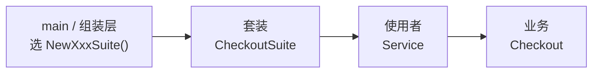

**抽象工厂模式** 提供一种创建 **一族相关对象** 的方式，使业务代码只依赖各产品的统一接口，而不必关心这一族具体由哪套实现组成；**选哪一套、怎么造**，在程序 **启动时**（`main` 或组装层）由对应的抽象工厂决定。

在电商订单系统里，一次结算会同时用到支付渠道、日志和订单模板，且必须对应同一部署场景：国内版是支付宝 + 审计日志 + 增值税发票模板，跨境版是信用卡 + 埋点日志 + 短文案收据——混搭（例如支付宝配跨境短收据）会导致收据格式、日志规范或支付流程对不上。业务代码只依赖统一接口完成结算；用哪一套，在部署/组装阶段定好，而不是运行时从各渠道随意组合。

下文延续 [工厂方法模式](/cs-fundamentals/design-patterns/factory)：上一篇只选 **一个** `PaymentProcessor`，这一篇把问题扩展为 **结算套装**——一族相关产品的配对，不是单条订单明细如何拼出来。

## 问题

[工厂方法模式](/cs-fundamentals/design-patterns/factory) 解决的是「创建 **一种** 产品」的解耦问题。实际项目里，对象往往 **成组出现**，且组内成员必须匹配：

- 国内版订单：支付宝支付渠道 + 审计日志 + 正式 HTML 订单模板
- 跨境版订单：信用卡支付渠道 + 埋点日志 + 短文案订单模板

若在每个用到的地方分别 `new` 具体类型，很容易出现 **混搭**——例如国内支付宝配了跨境短订单模板，或信用卡支付渠道配了审计日志，运行时才发现不兼容。

```go
func submitOrder(suite string, order Order) {
    var processor PaymentProcessor
    var logger ReceiptLogger
    var invoiceTpl InvoiceTemplate

    if suite == "domestic" {
        processor = &AlipayProcessor{}
        logger = &AuditReceiptLogger{}
        invoiceTpl = &VATInvoiceTemplate{}
    } else if suite == "cross_border" {
        processor = &CreditCardProcessor{}
        logger = &AnalyticsReceiptLogger{}
        invoiceTpl = &MobileReceiptTemplate{}
    }
    // 若三行分别来自不同分支、不同文件，极易配错组合…
    body := invoiceTpl.Render(order)
    processor.Pay(order)
    logger.Record("checkout", body)
}
```

这种写法的问题：

1. **族内一致性难保证**：`PaymentProcessor`、`ReceiptLogger`、`InvoiceTemplate` 分散创建，新增「国内微信套装」时要在多处同步改 `if/else`，漏改一处就会混用不同族的产品。
2. **调用方与多套具体类紧耦合**：业务代码必须知道每一族里有哪些具体类型名，违反 [依赖倒置](/cs-fundamentals/design-patterns#设计原则)（依赖抽象，而非具体实现）。
3. **扩展成本高**：加一个新套装 = 在多处复制粘贴一组构造逻辑；改套装内任一产品的构造方式，所有创建点都可能要动。
4. **切换整套实现困难**：从国内版切到跨境版，理论上应「一键换族」；分散的 `new` 让切换变成全局搜索替换。

本质矛盾是：业务只关心「拿来用一整套」，却不得不同时维护 **「族内有哪些产品、怎么配对」** 的细节。

## 意图

用一句话说：**提供一个创建一系列相关或相互依赖对象的接口，而无需指定它们具体的类。**

业务依赖各产品的 **抽象接口**（`PaymentProcessor`、`ReceiptLogger`、`InvoiceTemplate`）；具体造哪一族、族内每个产品怎么造，由 **抽象工厂** 在组装阶段统一提供。切换套装时，只换工厂实现，业务代码不动。

GoF 从 **实现结构** 角度的定义是：

> 提供一个创建一系列相关或相互依赖对象的接口，而无需指定它们具体的类。

与工厂方法的关系：

| | 工厂方法 | 抽象工厂 |
| :--- | :--- | :--- |
| 创建什么 | **一种** 产品（如 `PaymentProcessor`） | **一族** 相关产品（`PaymentProcessor` + `ReceiptLogger` + `InvoiceTemplate`） |
| 核心抽象 | 单个产品的创建方法（`NewXxx()`） | 一族产品的组合（如 `CheckoutSuite`） |
| 典型动机 | 解耦「造哪一种支付渠道」 | 保证「整套支付渠道、日志、订单模板」风格一致 |

> **命名说明**
>
> - **工厂方法**（上一篇）：每种产品一个 `NewXxx()`，选型在组装层。
> - **抽象工厂**（本文）：把一族相关产品 **成套** 创建并绑定在一起；Go 里常用一个 struct 装三个产品接口，不必硬套 `CreateXxx()` 工厂接口。

## 解决方案

把「一族产品」的创建收拢到一个 **套装** 里；每种套装在组装层一次性配好三个接口字段。业务只依赖套装里的抽象接口，不直接 `new` 具体类型。

### 产品接口

三个产品各自定义接口（与工厂方法篇相同，`PaymentProcessor` 可直接复用）：

```go
type PaymentProcessor interface {
    Pay(order Order)
}

type ReceiptLogger interface {
    Record(channel string, body string)
}

type InvoiceTemplate interface {
    Render(order Order) string
}
```

### 具体产品（两族示例）

**国内套装**：

```go
type AlipayProcessor struct{}
func (AlipayProcessor) Pay(order Order) { /* 调支付宝网关… */ }

type AuditReceiptLogger struct{}
func (AuditReceiptLogger) Record(channel, body string) { /* 写审计日志… */ }

type VATInvoiceTemplate struct{}
func (VATInvoiceTemplate) Render(order Order) string {
    return "<html><body>" + order.Summary + "</body></html>"
}
```

**跨境套装**：

```go
type CreditCardProcessor struct{}
func (CreditCardProcessor) Pay(order Order) { /* 调信用卡收单网关… */ }

type AnalyticsReceiptLogger struct{}
func (AnalyticsReceiptLogger) Record(channel, body string) { /* 埋点… */ }

type MobileReceiptTemplate struct{}
func (MobileReceiptTemplate) Render(order Order) string {
    if len(order.Summary) > 140 {
        return order.Summary[:137] + "..."
    }
    return order.Summary
}
```

### 套装（抽象工厂）

Go 里最常见、也最顺手的写法：**不必** 再包一层带 `CreateXxx()` 的 factory interface——直接把一族产品收成 **一个 struct，里面放三个产品接口**：

```go
type CheckoutSuite struct {
    PaymentProcessor PaymentProcessor
    ReceiptLogger   ReceiptLogger
    InvoiceTemplate InvoiceTemplate
}
```

每种套装用一个 **组装函数** 配好族内三个字段——配对写在一处，不会混搭：

```go
func NewDomesticCheckoutSuite() CheckoutSuite {
    return CheckoutSuite{
        PaymentProcessor: &AlipayProcessor{},
        ReceiptLogger:   &AuditReceiptLogger{},
        InvoiceTemplate: &VATInvoiceTemplate{},
    }
}

func NewCrossBorderCheckoutSuite() CheckoutSuite {
    return CheckoutSuite{
        PaymentProcessor: &CreditCardProcessor{},
        ReceiptLogger:   &AnalyticsReceiptLogger{},
        InvoiceTemplate: &MobileReceiptTemplate{},
    }
}
```

这就是 Go 里的「抽象工厂」：`CheckoutSuite` 是 **一族产品的抽象容器**，`NewDomesticCheckoutSuite()` 是 **具体工厂**（在组装层决定注入哪些实现）。不必为每套装再写一个 struct 去实现 `CreatePaymentProcessor()` 等方法——**差异就在字段里放了什么接口**，而不是多一层工厂 interface。

> 读 Java 资料时会看到 `AbstractFactory` 接口 + `CreateXxx()` 方法；那是 OOP 语言的惯用写法。Go 里若组装时就把产品造好、之后一直复用，**struct + 三个 interface 字段** 通常更直白。只有需要 **延迟创建** 或 **每次调用都造新实例** 时，才值得再包一层 `CreateXxx()` 工厂接口——见下文 [组装实践 · 按需创建](#按需创建)。

### 使用者

`Service` 在 **组装时** 注入整套 `CheckoutSuite`，运行时只使用其中的接口：

```go
type Service struct {
    suite CheckoutSuite
}

func NewService(suite CheckoutSuite) *Service {
    return &Service{suite: suite}
}

func (s *Service) Checkout(order Order) error {
    body := s.suite.InvoiceTemplate.Render(order)
    s.suite.PaymentProcessor.Pay(order)
    s.suite.ReceiptLogger.Record("checkout", body)
    return nil
}
```

**组装根** 决定用哪一套：

```go
domesticSvc := NewService(NewDomesticCheckoutSuite())
cross_borderSvc     := NewService(NewCrossBorderCheckoutSuite())
```

与分散 `new` 对比：

| | 分散创建 | 抽象工厂 |
| :--- | :--- | :--- |
| 族内一致性 | 靠人工保证三行 `new` 配对 | 组装函数内封装三个字段，不会混搭 |
| 切换套装 | 改多处构造代码 | 组装处换 `NewDomesticCheckoutSuite()` → `NewCrossBorderCheckoutSuite()` |
| 新增微信支付套装 | 多处加分支 | 新增 `NewWeChatCheckoutSuite()` 组装函数即可 |
| 业务代码 | 知道所有具体类型名 | 只依赖 `PaymentProcessor` 等接口和 `CheckoutSuite` |

新增套装时，只扩展、不改已有代码：

```go
func NewWeChatCheckoutSuite() CheckoutSuite {
    return CheckoutSuite{
        PaymentProcessor: &WeChatPayProcessor{},
        ReceiptLogger:   &AuditReceiptLogger{},       // 可与国内版共用审计
        InvoiceTemplate: &VATInvoiceTemplate{},
    }
}

wechatSvc := NewService(NewWeChatCheckoutSuite())
```

## 结构

| 角色 | 代码里是谁 | 管什么 |
| :--- | :--- | :--- |
| **抽象产品** | `PaymentProcessor`、`ReceiptLogger`、`InvoiceTemplate` | 各产品族的统一接口 |
| **具体产品** | `AlipayProcessor`、`AuditReceiptLogger` 等 | 某一族里的具体实现 |
| **抽象工厂** | `CheckoutSuite` | 一族产品的抽象容器（三个产品接口字段） |
| **具体工厂** | `NewDomesticCheckoutSuite()` 等 | 组装函数，配好一族具体实现 |
| **使用者** | `Service` | 只依赖 `CheckoutSuite` 及各产品接口 |

创建与使用分两个阶段：



**启动 / 组装时**：选定套装，三个产品字段在此配好并注入 `Service`：

```go
svc := NewService(NewDomesticCheckoutSuite())
//              ↑ 选族          ↑ PaymentProcessor / ReceiptLogger / InvoiceTemplate 在此注入
```

**运行时**：`Service` 只调接口方法，不出现 `AlipayProcessor` 等具体名字，也不再参与选型。

### 和工厂方法的关系（选读）

抽象工厂 **不是** 工厂方法的替代品，而是 **在其之上的组合**：

- 工厂方法：解耦 **一种** 产品的创建（`NewAlipayProcessor()`）。
- 抽象工厂：把一族产品 **打包进一个 struct**，保证 **成套** 使用。

若项目里只有一种产品、没有「族」的概念，用工厂方法即可，不必上抽象工厂。

### 和 GoF 术语的对应（选读）

| GoF 叫法 | 本文代码 | 一句话 |
| :--- | :--- | :--- |
| AbstractProduct | `PaymentProcessor` 等 | 产品接口 |
| ConcreteProduct | `AlipayProcessor` 等 | 具体产品 |
| AbstractFactory | `CheckoutSuite` | 一族产品的抽象容器 |
| ConcreteFactory | `NewDomesticCheckoutSuite()` 等 | 组装函数，配好一族实现 |
| Client | `Service` | 只通过套装使用产品族 |

## 适用场景

1. **产品必须成套、不能混搭**：UI 主题（按钮 + 对话框 + 滚动条）、数据库访问（连接 + 命令 + 事务）、跨平台渲染套件等。
2. **要在运行时切换整套实现**：国内版 / 跨境版、Windows / macOS 皮肤、MySQL / PostgreSQL 驱动族。
3. **想隐藏具体类的构造与组合**：调用方只知道「结算套装」，不知道族内每个类叫什么。
4. **扩展新套装而不改业务**：符合 [开闭原则](/cs-fundamentals/design-patterns#设计原则)——加 `NewCrossBorderCheckoutSuite()` 即可。

常见例子：跨平台 GUI 控件库、主题化的文档导出（PDF 字体 + 页眉 + 页脚一套）、云厂商 SDK 族（对象存储 + 队列 + 监控同一套认证方式）。

**不必强行使用**：只有一两个独立对象、不存在「族」或「配套」约束时，工厂方法或直接 `new` 更简单。为两三个毫无关联的类硬凑一个「抽象工厂」，只会增加间接层。

## 优缺点

| 优点 | 说明 |
| :--- | :--- |
| **保证族内一致** | 组装函数封装配对逻辑，避免混搭 |
| **切换套装简单** | 组装处换一个 `NewXxxSuite()`，业务与已有产品类不动 |
| **隔离具体类** | 使用者只依赖抽象接口，符合依赖倒置 |
| **易扩展新族** | 新增组装函数 + 具体产品，不必改 `Service`；Go 里不必为每族多写一个 struct |

| 缺点 | 说明 |
| :--- | :--- |
| **向套装加新产品种类成本高** | 若要在所有套装里加「第四类产品」，要改 `CheckoutSuite` 的字段及 **每一个** `NewXxxSuite()` |
| **间接层更深** | 比工厂方法多一层「工厂的组合」，阅读和调试成本更高 |
| **容易过度设计** | 产品之间本无配套关系时，抽象工厂是负担 |

最后一点值得单独说明：GoF 原文也指出，抽象工厂最大的麻烦是 **向套装体系新增一种产品类型**（例如给所有套装都加 `Metrics` 字段）——这比新增一个 **新套装** 更痛，因为要动 struct 和所有组装函数。若产品种类经常变、套装相对稳定，要权衡是否值得。

## 组装实践

> **阅读提示**：先掌握「在 `main` 里选 `NewXxxSuite()` 并 `NewService(suite)`」即可。本节是常见变体；初学可先跳过。

### 按配置选择套装

与工厂方法篇类似，`switch` 可以留在组装层，不应进入 `Service.Checkout`：

```go
func NewServiceFromConfig(cfg Config) (*Service, error) {
    var suite CheckoutSuite
    switch cfg.Suite {
    case "domestic":
        suite = NewDomesticCheckoutSuite()
    case "cross_border":
        suite = NewCrossBorderCheckoutSuite()
    default:
        return nil, fmt.Errorf("unknown suite: %q", cfg.Suite)
    }
    return NewService(suite), nil
}
```

这里的 `switch` 选的是 **整族**，不是族内的单个产品——族内配对仍由 `NewXxxSuite()` 保证。

### 与工厂方法的组合

组装函数里可以调用各产品的 `NewXxx()` 构造函数，不必直接 `&AlipayProcessor{}`——复杂构造留在工厂方法里，成套选型留在组装函数里：

```go
func NewDomesticCheckoutSuite() CheckoutSuite {
    return CheckoutSuite{
        PaymentProcessor: NewAlipayProcessor(loadAlipayConfig()),
        ReceiptLogger:   NewAuditReceiptLogger(),
        InvoiceTemplate: NewVATInvoiceTemplate(),
    }
}
```

### 按需创建

上文 `CheckoutSuite` 在组装时就把三个产品造好、之后复用。若每次 `Checkout` 都需要 **新实例**（带请求上下文、超时设置等），可以再包一层带 `CreateXxx()` 的工厂接口——这时才值得用 factory interface，而不是 struct 里直接放产品：

```go
type CheckoutSuiteFactory interface {
    CreatePaymentProcessor() PaymentProcessor
    CreateReceiptLogger() ReceiptLogger
    CreateInvoiceTemplate() InvoiceTemplate
}

type suiteFactory struct {
    newPaymentProcessor func() PaymentProcessor
    newReceiptLogger   func() ReceiptLogger
    newInvoiceTemplate func() InvoiceTemplate
}

func (f suiteFactory) CreatePaymentProcessor() PaymentProcessor { return f.newPaymentProcessor() }
func (f suiteFactory) CreateReceiptLogger() ReceiptLogger     { return f.newReceiptLogger() }
func (f suiteFactory) CreateInvoiceTemplate() InvoiceTemplate  { return f.newInvoiceTemplate() }

func NewDomesticCheckoutSuiteFactory() CheckoutSuiteFactory {
    return suiteFactory{
        newPaymentProcessor: NewAlipayProcessor,
        newReceiptLogger:   NewAuditReceiptLogger,
        newInvoiceTemplate: NewVATInvoiceTemplate,
    }
}

type CheckoutService struct {
    factory CheckoutSuiteFactory
}

func (s *CheckoutService) Checkout(order Order) error {
    processor := s.factory.CreatePaymentProcessor()
    logger := s.factory.CreateReceiptLogger()
    invoiceTpl := s.factory.CreateInvoiceTemplate()
    body := invoiceTpl.Render(order)
    processor.Pay(order)
    logger.Record("checkout", body)
    return nil
}
```

两种写法对比：

| | 套装 struct（本文主路径） | `CreateXxx()` 工厂接口 |
| :--- | :--- | :--- |
| 容器里放什么 | 三个 **产品接口** | 三个 **构造函数** |
| 何时创建 | 组装时一次 | 每次 `Checkout` 可调 `Create` |
| 适用 | 产品无状态、可复用 | 每次需要新实例 |
| 更接近 GoF | 概念上等价，Go 里更直白 | 与 Java 资料写法一致 |

多数无状态场景用套装 struct 即可；只有确实需要按需创建时，再引入 `CreateXxx()` 那一层。

## 小结

记住这四点即可：

1. **一族产品绑在一起**：`CheckoutSuite` 里 `PaymentProcessor` + `ReceiptLogger` + `InvoiceTemplate` 成套注入，避免混搭。
2. **业务只依赖接口**：`Service` 不出现具体类型名，切换套装只换 `NewXxxSuite()`。
3. **不必硬套 factory interface**：组装时造好、之后复用 → struct 里放三个产品接口；按需创建 → 再用 `CreateXxx()`。
4. **新增产品种类要动全体套装**：这是主要代价；产品种类稳定、套装常增时更合适。

上一篇的工厂方法管 **一种** 产品；本篇的抽象工厂管 **一套** 产品。先判断有没有「族」和「配套」需求，再决定用哪一个。若套装已经选好，但单条订单本身字段很多、可选项很多，则进入下一篇 [生成器模式](/cs-fundamentals/design-patterns/builder)：它关心的是 **如何把一条具体订单构建完整**。

## 参考阅读

- [x] [工厂方法模式](/cs-fundamentals/design-patterns/factory) — 本文前置阅读，单产品创建
- [x] [Refactoring.Guru - 抽象工厂模式](https://refactoringguru.cn/design-patterns/abstract-factory) (2026-06-17)
- [x] [菜鸟教程 - 抽象工厂模式](https://www.runoob.com/design-pattern/abstract-factory-pattern.html) (2026-06-17)
