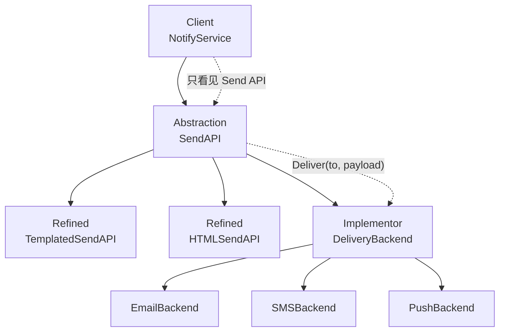

**桥接模式**（Bridge）提供一种 **把抽象与实现分离** 的方式，使 **两个会独立变化的维度各自扩展、互不相牵**：对外是抽象（**做什么**），对内是实现（**怎么做**）；抽象通过 **组合**（has-a）引用实现接口，而不是用 **继承**（is-a）为每一种「抽象变体 × 实现变体」各写一个类。

下文延续 [工厂方法模式](/cs-fundamentals/design-patterns/factory) 与 [适配器模式](/cs-fundamentals/design-patterns/adapter) 的「通知模块」场景：渠道已有邮件、短信、推送，消息形态又分 **纯文本**、**模板渲染**、**富文本 HTML**——两个维度都会继续增加。

## 问题

[工厂方法](/cs-fundamentals/design-patterns/factory) 解决了 **选哪一种 Notifier**；[适配器](/cs-fundamentals/design-patterns/adapter) 解决了 **第三方 API 与 `Notifier` 接口不一致**。但当 **消息形态** 与 **投递渠道** 都要独立扩展时，若用 **一个类扛两种职责** 或 **继承穷举组合**，问题会再次出现：

```go
// 每种「渠道 × 消息形态」一个具体类——组合爆炸
type EmailPlainNotifier struct{}
type EmailTemplatedNotifier struct{}
type EmailHTMLNotifier struct{}
type SMSPlainNotifier struct{}
type SMSTemplatedNotifier struct{}
type PushPlainNotifier struct{}
// 再来 Slack、Webhook… 每加一种形态或渠道，类数相乘
```

业务调用也会被迫认识所有组合：

```go
func notify(kind, channel, to, content string, vars map[string]string) error {
    switch {
    case channel == "email" && kind == "plain":
        return (&EmailPlainNotifier{}).Send(to, content)
    case channel == "email" && kind == "template":
        return (&EmailTemplatedNotifier{}).Send(to, vars)
    case channel == "sms" && kind == "plain":
        return (&SMSPlainNotifier{}).Send(to, content)
    // …
    }
    return nil
}
```

1. **类数量随维度相乘**：`渠道数 × 消息形态数` 个 Notifier，违反 [开闭原则](/cs-fundamentals/design-patterns#设计原则)——加一种 HTML 推送就要新增类，且往往复制粘贴「调 SMTP / 调 Twilio」的投递代码。
2. **抽象与实现绑死**：模板渲染逻辑散落在 `EmailTemplatedNotifier`、`SMSTemplatedNotifier` 里，改模板引擎要改多处；换短信网关时，每种消息形态的 SMS 类都要动。
3. **无法独立测试**：想单测「模板渲染」必须构造带真实渠道依赖的 Notifier；想单测「邮件投递」又绕不开某种消息形态。
4. **违反单一职责与合成复用**：一个类同时管 **格式化** 和 **渠道 I/O**；能用组合拆开的，却用继承堆子类。
5. **与工厂/适配器的分工错位**：工厂选「哪一个类」、适配器翻译接口——但 **类本身设计错了**（两种变化耦在一个继承树里），工厂只能在一堆组合类里 `switch`。

本质矛盾是：**有两个（或更多）独立变化维度**，却用 **单继承层次** 或 **巨型类** 表达，导致扩展任一侧都要动另一侧。

## 意图

用 GoF 的术语，系统拆成 **抽象部分**（Abstraction）和 **实现部分**（Implementor）两层——这里的「抽象 / 实现」是 **模式里的角色划分**，**不是** 编程语言里的 `interface`、`abstract class`，也 **不是** 日常说的「越抽象越 vague」。**抽象部分 = 调用方看到、直接使用的那一层**；**实现部分 = 底层平台真正干活的那一层**。

用更通俗的话说：**「调用方怎么发、发之前要做什么处理」是一回事，「最后经哪条路、用什么协议送出去」是另一回事**——两件事都会变，但应该分开设计，组装时再把它们 **配在一起**。

落到通知模块：

- **抽象部分**：**业务侧的发送 API**——`SendAPI` 提供 `Send(to, message)`，`TemplatedSendAPI` 提供 `SendWithVars(to, vars)` 并在内部渲染模板。纯文本、套模板并不「抽象」，它们是 **同一「发消息」能力下的不同入口**；这一层 **不管** 背后是 SMTP 还是 Twilio。
- **实现部分**：**底层投递能力**——`DeliveryBackend` 约定 `Deliver(to, payload)`，`EmailBackend`、`SMSBackend` 各自调 SMTP、短信网关。这一层 **不管** 正文是原始字符串还是渲染后的 HTML。

抽象部分 **组合** 持有实现部分（Go 里通常是 struct 字段引用 `DeliveryBackend`）。例如 `TemplatedSendAPI.SendWithVars` 先渲染模板，再调用 `backend.Deliver(...)`。加 HTML 入口只动抽象部分，接 Slack 只动实现部分，不必为每种组合写 `EmailHTMLNotifier` 这类类。

GoF 从 **实现结构** 角度的定义是：

> 将抽象部分与它的实现部分分离，使它们都可以独立地变化。

与 [适配器模式](/cs-fundamentals/design-patterns/adapter) 的关系：

| | 桥接 | 适配器 |
| :--- | :--- | :--- |
| 动机 | **设计阶段** 拆清两个变化维度 | **集成阶段** 接口已存在且不兼容 |
| 结构 | 抽象 **HAS-A** 实现接口 | 适配器 **HAS-A** 被适配者 |
| 典型时机 | 预知「形态 × 渠道」都会变 | 第三方/遗留 API 对不上 `Notifier` |
| 是否改 Adaptee | 实现层通常 **自研**，随设计演进 | 往往 **不改** 第三方代码 |

二者可 **组合**：`EmailBackend` 内部用 [适配器](/cs-fundamentals/design-patterns/adapter) 包装 `LegacySMTP`；`TemplatedSendAPI` 可桥接在任意 `DeliveryBackend` 上。

> **命名说明**
>
> - **桥接 vs 策略（Strategy）**：策略常替换 **单一算法/行为**；桥接强调 **整层实现**（渠道、渲染后端、存储引擎）与 **抽象层** 分离，两侧都可能有自己的子类层次。见下文 [组装实践 · 与策略的区别](#与策略的区别)。
> - **桥接 vs 适配器**：结构都是「A 持有 B」——看 **动机**：是为 **独立扩展两个维度**，还是为 **兼容已有接口**。

## 解决方案

下文按 **模式角色** 命名，避免和日常用语混淆：

| 角色 | 本文类型名 | 为何不用别的叫法 |
| :--- | :--- | :--- |
| 抽象部分 | `SendAPI`、`TemplatedSendAPI` | 强调 **调用方入口**，不是 `MessageSender` 那种「听起来包办投递」的名字 |
| 实现部分 | `DeliveryBackend`、`EmailBackend` | 强调 **底层投递**，不叫 `DeliveryChannel`——「Channel」在通知模块里通常指邮件/短信等 **业务渠道**，易和 Implementor 接口混淆 |

把 **底层怎么投递** 抽成 `DeliveryBackend`（Implementor），把 **调用方怎么发** 放在 `SendAPI` 及其 refined 类型（Abstraction，Go 里用 **嵌入** 扩展，不是继承子类）；`Send` 处理完本层逻辑后，委托 `backend.Deliver(...)`。

### 实现部分（Implementor）

```go
type DeliveryBackend interface {
    Deliver(to, payload string) error
}

type EmailBackend struct {
    smtp    LegacySMTP // 可与适配器组合
    subject string
}

func (b EmailBackend) Deliver(to, payload string) error {
    return b.smtp.MailTo(to, b.subject, payload)
}

type SMSBackend struct {
    client TwilioClient
}

func (b SMSBackend) Deliver(to, payload string) error {
    _, err := b.client.CreateMessage(to, payload)
    return err
}

type PushBackend struct {
    apns APNsClient
}

func (b PushBackend) Deliver(to, payload string) error {
    return b.apns.Send(to, payload)
}
```

### 抽象部分（Abstraction）

```go
type SendAPI struct {
    backend DeliveryBackend
}

func NewSendAPI(backend DeliveryBackend) SendAPI {
    return SendAPI{backend: backend}
}

func (api SendAPI) Send(to, message string) error {
    return api.backend.Deliver(to, message)
}
```

### refined 抽象部分（Refined Abstraction）

```go
type TemplatedSendAPI struct {
    SendAPI
    template string
}

func NewTemplatedSendAPI(backend DeliveryBackend, tmpl string) TemplatedSendAPI {
    return TemplatedSendAPI{
        SendAPI:  NewSendAPI(backend),
        template: tmpl,
    }
}

func (api TemplatedSendAPI) SendWithVars(to string, vars map[string]string) error {
    body := renderTemplate(api.template, vars)
    return api.SendAPI.Send(to, body)
}

type HTMLSendAPI struct {
    SendAPI
}

func NewHTMLSendAPI(backend DeliveryBackend) HTMLSendAPI {
    return HTMLSendAPI{SendAPI: NewSendAPI(backend)}
}

func (api HTMLSendAPI) SendHTML(to, htmlBody string) error {
    wrapped := wrapHTMLDocument(htmlBody)
    return api.SendAPI.Send(to, wrapped)
}
```

### 客户端与组装

```go
type NotifyService struct {
    sender interface {
        Send(to, message string) error
    }
}

func (svc *NotifyService) NotifyPlain(to, msg string) error {
    return svc.sender.Send(to, msg)
}

// 组装层：任意「抽象 × 实现」组合，不必新建组合类
emailPlain := NewSendAPI(EmailBackend{smtp: LegacySMTP{}, subject: "Notice"})
smsTmpl := NewTemplatedSendAPI(SMSBackend{client: TwilioClient{}}, "Hi {{.Name}}, code: {{.Code}}")
pushHTML := NewHTMLSendAPI(PushBackend{apns: APNsClient{}})

svc := &NotifyService{sender: emailPlain}
_ = smsTmpl.SendWithVars("+8613800138000", map[string]string{"Name": "Ada", "Code": "1234"})
_ = pushHTML.SendHTML("device-token", "<p>Hello</p>")
```

新增 **渠道** → 只加 `DeliveryBackend` 实现；新增 **消息形态** → 只加 refined `SendAPI`；**不必** 为每种组合写 `EmailHTMLNotifier`。

## 结构

| 角色 | 代码里是谁 | 管什么 |
| :--- | :--- | :--- |
| **抽象**（Abstraction） | `SendAPI` | 面向业务的发送 API，持有 Implementor |
| **refined 抽象** | `TemplatedSendAPI`、`HTMLSendAPI` | 在基类抽象上扩展格式化/模板逻辑 |
| **实现**（Implementor） | `DeliveryBackend` | 与渠道无关的底层投递接口 |
| **具体实现** | `EmailBackend`、`SMSBackend` | 各渠道的真实 I/O |
| **客户端**（Client） | `NotifyService`、组装层 | 依赖抽象 API，组装时绑定 Implementor |



**运行时** 调用链（模板 + 短信）：

```go
smsTmpl.SendWithVars(to, vars)
// → renderTemplate(...)              // Refined Abstraction
// → SendAPI.Send(to, body)           // Abstraction
// → backend.Deliver(to, body)        // Implementor → EmailBackend / SMSBackend …
```

### 和 GoF 术语的对应（选读）

| GoF 叫法 | 本文代码 | 一句话 |
| :--- | :--- | :--- |
| Abstraction | `SendAPI` | 高层接口，持有 Implementor |
| RefinedAbstraction | `TemplatedSendAPI` | 扩展抽象行为 |
| Implementor | `DeliveryBackend` | 实现层接口 |
| ConcreteImplementor | `EmailBackend` 等 | 具体渠道 |
| Client | `NotifyService` | 使用抽象，组装时注入 backend |

Go 无继承：`RefinedAbstraction` 用 **嵌入** `SendAPI` 复用 `Send`，而不是 `extends`。

## 适用场景

1. **两个维度独立变化**：消息形态 × 渠道、UI 控件 × 渲染后端（矢量/光栅）、业务 API × 存储引擎（MySQL/Redis）。
2. **想避免组合类爆炸**：若用继承要 `M×N` 个类，桥接后约 `M+N`。
3. **实现可能在运行时切换**：同一 `TemplatedSendAPI` 换注入的 `DeliveryBackend`（如 A/B 渠道、故障转移）。
4. **抽象与实现都应面向接口编程**：高层测模板逻辑时注入 `fakeBackend`；低层测 SMTP 时不碰 HTML 包装。
5. **实现细节应对客户端隐藏**：Client 只调 `Send` / `SendWithVars`，不知道 Twilio 还是 APNs。

**不必强行使用**：

- 只有一个变化维度、且不会增长——直接一个接口 + 几个实现（策略或简单多态）即可。
- 组合永远固定（例如 **只有** 邮件纯文本）——桥接多一层 indirection，收益不大。
- 问题是 **已有第三方接口不合**——优先 [适配器](/cs-fundamentals/design-patterns/adapter)，不是桥接。
- 变化维度 **三个以上**——桥接通常只桥 **一对** 层次；更复杂的用组合多个桥或重新划边界。

常见例子：跨平台 GUI（Widget × Renderer）、 JDBC 式驱动桥（DAO × Driver）、日志（Appender 抽象 × Console/File 实现）、消息队列生产者（序列化格式 × Broker 客户端）。

## 优缺点

| 优点 | 说明 |
| :--- | :--- |
| **开闭** | 新渠道 / 新消息形态各加一类，不修改对方 |
| **单一职责** | 格式化与投递分离，职责清晰 |
| **可测试** | `fakeDeliveryBackend` 单测抽象；渠道单测不碰模板 |
| **运行时绑定** | 组装层或配置决定 `SendAPI` 桥接哪个 `DeliveryBackend` |
| **合成复用** | 用组合替代继承穷举，符合 [设计原则](/cs-fundamentals/design-patterns#设计原则) |

| 缺点 | 说明 |
| :--- | :--- |
| **间接层增加** | 读代码需跳 Abstraction → Implementor |
| **设计 upfront 成本** | 要事先识别「哪两个维度该拆」；拆错维度后期仍痛苦 |
| **小项目显繁琐** | 固定组合少时，几个 Notifier 类比桥接更直观 |
| **接口设计要稳** | Implementor 接口过窄要频繁改；过宽则实现类臃肿 |

## 组装实践

> **阅读提示**：先掌握「Abstraction 持有 DeliveryBackend + refined 类型扩展格式 + 组装层自由组合」即可。本节是工程变体；初学可先跳过。

### 在组装层完成「抽象 × 实现」绑定

与 [工厂方法 · 按配置注入产品](/cs-fundamentals/design-patterns/factory#按配置注入产品) 类似，**选型** 留在 `main`：

```go
func NewNotifyStack(cfg Config) (*NotifyService, error) {
    var backend DeliveryBackend
    switch cfg.Channel {
    case "email":
        backend = EmailBackend{smtp: LegacySMTP{}, subject: cfg.Subject}
    case "sms":
        backend = SMSBackend{client: TwilioClient{}}
    default:
        return nil, fmt.Errorf("unknown channel: %q", cfg.Channel)
    }

    var sender SendAPI
    switch cfg.MessageKind {
    case "plain":
        sender = NewSendAPI(backend)
    case "template":
        return &NotifyService{
            sender: NewTemplatedSendAPI(backend, cfg.Template),
        }, nil
    default:
        return nil, fmt.Errorf("unknown message kind: %q", cfg.MessageKind)
    }
    return &NotifyService{sender: sender}, nil
}
```

两个 `switch` 在 **组装层相乘**，而不是在业务方法里；新增维度只扩展对应分支。

### 与适配器叠加

Implementor 内部可包装遗留 SDK——桥接管 **维度拆分**，适配器管 **接口翻译**：

```go
type EmailBackend struct {
    notifier Notifier // LegacySMTPAdapter 等，已实现 Deliver 或再包一层
}

func (b EmailBackend) Deliver(to, payload string) error {
    return b.notifier.Send(payload) // 地址等在 Adapter 组装时注入
}
```

### 与策略的区别

| | 桥接 | 策略 |
| :--- | :--- | :--- |
| 意图 | **抽象层 + 实现层** 两套层次都可扩展 | 替换 **一种行为/算法** |
| 结构 | Abstraction **HAS-A** Implementor，常有 refined 抽象 | Context **HAS-A** Strategy |
| 例子 | `TemplatedSendAPI` × `SMSBackend` | 排序算法、压缩算法二选一 |
| 判断 | 两侧是否都会 **成族地** 增加类型/实现 | 是否只是 **换一种做法** |

若只有「选哪种渠道」、消息形态不变，[工厂方法](/cs-fundamentals/design-patterns/factory) + 单一 `Notifier` 足够；若消息形态与渠道 **都会成族扩展**，用桥接。

### 与装饰器的区别

| | 桥接 | 装饰器 |
| :--- | :--- | :--- |
| 目的 | 拆 **两个变化维度** | **增强** 同一接口上的行为（重试、日志） |
| 关系 | 抽象 **拥有** 实现 | 装饰器 **包装** 同接口组件 |
| 叠加 | `RetryBackend` 包装 `DeliveryBackend` 仍属实现层装饰 | `RetryNotifier` 包装 `Notifier` |

可在 Implementor 外包装饰：`SendAPI{backend: RetryBackend{inner: SMSBackend{...}}}`。

### Implementor 接口粒度

`Deliver(to, payload string)` 保持 **最小可用**；渠道特有参数（邮件 subject、短信 sender ID）在 **具体 Implementor 构造时** 注入，不要泄漏到 `TemplatedSendAPI`：

```go
func NewEmailBackend(smtp LegacySMTP, defaultSubject string) EmailBackend {
    return EmailBackend{smtp: smtp, subject: defaultSubject}
}
```

若多种 Implementor 共享重试、指标，可抽 **装饰器** 或 **中间抽象**（`BaseBackend`），而不是把横切逻辑写进每个 `Deliver`。

### 指针、生命周期与共享 backend

重量级客户端（HTTP、连接池）在组装层 **共享一个** `SMSBackend` 实例，注入多个 `SendAPI` / `TemplatedSendAPI`——与 [适配器 · 指针接收者与 Adaptee 生命周期](/cs-fundamentals/design-patterns/adapter#指针接收者与-adaptee-生命周期) 相同：

```go
sharedSMS := SMSBackend{client: twilioClient}
plain := NewSendAPI(sharedSMS)
tmpl := NewTemplatedSendAPI(sharedSMS, cfg.AlertTemplate)
```

## 小结

记住这四点即可：

1. **两个独立变化维度 → 桥接**：抽象（消息形态）与实现（渠道）分开，用组合连接，避免 `M×N` 子类。
2. **Abstraction 持有 Implementor**：`SendAPI` 调 `DeliveryBackend.Deliver`，refined 类型只管格式化。
3. **组装层做笛卡尔积**：`NewTemplatedSendAPI(SMSBackend{...}, tmpl)`，不必写 `SMSTemplatedNotifier`。
4. **别与适配器、策略混淆**：桥接是 **设计上的分层**；适配器是 **集成时的翻译**；策略是 **单一行为替换**。

[适配器模式](/cs-fundamentals/design-patterns/adapter) 把 **现成的、接口不合** 的组件接进抽象；桥接则在 **设计之初** 就把 **会独立演化的两层** 拆开。下一篇可继续学习其他结构型模式（如组合、装饰器、外观等）。

## 参考阅读

- [x] [工厂方法模式](/cs-fundamentals/design-patterns/factory) — 通知模块与组装注入
- [x] [适配器模式](/cs-fundamentals/design-patterns/adapter) — 渠道集成与 `Notifier` 翻译
- [x] [Refactoring.Guru - 桥接模式](https://refactoringguru.cn/design-patterns/bridge) (2026-06-18)
- [x] [菜鸟教程 - 桥接模式](https://www.runoob.com/design-pattern/bridge-pattern.html) (2026-06-18)
