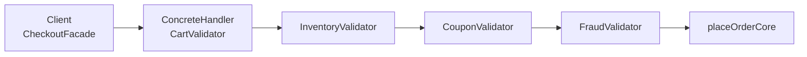
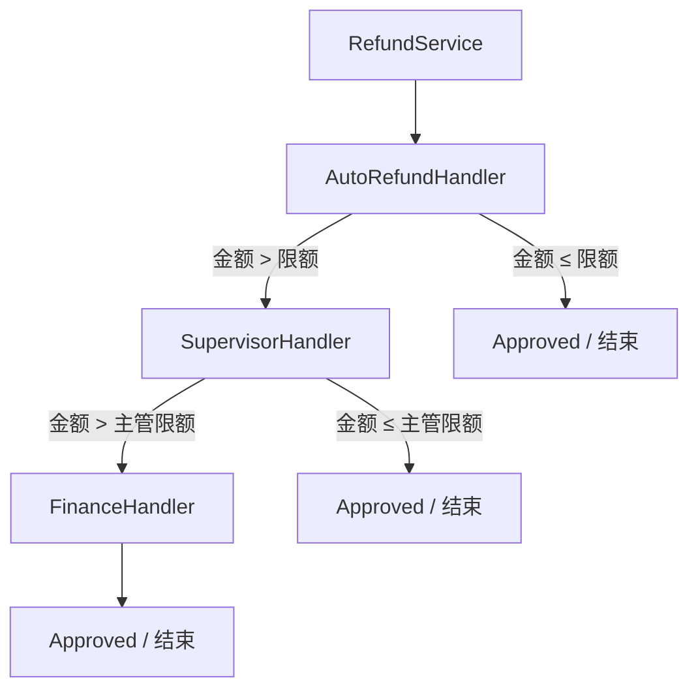

**责任链模式**（Chain of Responsibility）把 **多个处理者** 连成一条 **链**：请求从链头进入，每个处理者要么 **自己处理并结束传递**，要么 **处理一部分后交给下一个**，要么 **直接转发**——发送方 **只把请求交给链头**，不必知道 **哪一个** 节点会最终处理，也不必依赖整条链上所有具体类型。

与 [外观模式](/cs-fundamentals/design-patterns/facade) 的 **分工** 很常被问到：[外观](/cs-fundamentals/design-patterns/facade) 把 **固定顺序的多子系统编排** 收进 `PlaceOrder`；责任链把 **「谁来处理这类请求」** 或 **「可插拔的校验 / 审批步骤」** 从调用方剥离开——新增「跨境合规校验」「大额退款财务审批」时 **改链的组装**，而不是在 Facade 里 **又加一排 `if`**。与 [装饰器模式](/cs-fundamentals/design-patterns/decorator) 也不同：装饰器 **总会** 委托 `inner`；责任链的某一环可以 **消费请求、终止链条**，也可以 **根本不参与**（请求穿过）。

下文继续用「电商订单系统」：[外观](/cs-fundamentals/design-patterns/facade) 已提供 `PlaceOrder` 统一入口；当 **退款审批** 要按金额分流、**下单前** 要叠加可配置的风控与合规校验，且 **不同渠道**（App、B 端代客、跨境站）链长不同时，若把所有规则写进 Facade，会出现 **开闭困难、测试组合爆炸**——责任链把 **处理者** 与 **链接顺序** 拆开，由组装层拼链。

## 问题

`CheckoutFacade` 已在内部完成预占、扣款、落库。运营又要求：**下单前** 依次做购物车合法性、库存、优惠券、风控；**退款** 时小额自动退、中额主管批、大额财务批。团队先在 Facade 与 `RefundService` 里 **硬编码**：

```go
func (f *CheckoutFacade) PlaceOrder(ctx context.Context, req PlaceOrderRequest) error {
    if err := validateCart(req); err != nil {
        return err
    }
    if err := f.checkInventory(ctx, req); err != nil {
        return err
    }
    if err := validateCoupon(req); err != nil {
        return err
    }
    if f.cfg.EnableFraud {
        if err := f.fraud.Check(ctx, req); err != nil {
            return err
        }
    }
    if req.ShipToCountry != "CN" && !f.compliance.CrossBorderOK(req) {
        return ErrCompliance
    }
    // … 真正的 PlaceOrder 编排
    return f.placeOrderCore(ctx, req)
}

func (s *RefundService) RequestRefund(ctx context.Context, r RefundRequest) error {
    switch {
    case r.Amount <= 10000:
        return s.autoApprove(ctx, r)
    case r.Amount <= 100000:
        return s.supervisor.Approve(ctx, r)
    default:
        return s.finance.Approve(ctx, r)
    }
}
```

1. **开闭困难**：每加一条风控规则、每个新国家合规，都要 **改 Facade / RefundService** 源码；A/B 渠道想 **关掉某一环** 只能再加 `if cfg.X`。
2. **职责混杂**：`CheckoutFacade` 既管 **编排**（预占→支付→落库），又管 **十余条校验**——违反 [单一职责](/cs-fundamentals/design-patterns#设计原则)。
3. **发送方仍知道太多**：B 端代客下单想 **跳过 App 专属风控**、跨境站要多一环 **关税估算**，调用方开始复制 **不同 if 顺序**。
4. **审批层级难扩展**：「100 元以下自动退」改成「VIP 自动退、普通用户 50 元以下」时，`switch amount` **又长又脆**。
5. **与外观 / 装饰的分工错位**：[外观](/cs-fundamentals/design-patterns/facade) 解决 **多子系统联合使用**；[装饰器](/cs-fundamentals/design-patterns/decorator) 解决 **同一对象上叠加计价增强**——这里要解决的是 **多个独立处理者按链传递请求**，且 **链可配置、可增减环**。

本质矛盾是：**完成一次业务** 往往需要 **多步检查或分级审批**，但 **哪一步处理、链有多长** 应能 **独立变化**；发送方（Facade、HTTP Handler）只应 **把请求交给链头**，不应 **认识每一个 Validator / Approver 类型**。

### 责任链的两种常见形态

| 形态 | 行为 | 电商例子 |
| :--- | :--- | :--- |
| **单处理者**（经典 GoF） | 链上 **只有一个** 环真正「接单」；其余 **转发** | 退款：自动批 → 主管 → 财务，**命中一档即处理并结束** |
| **管道 / 全会签**（工程常见） | **每一环都必须通过**；失败则 **短路**；通过则 **交给 next** | 下单前：购物车 → 库存 → 券 → 风控，**全部 OK 才进** `placeOrderCore` |

文档 **分节讲** 两种形态；实现上常共用同一 `Handler` 接口与 `SetNext` 组装方式。HTTP 中间件、`grpc` 拦截器与 **管道式责任链** 是同一思想。

## 意图

用一句话说：**使多个对象都有机会处理请求，从而避免请求的发送者与接收者之间的耦合。将这些对象连成一条链，并沿着这条链传递该请求，直到有一个对象处理它为止。**

对 **管道式** 用法，可理解为：**沿链传递，每一环执行自己的检查；任一失败则终止；全部通过则进入后续业务。**

引入 **处理者**（Handler）统一接口；**具体处理者** 实现校验或审批；**链** 由组装层 `SetNext` 串起。`CheckoutFacade` 在 `placeOrderCore` **之前** 只调 `chain.Handle(ctx, &req)`；`RefundService` 只调 `approvalChain.Handle(ctx, &r)`：

```go
// Facade 不再 import 每一个 Validator 类型
if err := f.preCheckChain.Handle(ctx, &req); err != nil {
    return err
}
return f.placeOrderCore(ctx, req)
```

GoF 从 **结构** 角度的定义：

> 使多个对象都有机会处理请求，从而避免请求的发送者与接收者之间的耦合。将这些对象连成一条链，并沿着这条链传递该请求，直到有一个对象处理它为止。

### 和外观、装饰器、代理有啥不同

| | 责任链 | 外观 | 装饰器 | 代理 |
| :--- | :--- | :--- | :--- | :--- |
| **动机** | **解耦发送方与多个接收者**；可插拔处理环 | **简化** 多子系统 **固定编排** | **增强** 同一对象行为 | **控制** 对主题的访问 |
| **是否每条都执行** | **不一定**（单处理者只一环接单；管道式则每环都跑） | **通常固定全流程** | **每层都经过** | **代理层总在访问路径上** |
| **谁组装顺序** | 组装层 **拼链**；可 per-channel 不同链 | Facade **内部写死** 或注入子系统 | 客户端 **按需套娃** | 组装层 **包装** real |
| **典型场景** | 退款分级审批、下单前校验链 | `PlaceOrder` 预占+支付+落库 | 会员折+券+包装费 | 懒加载订单、读权限 |

#### 责任链像「中间件」吗？

**是。** `http.Handler` 链、`gin` 中间件、拦截器 **都是管道式责任链**：请求进链头，逐环 `next()`，某一环可 **直接返回错误** 终止。GoF 强调 **发送方不知道哪一环处理**；Web 中间件常 **每环都执行**。电商里把 **业务校验** 提成 `OrderHandler` 接口，HTTP 层与 Facade **共用同一条链**，比只在 Controller 堆中间件 **更可测、可复用**。

#### 责任链和外观能一起用吗？

**应该一起用。** Facade 管 **有副作用的编排**（预占、扣款）；责任链管 **前置无状态检查 / 分级审批**。`PlaceOrder` = `preCheckChain.Handle` + `placeOrderCore`——**编排仍在 Facade**，**规则扩展在链上**。

## 解决方案

定义 **处理者** 接口；各 **具体处理者** 实现单一规则；用 **基类或组合** 持有 `next` 并转发。发送方只依赖 **链头接口**。

### 处理者（Handler）接口与链基类

```go
type PlaceOrderContext struct {
    Req     PlaceOrderRequest
    User    User
    Channel string // "app" | "b2b" | "cross_border"
}

type OrderHandler interface {
    Handle(ctx context.Context, order *PlaceOrderContext) error
}

type BaseHandler struct {
    next OrderHandler
}

func (b *BaseHandler) SetNext(h OrderHandler) OrderHandler {
    b.next = h
    return h
}

func (b *BaseHandler) callNext(ctx context.Context, order *PlaceOrderContext) error {
    if b.next == nil {
        return nil
    }
    return b.next.Handle(ctx, order)
}
```

`SetNext` 返回传入的 handler，便于 **流畅组装**：`h1.SetNext(h2).SetNext(h3)`。

### 管道式：下单前校验链（每环必须通过）

```go
type CartValidator struct{ BaseHandler }

func (h *CartValidator) Handle(ctx context.Context, order *PlaceOrderContext) error {
    if len(order.Req.Lines) == 0 {
        return ErrEmptyCart
    }
    for _, line := range order.Req.Lines {
        if line.Quantity <= 0 {
            return ErrInvalidQuantity
        }
    }
    return h.callNext(ctx, order)
}

type InventoryValidator struct {
    BaseHandler
    inventory InventoryService
}

func (h *InventoryValidator) Handle(ctx context.Context, order *PlaceOrderContext) error {
    for _, line := range order.Req.Lines {
        if err := h.inventory.CheckStock(ctx, line.SKU, line.Quantity); err != nil {
            return err
        }
    }
    return h.callNext(ctx, order)
}

type CouponValidator struct {
    BaseHandler
    coupons CouponService
}

func (h *CouponValidator) Handle(ctx context.Context, order *PlaceOrderContext) error {
    if order.Req.CouponCode == "" {
        return h.callNext(ctx, order)
    }
    if err := h.coupons.Validate(ctx, order.User.ID, order.Req.CouponCode); err != nil {
        return err
    }
    return h.callNext(ctx, order)
}

type FraudValidator struct {
    BaseHandler
    fraud FraudService
}

func (h *FraudValidator) Handle(ctx context.Context, order *PlaceOrderContext) error {
    if order.Channel == "b2b" {
        return h.callNext(ctx, order) // B 端跳过 C 端风控
    }
    if err := h.fraud.Score(ctx, order); err != nil {
        return err
    }
    return h.callNext(ctx, order)
}
```

任一环返回 `error` → **链条短路**，不会进入 [外观](/cs-fundamentals/design-patterns/facade) 的 `placeOrderCore`；`next == nil` 时 **管道成功结束**。

### 单处理者：退款审批链（仅一环真正处理）

```go
type RefundContext struct {
    Req    RefundRequest
    User   User
    Result ApprovalResult
}

type RefundHandler interface {
    Handle(ctx context.Context, r *RefundContext) error
}

type AutoRefundHandler struct {
    BaseRefundHandler
    limit int64 // 分
}

func (h *AutoRefundHandler) Handle(ctx context.Context, r *RefundContext) error {
    if r.Req.Amount <= h.limit && !r.User.IsVIP {
        r.Result = ApprovalResult{Approved: true, By: "auto"}
        return nil // 处理完毕，不 callNext
    }
    return h.callNext(ctx, r)
}

type SupervisorHandler struct {
    BaseRefundHandler
    limit int64
    sup   SupervisorService
}

func (h *SupervisorHandler) Handle(ctx context.Context, r *RefundContext) error {
    if r.Req.Amount <= h.limit {
        res, err := h.sup.Approve(ctx, r.Req)
        if err != nil {
            return err
        }
        r.Result = res
        return nil
    }
    return h.callNext(ctx, r)
}

type FinanceHandler struct {
    BaseRefundHandler
    finance FinanceService
}

func (h *FinanceHandler) Handle(ctx context.Context, r *RefundContext) error {
    res, err := h.finance.Approve(ctx, r.Req)
    if err != nil {
        return err
    }
    r.Result = res
    return nil // 链尾必须处理，否则应返回 ErrNoHandler
}
```

100 元以下在 `AutoRefundHandler` **终结**；更大金额 **穿透** 到主管、财务。发送方 `RefundService` **不知道** 最终是哪一环批的。

### 组装链（按渠道不同链长）

```go
func NewAppPreCheckChain(inv InventoryService, coupons CouponService, fraud FraudService) OrderHandler {
    cart := &CartValidator{}
    stock := &InventoryValidator{inventory: inv}
    coupon := &CouponValidator{coupons: coupons}
    risk := &FraudValidator{fraud: fraud}
    cart.SetNext(stock).SetNext(coupon).SetNext(risk)
    return cart
}

func NewB2BPreCheckChain(inv InventoryService) OrderHandler {
    cart := &CartValidator{}
    stock := &InventoryValidator{inventory: inv}
    cart.SetNext(stock) // 无券、无 C 端风控
    return cart
}

func NewRefundApprovalChain(autoLimit, supervisorLimit int64, sup SupervisorService, fin FinanceService) RefundHandler {
    auto := &AutoRefundHandler{limit: autoLimit}
    supervisor := &SupervisorHandler{limit: supervisorLimit, sup: sup}
    finance := &FinanceHandler{finance: fin}
    auto.SetNext(supervisor).SetNext(finance)
    return auto
}
```

### 客户端（Client）——Facade 与 RefundService

```go
type CheckoutFacade struct {
    preCheck OrderHandler
    // … inventory, payment, orders 等
}

func (f *CheckoutFacade) PlaceOrder(ctx context.Context, req PlaceOrderRequest) error {
    oc := &PlaceOrderContext{Req: req, User: userFrom(ctx), Channel: channelFrom(ctx)}
    if err := f.preCheck.Handle(ctx, oc); err != nil {
        return err
    }
    return f.placeOrderCore(ctx, req)
}

type RefundService struct {
    approval RefundHandler
    payout   PayoutService
}

func (s *RefundService) RequestRefund(ctx context.Context, r RefundRequest) error {
    rc := &RefundContext{Req: r, User: userFrom(ctx)}
    if err := s.approval.Handle(ctx, &rc); err != nil {
        return err
    }
    if !rc.Result.Approved {
        return ErrRejected
    }
    return s.payout.Execute(ctx, r)
}
```

测试时注入 **只含两环的短链** 或 **mock 某一环**，无需启动完整 Facade。

## 结构

| 角色 | 代码里是谁 | 管什么 |
| :--- | :--- | :--- |
| **处理者**（Handler） | `OrderHandler`、`RefundHandler` | 处理请求的接口；声明 `Handle` |
| **具体处理者**（ConcreteHandler） | `CartValidator`、`AutoRefundHandler` | 实现检查或审批；决定 **处理 / 转发 / 短路** |
| **发送者**（Client） | `CheckoutFacade`、`RefundService` | 只把请求交给 **链头** |
| **请求**（Request） | `PlaceOrderContext`、`RefundContext` | 在链上传递的上下文 |



退款单处理者示意：



### 和 GoF 术语的对应（选读）

| GoF 叫法 | 本文代码 | 一句话 |
| :--- | :--- | :--- |
| Handler | `OrderHandler` | 定义 `Handle` 与可选 `SetNext` |
| ConcreteHandler | `FraudValidator` 等 | 实现具体规则 |
| Client | `CheckoutFacade` | 仅依赖链头 Handler |
| Successor | `next` 字段 | 链上下一环 |

Go 无抽象 Handler 基类；常用 **嵌入 `BaseHandler`** 复用 `callNext`。也可用 **切片 + for 循环** 实现管道（见 [组装实践](#组装实践)），语义仍是责任链，只是 **不用指针串 next**。

## 适用场景

1. **多个对象可能处理同一请求，且处理者在运行时未确定**：退款分级、客服工单升级、日志级别过滤（只由某一环写盘）。
2. **想动态指定处理者集合或顺序**：App / B 端 / 跨境 **不同链**；大促临时 **加一环** 限流校验。
3. **发送方不应依赖具体处理者类型**：Facade、Controller 只认 `OrderHandler`。
4. **规则可独立测试、独立发布**：新风控环 **新 struct + 改组装**，不动 `placeOrderCore`。
5. **管道式前置检查**：下单、提现、入驻审核——**全会签** 用责任链比 Facade 内 `if` 堆叠更清晰。

**不必强行使用**：

- 只有 **固定两步、永不变** 的校验——直接两个函数调用更简单。
- 需要的是 **有副作用的固定编排**（预占→支付→落库）——用 [外观](/cs-fundamentals/design-patterns/facade)，不是责任链替代 Facade。
- 每一层都要 **包装同一接口并叠加计价**——用 [装饰器](/cs-fundamentals/design-patterns/decorator)。
- 只有 **一个** 接收者——不需要链。
- 处理者之间 **强顺序依赖且共享大量中间状态**——可能更适合 **显式状态机** 或工作流引擎（责任链仍可作 **轻量** 替代）。

常见例子：Servlet `Filter` 链、Netty `ChannelPipeline`、Kubernetes **准入控制器**（Admission Webhook 链）、前端事件冒泡、日志 appender 链。

## 优缺点

| 优点 | 说明 |
| :--- | :--- |
| **开闭** | 新校验 / 新审批档 **加 ConcreteHandler + 改组装** |
| **单一职责** | 每环一个文件一种规则；Facade 专注编排 |
| **发送方解耦** | Client 不 import 十个 Validator |
| **可组合** | 按渠道拼不同链；测试用短链 |
| **与 Facade 正交** | 前置链 + 核心编排 **分层清晰** |

| 缺点 | 说明 |
| :--- | :--- |
| **链未命中** | 单处理者链若 **无人处理**，需链尾兜底或明确 `ErrNoHandler` |
| **调试路径** | 请求在哪一环失败，要靠 **日志 / 链环命名**；过长链难 trace |
| **顺序敏感** | 管道式：先风控还是先库存，业务上要 **文档化** |
| **性能** | 环过多时 **每次请求遍历**；极热路径可合并或编译期链 |
| **与循环依赖** | Handler 互相引用子系统时，注意 **依赖方向** 仍指向领域服务 |

## 组装实践

> **阅读提示**：先掌握「**链头进入、每环处理或转发、发送方不知具体环**」即可。本节是工程变体；初学可先跳过。

### 指针链 vs 切片链

```go
// 切片管道：顺序即链，无 SetNext
type Pipeline struct {
    handlers []OrderHandler
}

func (p *Pipeline) Handle(ctx context.Context, order *PlaceOrderContext) error {
    for _, h := range p.handlers {
        if err := h.Handle(ctx, order); err != nil {
            return err
        }
    }
    return nil
}

// 注意：此时每个 Handler 不应再 callNext，否则双重遍历
```

**指针链**：灵活 `SetNext`、经典 GoF 图。**切片链**：顺序一目了然、易单测「去掉中间某一环」。**勿混用**：切片模式下 Handler **只 return err 或 nil**，不再 `callNext`。

### 管道链顺序建议（下单前）

| 顺序（前 → 后） | 原因 |
| :--- | :--- |
| **廉价、无副作用** 校验靠前 | 空购物车、非法数量 **尽早失败** |
| **依赖外部的读检查** | 库存、券有效性 |
| **重 / 慢 / 第三方** 靠后 | 风控评分、跨境合规 **少打无效单** |
| **进入 Facade 核心** 最后 | 预占、扣款 **只在全会签后** |

与 [代理模式](/cs-fundamentals/design-patterns/proxy) 组合：`InventoryValidator` 注入的 `InventoryService` 可以是 **带缓存的远程代理**，责任链 **不关心** 库存是本地还是 gRPC。

### 单处理者链尾兜底

```go
type RejectHandler struct{ BaseRefundHandler }

func (h *RejectHandler) Handle(ctx context.Context, r *RefundContext) error {
    r.Result = ApprovalResult{Approved: false, Reason: "no approver matched"}
    return nil
}
// finance.SetNext(&RejectHandler{})
```

避免请求 **穿透链尾无人处理** 却 **静默成功**。

### 与外观、装饰器一起用

```go
func NewCheckoutFacade(preCheck OrderHandler, /* 子系统 */) *CheckoutFacade {
    return &CheckoutFacade{preCheck: preCheck, /* … */}
}

// 行级计价仍在装饰器；链只管订单级前置条件
facade := NewCheckoutFacade(
    NewAppPreCheckChain(cachingInventoryProxy, coupons, fraud),
    /* payment, orders, … */
)
```

[装饰器](/cs-fundamentals/design-patterns/decorator) 作用在 `OrderLine.Total()`；责任链作用在 `PlaceOrderRequest` **整体**——层次不同，可 **同时存在**。

### 可观测性

```go
func (h *CartValidator) Handle(ctx context.Context, order *PlaceOrderContext) error {
    ctx = context.WithValue(ctx, handlerKey{}, "cart")
    start := time.Now()
    err := h.handle(ctx, order)
    metrics.Record("precheck", "cart", time.Since(start), err)
    return err
}
```

每一环打 **name + latency**，排障时可见 **卡在哪一环**。

### 测试策略

```go
func TestPreCheckChain_StopsOnEmptyCart(t *testing.T) {
    chain := NewAppPreCheckChain(fakeInv{}, fakeCoupons{}, fakeFraud{})
    err := chain.Handle(context.Background(), &PlaceOrderContext{Req: PlaceOrderRequest{}})
    if !errors.Is(err, ErrEmptyCart) {
        t.Fatal(err)
    }
}

func TestRefundChain_AutoApprovesSmall(t *testing.T) {
    chain := NewRefundApprovalChain(10000, 100000, nil, nil)
    rc := &RefundContext{Req: RefundRequest{Amount: 5000}}
    _ = chain.Handle(context.Background(), rc)
    if rc.Result.By != "auto" {
        t.Fatal("expected auto")
    }
}

func TestRefundChain_SkipsAutoForLarge(t *testing.T) {
    sup := &recordingSupervisor{}
    chain := NewRefundApprovalChain(10000, 100000, sup, nil)
    rc := &RefundContext{Req: RefundRequest{Amount: 50000}}
    _ = chain.Handle(context.Background(), rc)
    if sup.calls != 1 {
        t.Fatal("supervisor should approve")
    }
}
```

## 小结

记住这四点即可：

1. **链上传递，发送方只认链头**：`CheckoutFacade` / `RefundService` 把 `PlaceOrderContext`、`RefundContext` 交给 **第一个 Handler**，不必知道哪一环最终处理。
2. **两种形态分清**：**管道式**（下单前校验，每环必须通过）；**单处理者**（退款审批，一环接单即结束）。
3. **与 Facade 分工**：责任链做 **可插拔检查 / 分级审批**；[外观](/cs-fundamentals/design-patterns/facade) 做 **有副作用的核心编排**——`Handle` 通过后再 `placeOrderCore`。
4. **组装在边界**：按渠道 `NewAppPreCheckChain` / `NewB2BPreCheckChain`；新增规则 **新 Handler + 改链**，少改 Facade 内部。

[外观模式](/cs-fundamentals/design-patterns/facade) 解决了 **「客户端不要认识六个子系统」**；责任链解决 **「客户端也不要认识十二条校验与三档审批」**——把 **谁有权处理这类请求** 从发送方剥到 **可配置的处理者链** 上，让下单与退款在规则频繁变化时仍保持 [开闭](/cs-fundamentals/design-patterns#设计原则)。

## 参考阅读

- [x] [外观模式](/cs-fundamentals/design-patterns/facade) — 多子系统编排；与前置责任链分层配合
- [x] [装饰器模式](/cs-fundamentals/design-patterns/decorator) — 行级增强；与订单级责任链层次不同
- [x] [代理模式](/cs-fundamentals/design-patterns/proxy) — 链环可注入带缓存/远程的库存代理
- [x] [Refactoring.Guru - 责任链模式](https://refactoringguru.cn/design-patterns/chain-of-responsibility) (2026-06-22)
- [x] [菜鸟教程 - 责任链模式](https://www.runoob.com/design-pattern/chain-of-responsibility-pattern.html) (2026-06-22)
