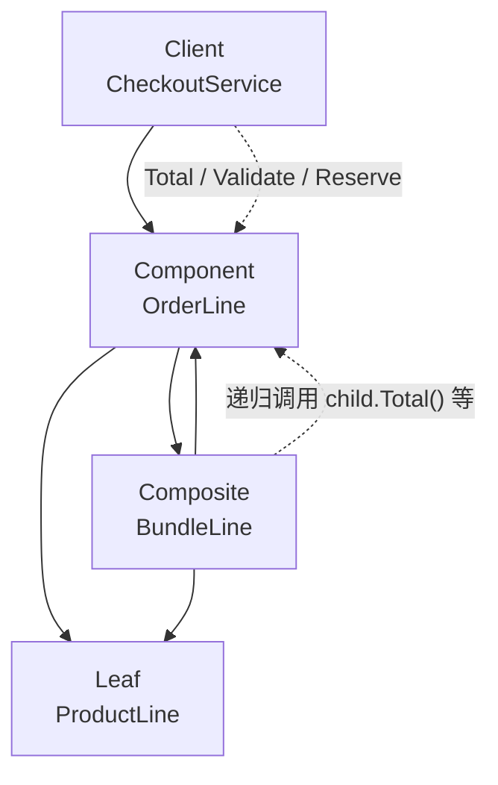

**组合模式**（Composite）提供一种 **把单个对象与对象组合成树形结构，并对外提供统一接口** 的方式，使 **客户端不必区分「叶子节点」还是「容器节点」**：对整棵订单明细树调用 `Total()`、`Validate()`、`ReserveInventory()` 时，组合节点把请求 **递归** 转发给子节点，叶子节点执行具体逻辑。

下文继续使用「电商订单系统」，但问题已经不是 **把第三方 SDK 接成 `PaymentProcessor`**（适配器），也不是 **把支付请求形态与支付后端拆开**（桥接）。现在订单里既有 **单件商品**，也有 **套餐 / 礼盒**（内含多件子商品，子套餐还可以再嵌套）。本文关注 **如何让结算、校验、扣库存等操作在整棵明细树上用同一套接口递归执行**，而不是在每个业务方法里写一遍 `if bundle { … } else { … }`。

## 问题

订单明细天然是 **树形结构**：一行可能是单个 SKU，也可能是「春节礼盒」——里面 3 个单品 + 1 个子套餐。结算、优惠券分摊、库存预占都要 **遍历这棵树**。

若没有统一抽象，业务代码会在 **每种操作** 里重复分支与递归：

```go
type CartItem struct {
    Kind     string // "product" | "bundle"
    SKU      string
    Quantity int
    UnitPrice int64
    Children []CartItem
}

func cartTotal(items []CartItem) int64 {
    var sum int64
    for _, item := range items {
        switch item.Kind {
        case "product":
            sum += item.UnitPrice * int64(item.Quantity)
        case "bundle":
            sum += bundleTotal(item.Children) // 每种操作都要写一遍递归
        }
    }
    return sum
}

func validateCart(items []CartItem) error {
    for _, item := range items {
        switch item.Kind {
        case "product":
            if item.SKU == "" {
                return fmt.Errorf("missing sku")
            }
        case "bundle":
            if len(item.Children) == 0 {
                return fmt.Errorf("empty bundle")
            }
            if err := validateCart(item.Children); err != nil {
                return err
            }
        default:
            return fmt.Errorf("unknown kind: %q", item.Kind)
        }
    }
    return nil
}
```

再来 **预占库存**、**分摊优惠券**、**导出明细 JSON**，每种都要复制类似的 `switch` + 递归：

1. **类型分支散落各处**：`Total`、`Validate`、`Reserve` 各自维护一套 `product` / `bundle` 判断，改一种明细类型（如加「赠品行」）要改 **所有** 方法，违反 [开闭原则](/cs-fundamentals/design-patterns#设计原则)。
2. **客户端被迫认识树结构**：`CheckoutService` 要知道「套餐里还有子套餐」，无法只调 `line.Total()` 就拿到整单金额。
3. **递归逻辑重复且易错**：深度嵌套时，有的方法忘了递归、有的多递归一层，bug 难查。
4. **违反单一职责与针对接口编程**：结算服务既管 **业务流程**，又管 **树怎么遍历**；无法对「整棵明细树」注入 mock 做单元测试。
5. **与适配器 / 桥接的分工错位**：接口已经接好、支付维度也拆开了，但 **订单内容本身是树**——问题出在 **没有统一的组件抽象**，而不是创建或桥接。

本质矛盾是：**部分-整体层次** 在业务里客观存在，客户端却 **不能** 用同一套接口对待「单个明细」和「明细组合」。

## 意图

用一句话说：**将对象组合成树形结构以表示「部分-整体」层次，并使得客户端对单个对象和组合对象的使用具有一致性。**

把 **订单明细** 抽象成 `OrderLine`（Component）：无论是 **单品行**（Leaf）还是 **套餐行**（Composite），都实现同一组方法。客户端（如 `CheckoutService`）只持有 `[]OrderLine` 或根节点，调用 `Total()` 时 **不必** 知道底下是 1 个 SKU 还是 10 层嵌套礼盒。

GoF 从 **结构** 角度的定义：

> 将对象组合成树形结构以表示「部分-整体」的层次结构。组合模式使得用户对单个对象和组合对象的使用具有一致性。

### 和适配器、桥接有啥不同

三者都可能出现「A 持有 B」，但 **动机** 不同：

| | 组合 | 适配器 | 桥接 |
| :--- | :--- | :--- | :--- |
| **结构形态** | **树**：Composite 持有 **多个** 同接口子节点 | **平接**：Adapter 持有 **一个** 不兼容 Adaptee | **两层**：Abstraction 持有 **一个** Implementor |
| **你在解决什么** | **部分-整体** 层次，客户端 **统一** 对待叶子与容器 | 已有接口 **翻译** 成目标接口 | **两个独立变化维度** 拆分 |
| **典型操作** | `Total()` 递归汇总子节点 | `Pay()` 映射为 `ChargeCard()` | `Checkout()` 委托 `backend.Charge()` |

组合常与 [生成器模式](/cs-fundamentals/design-patterns/builder) **配合**：Builder 一步步拼出 `Order`，其中套餐节点用 Composite 组装子行；与 [桥接模式](/cs-fundamentals/design-patterns/bridge) **正交**：明细树管 **订单里有什么**，桥接管 **怎么提交、走哪个支付后端**。

> **命名说明**
>
> - **透明组合**（本文）：Leaf 与 Composite **同一接口**，客户端完全不区分——Go 里常用 `OrderLine` 接口 + `ProductLine` / `BundleLine`。
> - **安全组合**（GoF 变体）：Composite 有 `Add`/`Remove`，Leaf 没有——客户端若要对 **容器** 做结构编辑，需区分类型；只读遍历场景用透明组合更简单。
> - **组合 vs 装饰器**：组合表达 **is-part-of** 树（礼盒 **包含** 商品）；装饰器表达 **has-a** 包装链（同一接口上叠加重试、日志）。见后文 [组装实践 · 与装饰器的区别](#与装饰器的区别)。

## 解决方案

定义 **组件** 接口 `OrderLine`，让 **叶子**（单品）与 **组合**（套餐）都实现它；组合体在 `Total`、`Validate` 等方法里 **遍历 children 并聚合结果**。

### 组件（Component）

```go
type OrderLine interface {
    Total() int64
    Validate() error
    ReserveInventory() error
}
```

客户端只依赖这一接口，不依赖具体是 `ProductLine` 还是 `BundleLine`。

### 叶子（Leaf）

```go
type ProductLine struct {
    SKU      string
    Name     string
    Quantity int
    UnitPrice int64
}

func (p ProductLine) Total() int64 {
    return p.UnitPrice * int64(p.Quantity)
}

func (p ProductLine) Validate() error {
    if p.SKU == "" {
        return fmt.Errorf("product line: missing sku")
    }
    if p.Quantity <= 0 {
        return fmt.Errorf("product line %s: invalid quantity", p.SKU)
    }
    return nil
}

func (p ProductLine) ReserveInventory() error {
    return inventory.Reserve(p.SKU, p.Quantity)
}
```

### 组合（Composite）

```go
type BundleLine struct {
    BundleID string
    Name     string
    Children []OrderLine
}

func (b BundleLine) Total() int64 {
    var sum int64
    for _, child := range b.Children {
        sum += child.Total()
    }
    return sum
}

func (b BundleLine) Validate() error {
    if b.BundleID == "" {
        return fmt.Errorf("bundle line: missing bundle id")
    }
    if len(b.Children) == 0 {
        return fmt.Errorf("bundle %s: empty children", b.BundleID)
    }
    for _, child := range b.Children {
        if err := child.Validate(); err != nil {
            return err
        }
    }
    return nil
}

func (b BundleLine) ReserveInventory() error {
    for _, child := range b.Children {
        if err := child.ReserveInventory(); err != nil {
            return err
        }
    }
    return nil
}
```

### 客户端

```go
type CheckoutService struct {
    lines []OrderLine
}

func (svc *CheckoutService) Checkout() error {
    var amount int64
    for _, line := range svc.lines {
        if err := line.Validate(); err != nil {
            return err
        }
        if err := line.ReserveInventory(); err != nil {
            return err
        }
        amount += line.Total()
    }
    return charge(amount)
}
```

组装一棵 **嵌套礼盒** 时，客户端仍只调 `Total()`——递归发生在 `BundleLine` 内部：

```go
giftBox := BundleLine{
    BundleID: "gift-2026",
    Name:     "春节礼盒",
    Children: []OrderLine{
        ProductLine{SKU: "tea-001", Quantity: 1, UnitPrice: 8800},
        BundleLine{
            BundleID: "snack-pack",
            Name:     "零食小包",
            Children: []OrderLine{
                ProductLine{SKU: "nut-002", Quantity: 2, UnitPrice: 1500},
            },
        },
    },
}

svc := &CheckoutService{lines: []OrderLine{giftBox, ProductLine{SKU: "book-99", Quantity: 1, UnitPrice: 4500}}}
_ = svc.Checkout() // 11800，无需 if bundle
```

新增 **赠品行**、**虚拟 bundle** → 新实现 `OrderLine`，`CheckoutService` **不必改**。

## 结构

| 角色 | 代码里是谁 | 管什么 |
| :--- | :--- | :--- |
| **组件**（Component） | `OrderLine` | 叶子与组合的统一接口 |
| **叶子**（Leaf） | `ProductLine` | 不可再分的明细，执行具体 I/O |
| **组合**（Composite） | `BundleLine` | 持有 `[]OrderLine`，递归聚合/转发 |
| **客户端**（Client） | `CheckoutService` | 只依赖 `OrderLine`，遍历根列表 |



**运行时** 对礼盒调用 `Total()`：

```go
giftBox.Total()
// → child[0].Total()                    // ProductLine: 8800
// → child[1].Total()                    // BundleLine
//     → grandchild[0].Total()           // ProductLine: 3000
// → 8800 + 3000 = 11800
```

### 和 GoF 术语的对应（选读）

| GoF 叫法 | 本文代码 | 一句话 |
| :--- | :--- | :--- |
| Component | `OrderLine` | 统一接口 |
| Leaf | `ProductLine` | 叶子，无子节点 |
| Composite | `BundleLine` | 容器，持有子 Component |
| Client | `CheckoutService` | 只通过 Component 操作树 |

Go 无继承：`BundleLine` 与 `ProductLine` **各自实现** `OrderLine`；子节点类型是 `OrderLine` 接口，天然支持任意深度嵌套。

## 适用场景

1. **部分-整体层次稳定且需统一操作**：订单明细、菜单（含子菜单）、组织架构、文件系统（文件/目录）、UI 组件树（面板含按钮含子面板）。
2. **客户端应忽略组合与个体的差异**：结算只调 `Total()`，不关心底下几层 bundle。
3. **对整棵树做同一类遍历**：校验、计价、库存、权限检查、序列化——接口一致，Composite 负责递归。
4. **结构可能动态变化**：购物车增删子行、重组套餐——在 Composite 上 `Add`/`Remove`（安全组合）或重建 `Children` 切片。
5. **与生成器 / 工厂组合建树**：[生成器](/cs-fundamentals/design-patterns/builder) 产出 `ProductLine`，工厂方法创建预设 `BundleLine` 模板。

**不必强行使用**：

- 只有 **一层** 列表、永远不会有嵌套——`[]ProductLine` 直接循环更简单。
- 叶子与组合 **行为差异很大**（组合能打折、叶子不能）且客户端 **必须** 区分——硬套同一接口会让 Leaf 实现空方法或 panic，考虑拆接口或用访问者模式。
- 需要的是 **两个变化维度独立扩展**（如支付形态 × 支付后端）——那是 [桥接](/cs-fundamentals/design-patterns/bridge)，不是组合。
- 树很深且 **操作类型很多、组件类型相对固定**——可考虑 **访问者模式** 把新操作从 Component 接口上挪走，避免 `OrderLine` 接口越来越胖（见 [组装实践 · 接口膨胀与访问者](#接口膨胀与访问者)）。

常见例子：购物车明细树、文档大纲、图形编辑器（Group + Shape）、权限树、配置 JSON 的嵌套对象模型。

## 优缺点

| 优点 | 说明 |
| :--- | :--- |
| **开闭** | 新明细类型 = 新 `OrderLine` 实现，Client 与已有 Leaf/Composite 少改 |
| **单一职责** | 遍历与聚合在 `BundleLine`；单品逻辑在 `ProductLine`；结算在 `CheckoutService` |
| **客户端简化** | 无 `switch kind`，统一调 `Total()` / `Validate()` |
| **递归自然** | 嵌套深度任意，结构自相似 |
| **符合合成复用** | 套餐 **组合** 子行，而非用继承堆 `GiftBox extends Product` |

| 缺点 | 说明 |
| :--- | :--- |
| **接口可能过宽** | 透明组合下 Leaf 也要实现 Client 用不到的方法（或留空） |
| **类型约束弱** | 运行时才能把「空 bundle」拦在 `Validate`；编译期难禁止 Leaf 被 `Add` 子节点 |
| **深树性能** | 每次 `Total` 全树遍历；极大购物车需缓存或增量维护 |
| **过度设计风险** | 扁平 SKU 列表套 Composite 多一层 indirection |

## 组装实践

> **阅读提示**：先掌握「`OrderLine` 接口 + Leaf/Composite 实现 + Client 只调接口」即可。本节是工程变体；初学可先跳过。

### 用生成器 / 工厂组装树

明细树常在 **下单前** 由 Builder 或工厂拼好，再交给 `CheckoutService`：

```go
func NewSpringGiftBox() OrderLine {
    return BundleLine{
        BundleID: "gift-2026",
        Name:     "春节礼盒",
        Children: []OrderLine{
            ProductLine{SKU: "tea-001", Quantity: 1, UnitPrice: 8800},
            NewSnackPack(), // 子工厂返回嵌套 BundleLine
        },
    }
}

func buildOrderFromBuilder(b *OrderBuilder) []OrderLine {
    order := b.Build()
    lines := make([]OrderLine, len(order.Items))
    for i, item := range order.Items {
        lines[i] = ProductLine{SKU: item.SKU, Quantity: item.Qty, UnitPrice: item.Price}
    }
    return lines
}
```

**构建树**（Builder/工厂）与 **遍历树**（Composite Client）分层：Builder 知道 SKU 与 bundle 模板；Checkout 只认 `OrderLine`。

### 安全组合：结构编辑 API

若购物车 UI 需要 **增删子行**，可把编辑方法只放在 Composite 上（或单独 `LineMutator` 接口）：

```go
type MutableBundle interface {
    OrderLine
    Add(child OrderLine)
    Remove(sku string) bool
}

func (b *BundleLine) Add(child OrderLine) {
    b.Children = append(b.Children, child)
}
```

Client 若 **只读结算**，仍依赖 `OrderLine`；编辑模块依赖 `MutableBundle`，避免 Leaf 实现无意义的 `Add`。

### 与装饰器的区别

| | 组合 | 装饰器 |
| :--- | :--- | :--- |
| 关系 | **部分-整体**，子节点是 **内容** | **包装**，内外 **同一接口** |
| 结构 | 树，一个 Composite 多个 child | 链，一层包一层 |
| 目的 | 统一对待 **整棵明细** | **增强** 单行行为（折扣、日志） |
| 例子 | 礼盒包含茶叶 + 零食包 | `DiscountLine{inner: ProductLine{...}}` 在 `Total()` 里打折 |

可叠加：`BundleLine` 的 child 可以是 `DiscountLine{inner: ProductLine{...}}`，只要 `DiscountLine` 也实现 `OrderLine`。

### 与迭代器 / 扁平化

报表、物流拆单有时需要 **扁平 SKU 列表**。在 Composite 上提供 **访问者** 或 `Walk(func(OrderLine))`，而不是让 Client 手写递归：

```go
func Walk(line OrderLine, fn func(OrderLine)) {
    fn(line)
    if b, ok := line.(BundleLine); ok {
        for _, child := range b.Children {
            Walk(child, fn)
        }
    }
}
```

Go 1.18+ 也可用泛型辅助函数收集所有 `ProductLine`，避免业务里复制遍历逻辑。

### 接口膨胀与访问者

当 `OrderLine` 上要加 `ExportJSON`、`ApplyCoupon`、`CalcTax` 等 **很多种** 操作时，Component 接口会 **越来越胖**，每个 Leaf/Composite 都要改。

两种缓解：

1. **拆小接口**：`Pricer`、`Validator`、`InventoryHolder`——Client 按需组合约束。
2. **访问者模式**（后续模式）：新操作 = 新 Visitor，Component 只保留 `Accept(Visitor)`。

小项目 **3～5 个方法** 留在 `OrderLine` 即可；方法超过 ~7 个且还在涨，再考虑访问者。

### 错误聚合与部分失败

`ReserveInventory` 递归时，若希望 **尽量预占、并汇总失败 SKU**：

```go
func (b BundleLine) ReserveInventory() error {
    var errs []error
    for _, child := range b.Children {
        if err := child.ReserveInventory(); err != nil {
            errs = append(errs, err)
        }
    }
    return errors.Join(errs...)
}
```

策略（全失败才回滚 vs 部分成功）属于业务规则，Composite 只负责 **把递归与聚合方式集中在一处**。

## 小结

记住这四点即可：

1. **部分-整体是树 → 组合**：单品与套餐都实现同一 `OrderLine`，Client 不写 `if bundle`。
2. **Composite 递归、Leaf 干活**：`BundleLine.Total()` 汇总子节点；`ProductLine.Total()` 算本行。
3. **与适配器、桥接正交**：组合管 **订单里有什么**；适配器管 **接口翻译**；桥接管 **两维独立变化**。
4. **注意接口别无限变胖**：只读遍历用透明组合；操作暴增时拆接口或访问者。

[桥接模式](/cs-fundamentals/design-patterns/bridge) 把 **支付请求形态与支付后端** 拆开；组合模式把 **订单明细的树形结构** 与 **结算/校验/库存** 的调用方式统一。放回电商订单系统这条主线：明细从扁平 SKU 长成嵌套套餐时，用组合让 `CheckoutService` 始终只面对 `OrderLine`。

## 参考阅读

- [x] [生成器模式](/cs-fundamentals/design-patterns/builder) — 分步构建订单，可与 Composite 组装明细树
- [x] [桥接模式](/cs-fundamentals/design-patterns/bridge) — 支付维度拆分，与明细树结构正交
- [x] [Refactoring.Guru - 组合模式](https://refactoringguru.cn/design-patterns/composite) (2026-06-22)
- [x] [菜鸟教程 - 组合模式](https://www.runoob.com/design-pattern/composite-pattern.html) (2026-06-22)
