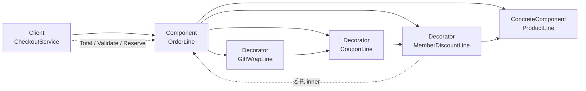

**装饰器模式**（Decorator）提供一种 **在不改原对象类的前提下，动态地给对象叠加额外行为** 的方式：装饰器与被装饰对象 **实现同一接口**，内部 **持有** 一个同接口的 `inner`，在转发调用前后插入折扣、日志、重试等逻辑；客户端仍只依赖该接口，可按需 **一层层包装** 出不同组合。

下文继续用「电商订单系统」：同一行明细可能要叠加会员价、优惠券、礼品包装费、运费险等可选增强，且每种能力可单独开关、多层组合——若用子类穷举每一种组合，结算逻辑将难以保持统一调用 `line.Total()`。

## 问题

[组合模式](/cs-fundamentals/design-patterns/composite) 让 `ProductLine` 与 `BundleLine` 都实现 `OrderLine`，`CheckoutService` 可以统一遍历。但当 **单行** 上要叠加多种 **可选、可组合** 的增强时，若用 **继承穷举**，类数会再次爆炸：

```go
type ProductLine struct { /* 基础单品 */ }

type MemberProductLine struct { ProductLine }      // 会员价
type CouponProductLine struct { ProductLine }       // 优惠券
type GiftWrapProductLine struct { ProductLine }     // 礼品包装

// 会员 + 优惠券 + 礼品包装 → 又要一个类
type MemberCouponGiftWrapProductLine struct { /* … */ }
```

业务组装也会变成巨型 `switch`：

```go
func buildLine(sku string, member, coupon, giftWrap bool) OrderLine {
    switch {
    case member && coupon && giftWrap:
        return MemberCouponGiftWrapProductLine{SKU: sku}
    case member && coupon:
        return MemberCouponProductLine{SKU: sku}
    // … 2^N 种组合
    default:
        return ProductLine{SKU: sku}
    }
}
```

再来 **满减分摊**、**积分抵扣**、**行级日志**，每种都要么加子类、要么改 `ProductLine` 本体：

1. **组合爆炸回归**：`基础类型数 × 可选增强数` 若用继承表达，仍是乘法；违反 [开闭原则](/cs-fundamentals/design-patterns#设计原则)——加一种「运费险」要新增多个组合子类。
2. **增强与核心职责缠在一起**：`ProductLine` 既要算 SKU 单价，又要管会员折扣规则、又要管礼品盒费用，违反 **单一职责**。
3. **运行时无法灵活拆装**：大促只开优惠券、关礼品包装——继承树在编译期就定死了组合，配置层难以 `enableGiftWrap=false` 就拆掉一层。
4. **与组合的分工错位**：组合解决 **树形部分-整体**；单行上的 **可叠加增强** 不是「再挂一个 child」，而是 **包装同一接口**。
5. **测试困难**：想单测「优惠券怎么改 `Total()`」必须构造带会员、礼品包装的巨型子类，而不是只包一层 `CouponLine`。

本质矛盾是：**同一接口上的多种横切增强** 需要 **动态组合**，却用 **静态继承** 或 **改基础类** 来表达。

## 意图

用一句话说：**动态地给对象添加一些额外的职责，就增加功能来说，装饰器比生成子类更为灵活。**

把 **基础明细** 当作 `OrderLine` 的具体组件（Concrete Component），把 **会员折扣、优惠券、礼品包装费** 做成装饰器（Decorator）：每个装饰器 **实现** `OrderLine`，**持有** `inner OrderLine`，在 `Total()` 里先调 `inner.Total()` 再调整金额。客户端组装时 **按需套娃**：

```go
line := GiftWrapLine{
    Fee: 500, 
    Inner: CouponLine{
        Off: 1000, 
        Inner: ProductLine{
            SKU: "tea-001", 
            UnitPrice: 8800, 
            Quantity: 1,
        },
    },
}
```

GoF 从 **结构** 角度的定义：

> 动态地给一个对象添加一些额外的职责。就增加功能来说，装饰器模式比生成子类更为灵活。

### 和组合、桥接、适配器有啥不同

四者都可能「A 持有 B」，但 **动机** 不同：

| | 装饰器 | 组合 | 桥接 | 适配器 |
| :--- | :--- | :--- | :--- | :--- |
| **结构形态** | **链**：一层包一层，同接口 | **树**：一个 Composite 多个 child | **两层**：抽象 × 实现 | **平接**：翻译一个 Adaptee |
| **你在解决什么** | **动态叠加** 同一接口上的增强 | **部分-整体** 统一遍历 | **两个独立变化维度** 拆分 | **接口不兼容** 的翻译 |
| **典型操作** | `Total()` 先委托 `inner` 再调价 | `Total()` 递归汇总 children | `Checkout()` 委托 `backend.Charge()` | `Pay()` 映射为 `ChargeCard()` |
| **关系语义** | **has-a** 包装，增强外观 | **is-part-of** 包含子明细 | 抽象 **拥有** 实现 | 适配 **现有** 组件 |

#### 装饰器像「只有一个子节点的 Bundle」吗？

**代码形态** 很像：都实现同一接口，都通过委托往下调。但 **问的问题不一样**：

| | 组合（Bundle） | 装饰器 |
| :--- | :--- | :--- |
| **在回答** | 这一行 **由哪些独立明细组成**？ | 这一行 **还是原来那行**，外面叠了哪些规则？ |
| **拓扑** | 1 → **N**（兄弟并列），树 | 1 → **1**（单链），链表 |
| **递归在干什么** | **汇总** 多个 peer：`sum += child.Total()` | **变换** 同一条 spine：`transform(inner.Total())` |
| **业务实体数** | 礼盒里 2 个 SKU = **2 件商品** | 茶叶 + 券 + 包装 = **还是 1 行茶叶** |
| **拆掉外层** | 少一个 child = 少一件商品 | 去掉 `CouponLine` = 还是那行茶叶，只是不再打折 |

用同一棵明细树看差异最直观：

```go
// 组合：礼盒 *包含* 茶叶和杯子——两件独立商品，库存各预占各的
bundle := BundleLine{
    Children: []OrderLine{
        ProductLine{SKU: "tea-001", Quantity: 1, UnitPrice: 8800},
        ProductLine{SKU: "cup-002", Quantity: 1, UnitPrice: 3200},
    },
}
// bundle.Total() → 8800 + 3200；Reserve 要 Reserve 两个 SKU

// 装饰：还是一行茶叶，会员折 + 券 + 包装费是 *套在外面* 的规则
decorated := GiftWrapLine{
    Fee: 500,
    Inner: CouponLine{
        Off: 1000,
        Inner: ProductLine{SKU: "tea-001", Quantity: 1, UnitPrice: 8800},
    },
}
// decorated.Total() → 对 *同一个* tea 逐层算价；Reserve 只 Reserve tea-001
```

若强行把优惠券当成组合的「子节点」，会变成：

```go
BundleLine{Children: []OrderLine{
    ProductLine{SKU: "tea-001", ...},
    AdjustmentLine{Amount: -1000}, // 假装礼盒里「有一件负价商品」
}}
```

能算出钱，但语义错了：优惠券 **不是** 订单里的一件货——列表展示会多出一行、满减分摊会把它当 SKU、预占库存也不知道该怎么对 `AdjustmentLine` 调 `Reserve`。组合要求每个 child 都是 **可独立存在的明细**；装饰器的中间层 **离开 inner 就没有业务意义**。

所以：**不是「能不能递归」的区别，而是「递归是在合并多个独立部分，还是在变换同一个对象」**。结构上你当然可以把装饰链写成 `BundleLine{Children: []OrderLine{inner}}` 这种单子节点 bundle，但那样只是把链表硬塞进树里，意图仍然应该是装饰——除非那个 child 在业务上真的是另一件商品。

装饰常与 [组合](/cs-fundamentals/design-patterns/composite) **叠加**：`BundleLine` 的 child 可以是 `CouponLine{inner: ProductLine{...}}`；与 [桥接](/cs-fundamentals/design-patterns/bridge) **正交**：桥接管支付维度，装饰器管 **单行计价增强**。支付侧同样可用装饰器：`RetryProcessor` 包装 `AlipayProcessor`，那是 **对 `PaymentProcessor` 的增强**，不是订单明细树。

> **命名说明**
>
> - **装饰器 vs 子类**：子类在编译期固定「是一种带会员价的商品」；装饰器在运行时叠「外面套优惠券、再套礼品盒」。
> - **装饰器 vs 责任链**：责任链常 **不确定** 谁处理请求；装饰器 **每层都参与**，且 **保证** 最终会调到最内层组件。

## 解决方案

定义与 [组合模式](/cs-fundamentals/design-patterns/composite) 相同的 **组件** 接口 `OrderLine`；**具体组件** 实现基础逻辑；**装饰器** 持有 `inner OrderLine` 并实现同一接口，在方法里 **先委托、再增强**。

### 组件（Component）

```go
type OrderLine interface {
    Total() int64
    Validate() error
    ReserveInventory() error
}
```

`CheckoutService` 只依赖这一接口——与组合模式一致。

### 具体组件（Concrete Component）

```go
type ProductLine struct {
    SKU       string
    Name      string
    Quantity  int
    UnitPrice int64
}

func (p ProductLine) Total() int64 {
    return p.UnitPrice * int64(p.Quantity)
}

func (p ProductLine) Validate() error {
    if p.SKU == "" {
        return fmt.Errorf("product line: missing sku")
    }
    if p.Quantity <= 0 {
        return fmt.Errorf("product line %s: invalid quantity", p.SKU)
    }
    return nil
}

func (p ProductLine) ReserveInventory() error {
    return inventory.Reserve(p.SKU, p.Quantity)
}
```

### 装饰器（Decorator）

Go 无抽象装饰器基类，常用 **嵌入 `inner OrderLine` 的 struct** 表达「这是包装层」；各具体装饰器实现自己的增强逻辑：

```go
type MemberDiscountLine struct {
    Inner      OrderLine
    DiscountBP int // 万分比，例如 9500 = 95 折
}

func (d MemberDiscountLine) Total() int64 {
    base := d.Inner.Total()
    return base * int64(d.DiscountBP) / 10000
}

func (d MemberDiscountLine) Validate() error {
    return d.Inner.Validate()
}

func (d MemberDiscountLine) ReserveInventory() error {
    return d.Inner.ReserveInventory()
}

type CouponLine struct {
    Inner OrderLine
    Off   int64 // 固定减免，单位：分
}

func (c CouponLine) Total() int64 {
    total := c.Inner.Total()
    if total <= c.Off {
        return 0
    }
    return total - c.Off
}

func (c CouponLine) Validate() error {
    return c.Inner.Validate()
}

func (c CouponLine) ReserveInventory() error {
    return c.Inner.ReserveInventory()
}

type GiftWrapLine struct {
    Inner OrderLine
    Fee   int64
}

func (g GiftWrapLine) Total() int64 {
    return g.Inner.Total() + g.Fee
}

func (g GiftWrapLine) Validate() error {
    return g.Inner.Validate()
}

func (g GiftWrapLine) ReserveInventory() error {
    return g.Inner.ReserveInventory()
}
```

未增强的方法 **原样转发** 给 `inner`——装饰器只改它关心的那一两个方法（这里是 `Total()`），库存仍由最内层 `ProductLine` 决定。

### 客户端与组装

```go
type CheckoutService struct {
    lines []OrderLine
}

func (svc *CheckoutService) Checkout() error {
    var amount int64
    for _, line := range svc.lines {
        if err := line.Validate(); err != nil {
            return err
        }
        if err := line.ReserveInventory(); err != nil {
            return err
        }
        amount += line.Total()
    }
    return charge(amount)
}
```

组装层按配置 **套装饰器**，不必为每种组合建类：

```go
func buildTeaLine(cfg LineConfig) OrderLine {
    line := OrderLine(ProductLine{
        SKU: "tea-001", Name: "春茶", Quantity: 1, UnitPrice: 8800,
    })
    if cfg.MemberDiscountBP > 0 {
        line = MemberDiscountLine{Inner: line, DiscountBP: cfg.MemberDiscountBP}
    }
    if cfg.CouponOff > 0 {
        line = CouponLine{Inner: line, Off: cfg.CouponOff}
    }
    if cfg.GiftWrap {
        line = GiftWrapLine{Inner: line, Fee: 500}
    }
    return line
}

// 会员 95 折 + 满 10 减 10 + 礼品盒 5 元 → 8800*0.95 - 1000 + 500 = 7860
line := buildTeaLine(LineConfig{MemberDiscountBP: 9500, CouponOff: 1000, GiftWrap: true})
svc := &CheckoutService{lines: []OrderLine{line}}
_ = svc.Checkout()
```

新增 **积分抵扣** → 只加 `PointsLine` 装饰器，`CheckoutService` **不必改**。

## 结构

| 角色 | 代码里是谁 | 管什么 |
| :--- | :--- | :--- |
| **组件**（Component） | `OrderLine` | 装饰器与具体组件的统一接口 |
| **具体组件**（Concrete Component） | `ProductLine` | 核心明细逻辑，可被装饰 |
| **装饰器**（Decorator） | `MemberDiscountLine`、`CouponLine`、`GiftWrapLine` | 持有 `inner`，委托并增强 |
| **客户端**（Client） | `CheckoutService`、组装函数 | 只依赖 `OrderLine`，在组装层套娃 |



**运行时** 对套了三层的行调用 `Total()`：

```go
GiftWrapLine{Inner: CouponLine{Inner: MemberDiscountLine{Inner: ProductLine{UnitPrice: 8800, Quantity: 1}, DiscountBP: 9500}, Off: 1000}, Fee: 500}.Total()
// → GiftWrap: inner.Total() + 500
//     → Coupon: inner.Total() - 1000
//         → Member: inner.Total() * 9500 / 10000  // ProductLine: 8800 → 8360
//     → 7360
// → 7860
```

装饰顺序 **影响结果**（先打折再满减 vs 先满减再打折）——这是业务规则，应在组装层或文档里约定，而不是藏在 `ProductLine` 里。

### 和 GoF 术语的对应（选读）

| GoF 叫法 | 本文代码 | 一句话 |
| :--- | :--- | :--- |
| Component | `OrderLine` | 统一接口 |
| ConcreteComponent | `ProductLine` | 被装饰的核心对象 |
| Decorator | `MemberDiscountLine` 等 | 持有 Component，增强行为 |
| Client | `CheckoutService` | 只通过 Component 操作，组装层负责套娃 |

Go 无继承：每个装饰器 **独立 struct**，显式持有 `Inner OrderLine`；也可用 **函数式** 包装（见 [组装实践 · 函数式装饰](#函数式装饰)）。

## 适用场景

1. **多种可选增强可任意组合**：会员价、优惠券、包装费、税费、行级日志——用装饰器比 `2^N` 子类更可控。
2. **不能或不宜改原类**：`ProductLine` 已稳定、多处使用，新促销规则用外层装饰添加。
3. **增强可运行时拆装**：根据订单上下文在组装层决定是否 `GiftWrapLine`。
4. **符合开闭**：新增强 = 新装饰器类，不改已有 `ProductLine` 与其他装饰器。
5. **横切关注点**：支付 `PaymentProcessor` 的重试、指标、审计日志——装饰 `Pay` 前后逻辑。

**不必强行使用**：

- 增强 **固定且只有一种**（永远会员 95 折）——直接在 `ProductLine` 或组装时算一次更简单。
- 装饰层之间 **强依赖复杂状态机**（要读全局购物车才能算满减）——可能更适合 **领域服务** 或 **策略对象**，而不是一层层 `Total()` 嵌套。
- 结构是 **树形部分-整体**——用 [组合](/cs-fundamentals/design-patterns/composite)，不是装饰器。
- 两个 **独立变化维度成族扩展**——用 [桥接](/cs-fundamentals/design-patterns/bridge)。
- 接口 **根本不一致**——用 [适配器](/cs-fundamentals/design-patterns/adapter)。

常见例子：`io.Reader` / `io.Writer` 包装链（`bufio`、`gzip`、`encrypt`）、HTTP 中间件、`java.io` 流装饰、带缓存的 Repository 包装。

## 优缺点

| 优点 | 说明 |
| :--- | :--- |
| **开闭** | 新增强 = 新装饰器，少改 `ProductLine` 与 Client |
| **单一职责** | 会员折扣在 `MemberDiscountLine`，SKU 计价在 `ProductLine` |
| **运行时组合** | 组装层按配置套娃，无组合子类爆炸 |
| **符合合成复用** | 用 has-a 包装替代 is-a 继承堆叠 |
| **可叠加** | 多层装饰仍对外是一个 `OrderLine` |

| 缺点 | 说明 |
| :--- | :--- |
| **顺序敏感** | 折扣与满减叠加顺序影响金额，需明确约定 |
| **调试链较长** | `Total()` 要跳进多层 inner，栈深时读代码费力 |
| **小对象过多** | 每层装饰一个 struct，极高频路径要注意分配（可用函数式或合并装饰缓解） |
| **接口变宽时痛苦** | `OrderLine` 每加一个方法，所有装饰器都要转发——与组合相同，接口胖时考虑拆分 |
| **过度设计** | 只有一层固定加价时，单独字段比装饰器直接 |

## 组装实践

> **阅读提示**：先掌握「`OrderLine` + 持有 `inner` 的装饰器 + 组装层套娃」即可。本节是工程变体；初学可先跳过。

### 与组合叠加

套餐子行可以是「带装饰的单品」：

```go
giftBox := BundleLine{
    BundleID: "gift-2026",
    Children: []OrderLine{
        GiftWrapLine{
            Fee: 500,
            Inner: CouponLine{
                Off: 800,
                Inner: ProductLine{SKU: "tea-001", Quantity: 1, UnitPrice: 8800},
            },
        },
        ProductLine{SKU: "cup-002", Quantity: 1, UnitPrice: 3200},
    },
}
```

组合管 **树怎么遍历**；装饰器管 **某一节点上的增强**。`BundleLine.Total()` 仍递归 `child.Total()`，不关心 child 是裸 `ProductLine` 还是三层包装。

### 支付侧的同类用法

对 `PaymentProcessor` 做重试、日志，结构与订单行装饰相同：

```go
type PaymentProcessor interface {
    Pay(order Order) error
}

type RetryProcessor struct {
    Inner      PaymentProcessor
    MaxRetries int
}

func (r RetryProcessor) Pay(order Order) error {
    var err error
    for i := 0; i <= r.MaxRetries; i++ {
        if err = r.Inner.Pay(order); err == nil {
            return nil
        }
    }
    return err
}
```

可与 [桥接](/cs-fundamentals/design-patterns/bridge) 叠加：`CheckoutAPI` 桥接 `RetryBackend{inner: WeChatPayBackend{...}}`——桥接拆维度，装饰器加横切。

### 函数式装饰

Go 里也可用 **高阶函数** 减少装饰器 struct 数量（适合只改一个方法的场景）：

```go
type Pricer interface {
    Total() int64
}

func WithCoupon(inner Pricer, off int64) Pricer {
    return pricedFunc(func() int64 {
        t := inner.Total()
        if t <= off {
            return 0
        }
        return t - off
    })
}

type pricedFunc func() int64

func (f pricedFunc) Total() int64 { return f() }
```

完整 `OrderLine` 三个方法时，struct 装饰器通常 **更清晰**；仅 `Total()` 可变时函数式更轻。

### 顺序与可交换性

文档化 **组装顺序** 或在装饰器内声明优先级：

```go
// 约定：先会员折扣 → 再优惠券 → 最后礼品包装费（费用不参与折扣）
func DecorateLine(base OrderLine, cfg LineConfig) OrderLine {
    line := base
    if cfg.MemberDiscountBP > 0 {
        line = MemberDiscountLine{Inner: line, DiscountBP: cfg.MemberDiscountBP}
    }
    if cfg.CouponOff > 0 {
        line = CouponLine{Inner: line, Off: cfg.CouponOff}
    }
    if cfg.GiftWrap {
        line = GiftWrapLine{Inner: line, Fee: 500}
    }
    return line
}
```

复杂满减（跨行、满 300 减 50）不适合单行装饰器——放在 `CheckoutService` 或 **价格引擎** 统一算，单行装饰只处理 **行内** 逻辑。

### 与策略的区别

| | 装饰器 | 策略 |
| :--- | :--- | :--- |
| 意图 | **叠加** 多层行为，对外仍是一个 Component | **替换** 一种算法 |
| 结构 | 链式包装，每层都委托 inner | Context 持有一个 Strategy，通常 **互斥** |
| 例子 | 会员折 + 券 + 包装费层层套 | 「用平台券算法还是店铺券算法」二选一 |

若促销规则 **互斥**（只能用一种券），用策略；若 **可叠加**，用装饰器或显式 **价格管道**（pipeline）。

### 拆接口减轻转发负担

当只有部分装饰器关心 `ReserveInventory`，可拆小接口：

```go
type Pricer interface { Total() int64 }
type Validator interface { Validate() error }
type InventoryHolder interface { ReserveInventory() error }
```

装饰器只实现它改动的接口；`CheckoutService` 用类型断言或辅助函数组合约束。小项目 **3～5 个方法** 全转发即可。

### 透明性：装饰器是否暴露 inner

多数场景 **不暴露** `inner`，客户端只认最外层 `OrderLine`。若运营要「展示原价与实付」，可加 **可选** 方法或单独 `PriceBreakdown(line OrderLine)` 遍历装饰链——Go 可用 type switch 或 `interface{ Unwrap() OrderLine }` 约定。

## 小结

记住这四点即可：

1. **同一接口上可叠加增强 → 装饰器**：持有 `inner`，先委托再增强，避免 `2^N` 子类。
2. **组装层套娃、Client 不变**：`CheckoutService` 仍只调 `line.Total()`，顺序在组装函数里约定。
3. **与组合正交**：组合是树 **包含** 子行；装饰是 **包装** 单行；child 可以是装饰过的 `ProductLine`。
4. **别滥用**：跨行满减、复杂促销引擎不属于单行装饰；接口越来越胖时拆小接口或管道化。

[组合模式](/cs-fundamentals/design-patterns/composite) 统一了 **订单明细树** 的遍历；装饰器模式统一了 **单行上的可选增强** 如何动态组合。下一篇 [外观模式](/cs-fundamentals/design-patterns/facade) 关注 **下单用例** 如何穿过库存、支付、通知等子系统而不让每个入口重复编排。

## 参考阅读

- [x] [组合模式](/cs-fundamentals/design-patterns/composite) — 明细树与装饰器可叠加在行节点上
- [x] [桥接模式](/cs-fundamentals/design-patterns/bridge) — 支付维度拆分，与行级装饰正交
- [x] [Refactoring.Guru - 装饰器模式](https://refactoringguru.cn/design-patterns/decorator) (2026-06-22)
- [x] [菜鸟教程 - 装饰器模式](https://www.runoob.com/design-pattern/decorator-pattern.html) (2026-06-22)
