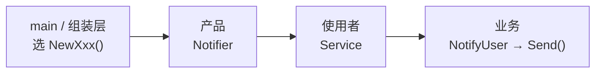

**工厂方法模式** 解决的是：业务代码需要对象时，**不要在业务里直接 `new` 具体类型**，而是把「造哪个对象」这件事拆出去，在程序 **启动时**（`main` 里）决定，业务只依赖统一接口。

打个比方：业务代码像「点外卖」——只关心「能送到就行」；选邮件、短信还是推送，在「下单前」定好，而不是每送一次消息再重新选平台。

下文用「通知模块」贯穿全文：根据配置向用户发邮件、短信或推送。

## 问题

业务代码经常需要 **创建对象**，最直接的做法是在用到的地方直接构造具体类型：

```go
func notifyUser(typ, message string) {
    if typ == "email" {
        notifier := &EmailNotifier{}
        notifier.Send(message)
    } else if typ == "sms" {
        notifier := &SmsNotifier{}
        notifier.Send(message)
    } else if typ == "push" {
        notifier := &PushNotifier{}
        notifier.Send(message)
    }
}
```

这种写法在类型少、逻辑简单时还能应付，但对象种类一多，问题就会暴露：

1. **调用方与具体类紧耦合**：`notifyUser` 必须知道 `EmailNotifier`、`SmsNotifier` 等每一个实现类的名字，并直接依赖它们的构造方式。新增一种通知渠道，就要改所有创建对象的代码。
2. **创建逻辑分散、重复**：具体类型构造和 `if/else` 散落在各处，同一套「按类型选实现」的规则被复制多遍，维护成本高。
3. **违反开闭原则**（对扩展开放、对修改关闭——加新功能尽量写新代码，少改旧代码）：扩展新类型意味着修改已有分支，而不是只增加新代码；容易引入回归。
4. **不利于测试与替换**：单元测试时难以注入 **mock**（测试用的假实现）；运行时切换实现（例如从 SMTP 换成第三方 API）也要改调用方。

本质矛盾是：**使用者只关心「拿到一个符合接口的对象并调用它」**，却不得不承担 **「如何构造具体对象」** 的细节。

## 意图

用一句话说：**把「创建对象」从业务代码里拆出去** ——业务只依赖统一接口（如 `Notifier`），具体用哪种实现，在程序启动时（**组装**阶段）决定。

在 Go 里通常这样做：

- 每种产品提供各自的 **构造函数**（如 `NewEmailNotifier()`），由它决定如何构造具体类型；
- **组装阶段**（`main` 或依赖注入工具里）选定调用哪个构造函数，把得到的 **产品** **注入**（从外部传进来，而不是在内部自己 `new`）业务代码；
- 业务代码只依赖 `Notifier` 等产品 **接口**（一组方法的约定；谁实现了这些方法，谁就算这种类型），不出现具体类型名和 `switch`；新增产品时 **新增构造函数**，在组装处换一行。

GoF（《设计模式》一书）的原文定义是：

> 定义一个创建对象的接口，让子类决定实例化哪一个类；工厂方法把类的实例化延迟到子类。

Java/C++ 里常写成 Creator 子类；**Go 没有继承**，用 `NewXxx()` 函数 + 注入代替「子类决定实例化」。

> **命名说明**
>
> - **简单工厂**：一个函数 + `switch` 选类型——常见写法，**不是** GoF 23 种模式之一。
> - **工厂方法**（本文）：每种产品一个 `NewXxx()`，选型挪到组装层——GoF 意义上的工厂方法模式。

## 解决方案

沿用通知模块的例子：先说明 **简单工厂** 及其局限，再给出 **工厂方法** 的完整解法。

### 前置：简单工厂

把 `if/else` 和构造逻辑收进一个工厂函数，是迈向工厂方法的第一步：

```go
// 产品接口：只要实现了 Send，就算是一种 Notifier
type Notifier interface {
    Send(message string)
}

type EmailNotifier struct{}

func (EmailNotifier) Send(message string) {
    // 发邮件…
}

type SmsNotifier struct{}

func (SmsNotifier) Send(message string) {
    // 发短信…
}

type PushNotifier struct{}

func (PushNotifier) Send(message string) {
    // 发推送…
}

func NewEmailNotifier() Notifier { return &EmailNotifier{} }
func NewSmsNotifier() Notifier   { return &SmsNotifier{} }
func NewPushNotifier() Notifier  { return &PushNotifier{} }

func NewNotifier(typ string) (Notifier, error) {
    switch typ {
    case "email":
        return NewEmailNotifier(), nil
    case "sms":
        return NewSmsNotifier(), nil
    case "push":
        return NewPushNotifier(), nil
    default:
        return nil, fmt.Errorf("unknown type: %s", typ)
    }
}

func notifyUser(typ, message string) error {
    notifier, err := NewNotifier(typ)
    if err != nil {
        return err
    }
    notifier.Send(message)
    return nil
}
```

这解决了调用方直接 `new` 的问题，但 **新增渠道仍要改 `NewNotifier` 的 `switch`**，工厂本身不满足 [开闭原则](/cs-fundamentals/design-patterns#设计原则)。工厂方法要做的，就是把这段 `switch` 从业务路径里拆掉，并把选型挪到 **组装层**（程序启动、`main` 里把各模块拼在一起的那一层）。

### 工厂方法

**核心变化**：每种渠道对应一个 **构造函数**（如 `NewEmailNotifier()`），在 **组装时** 调用一次，把得到的 `Notifier` 注入 `Service`。运行时 `Service` 只使用产品，不再传 `typ`。

```go
type Service struct {
    notifier Notifier // 组装时注入已创建好的产品
}

func (s *Service) NotifyUser(message string) error {
    s.notifier.Send(message)
    return nil
}
```

**组装根**（程序入口，通常是 `main`）决定渠道——构造函数在这里完成创建，选型发生在启动阶段：

```go
emailSvc := &Service{notifier: NewEmailNotifier()}
smsSvc  := &Service{notifier: NewSmsNotifier()}
pushSvc := &Service{notifier: NewPushNotifier()}
```

与简单工厂对比：

| | 简单工厂 | 工厂方法 |
| :--- | :--- | :--- |
| 谁决定渠道 | 每次调用传 `typ`，`NewNotifier` 内 `switch` | `main` 选用哪个 `NewXxx()` |
| 调用签名 | `notifyUser(typ, message)` | `NotifyUser(message)` |
| 新增微信渠道 | 改 `NewNotifier`，加 `case "wechat"` | 只加 `NewWeChatNotifier()`，组装处换一行 |

新增渠道时，工厂方法只需扩展，不必修改已有代码：

```go
type WeChatNotifier struct{}

func (WeChatNotifier) Send(message string) { /* 发微信… */ }

func NewWeChatNotifier() Notifier { return &WeChatNotifier{} }

wechatSvc := &Service{notifier: NewWeChatNotifier()}
```

> 若每次调用都需要 **新的产品实例**（例如带请求上下文的对象），见下文 [组装实践 · 注入构造函数](#注入构造函数)（进阶内容，初学可先跳过）。

## 结构

下面用表格把上一节三个角色再捋一遍（不是新概念，而是复习）：

| 角色 | 代码里是谁 | 管什么 |
| :--- | :--- | :--- |
| **产品** | `Notifier` 及其实现 | 业务真正要用的能力，比如 `Send()` |
| **工厂方法** | `NewEmailNotifier()` 等 | 负责构造并返回对应的产品 |
| **使用者** | `Service` | 只拿产品来用，不管产品从哪来 |

容易混的一点是：**创建** 和 **使用** 发生在两个不同阶段：



**启动 / 组装时**（`main`）：选好渠道，调构造函数，把造好的产品塞进 `Service`：

```go
emailSvc := &Service{notifier: NewEmailNotifier()}
//                   ↑ 这里注入           ↑ 这里创建
```

**运行时**（`NotifyUser`）：`Service` 只管调用，不再碰构造函数，也不再出现 `EmailNotifier` 这类具体名字：

```go
func (s *Service) NotifyUser(message string) error {
    s.notifier.Send(message) // 只知道这是个 Notifier
    return nil
}
```

和简单工厂的关键差别不在「有没有工厂」，而在 **谁决定造哪种产品**：简单工厂是运行时传 `typ`、函数里 `switch`；工厂方法是 **启动时** 在 `main` 里选定调用哪个 `NewXxx()`，业务代码从此不再参与选型。

### 和 GoF 术语的对应（选读）

读 Java 资料时可能会看到这些英文名，和本文 Go 代码的对应关系如下：

| GoF 叫法 | 本文代码 | 一句话 |
| :--- | :--- | :--- |
| Product | `Notifier` | 产品接口 |
| ConcreteProduct | `EmailNotifier` 等 | 具体产品 |
| Creator | `func() Notifier` 或含 `Create()` 的接口 | 工厂方法的抽象（Go 里常用函数签名表达） |
| ConcreteCreator | `NewEmailNotifier()` 等 | 具体工厂方法 |
| Client | `Service` | 只依赖产品接口的使用方 |

`main` 不算 GoF 里的 Client，它是 **组装根**：在程序入口完成「选构造函数 → 创建 → 注入」，之后 `Service` 就按普通业务代码运行了。

## 适用场景

以下几类情况适合用工厂方法，而不是在业务里直接 `new` 或堆 `switch`：

1. **实现会随环境变化**：例如日志写本地文件还是远程服务、通知走 SMTP 还是第三方 API、数据库驱动随部署切换——具体类型在启动时确定，运行时不变。
2. **需要扩展而不改旧代码**：新增一种渠道或后端，只加「产品 + `NewXxx()`」，符合 [开闭原则](/cs-fundamentals/design-patterns#设计原则)。
3. **创建过程有一定复杂度**：构造时需要读配置、建立连接、注入依赖，值得从业务逻辑里拆出去。
4. **测试要替换实现**：组装阶段注入 mock 的 `Notifier`，`Service` 本身不用改。

常见例子：多后端日志、可切换的数据库访问层、支持多种协议（HTTP / gRPC / WebSocket）的客户端框架。

**不必强行使用**：对象构造非常简单（无参数、无分支）、类型几乎不变、团队规模很小——直接 `&EmailNotifier{}` 往往更清晰。多个 `NewXxx()` 构造函数在简单场景下也属于过度设计。

## 优缺点

| 优点 | 说明 |
| :--- | :--- |
| **解耦** | 业务代码只依赖 `Notifier` 接口，不知道具体类型名 |
| **集中创建逻辑** | 每种产品的构造规则落在各自的 `NewXxx()` 里，不散落在各处 |
| **易扩展** | 加新产品 = 加一个 `NewXxx()`，不必改 `Service` 和已有构造函数 |
| **易测试** | 组装处可换成 mock 产品，或注入返回 mock 的构造函数 |

| 缺点 | 说明 |
| :--- | :--- |
| **构造函数变多** | 每种产品通常对应一个 `NewXxx()` |
| **间接层变多** | 读代码时要跳构造函数 → 产品，比直接 `new` 多一层 |
| **选型仍在某处发生** | `switch` 从业务里挪到了 `main` 或组装函数，并没有消失，只是换了个位置 |

## 组装实践

> **阅读提示**：先掌握上一节「在 `main` 里选 `NewXxx()` 并注入 `Service`」即可。本节是真实项目里的常见变体；若觉得信息量偏大，可先跳过，回头再读。

前文 `main` 里写死了 `NewEmailNotifier()`。实际项目里，组装根常见两种写法：**注入已创建好的产品**，或 **注入构造函数、用时再创建**。选型逻辑（包括配置里的 `switch`）都应停在这一层，不进入 `Service` 的业务方法。

### 按配置注入产品

选型来自配置或环境变量时，组装函数里仍可能出现 `switch`——这很正常：

```go
func NewServiceFromConfig(cfg Config) (*Service, error) {
    var notifier Notifier
    switch cfg.NotifierType {
    case "email":
        notifier = NewEmailNotifier()
    case "sms":
        notifier = NewSmsNotifier()
    case "push":
        notifier = NewPushNotifier()
    default:
        return nil, fmt.Errorf("unknown notifier: %q", cfg.NotifierType)
    }
    return &Service{notifier: notifier}, nil
}

// main
svc, err := NewServiceFromConfig(loadConfig())
```

看到这里很容易问：**这不还是 `switch` 吗？和简单工厂有什么区别？**

确实像——若只把 `NewNotifier(typ)` 拆成多个 `NewXxx()`，组装处仍留一个 `switch`，**形式上**和简单工厂很接近。价值不在于「消灭 `switch`」，而在于 **`switch` 挪到了哪里、动的是哪份代码**：

| | 简单工厂 | 工厂方法（本文） |
| :--- | :--- | :--- |
| `switch` 在哪 | `NewNotifier` 内部 | 组装函数 `NewServiceFromConfig` |
| 何时执行 | 每次 `notifyUser(typ, …)` 都可能走到 | 启动 / 组装时执行一次 |
| 业务代码 | 仍要传 `typ`，参与选型 | `NotifyUser(message)`，不再传 `typ` |
| 加微信渠道 | 改 `NewNotifier`，**动已有工厂函数** | 加 `NewWeChatNotifier()` + 组装处加一个 `case`，**不动** `Service` 和已有 `NewXxx()` |

开闭原则保护的是 **`Service` 和各产品的构造函数**——新增渠道不必改它们；组装处的 `switch` 仍要加一个分支，这是 **配置映射** 的成本，两种写法都逃不掉。

若各渠道构造参数不同（邮件要 SMTP 地址、短信要 API Key），简单工厂的 `NewNotifier(typ string)` 会迅速膨胀成一堆可选参数；拆成 `NewEmailNotifier(smtp string)`、`NewSmsNotifier(apiKey string)` 才划得来——这时「多个构造函数」不只是换皮，而是真的在分担各自的构造逻辑。

若连组装处的 `switch` 也想省掉，可以进一步用 **注册表**（`map[string]func() Notifier`，各包在 `init` 里注册），或 **按部署拆分**（邮件版、短信版各自独立的 `main`，配置文件里写死渠道）。那是工厂方法之上的工程选择，不是模式本身的必选项。

### 注入构造函数

若每次调用都需要 **新的产品实例**（例如每次通知都要新建一个带请求 ID、超时设置的对象），组装时只注入构造函数，在业务方法里再创建。

Go 里没有继承，可以 **注入 `func() Notifier`、在业务方法里调用**：

```go
type NotifyService struct {
    newNotifier func() Notifier // 注入构造函数，而非已创建好的产品
}

func (s *NotifyService) NotifyUser(message string) error {
    notifier := s.newNotifier() // 业务方法里创建
    notifier.Send(message)
    return nil
}

// 组装：传函数值，不要加括号
svc := &NotifyService{newNotifier: NewEmailNotifier}
```

按配置选型时，组装处选定构造函数再注入即可——`switch` 仍在组装层，逻辑与上一小节相同：

```go
func NewNotifyServiceFromConfig(cfg Config) (*NotifyService, error) {
    switch cfg.NotifierType {
    case "email":
        return &NotifyService{newNotifier: NewEmailNotifier}, nil
    case "sms":
        return &NotifyService{newNotifier: NewSmsNotifier}, nil
    default:
        return nil, fmt.Errorf("unknown notifier: %q", cfg.NotifierType)
    }
}
```

### 两种注入方式对比

| | 注入产品（`Service`） | 注入构造函数（`NotifyService`） |
| :--- | :--- | :--- |
| 组装处 | `notifier: NewEmailNotifier()` | `newNotifier: NewEmailNotifier` |
| 何时创建 | 组装时一次 | 每次 `NotifyUser` 调用时 |
| 适用 | 产品无状态、可复用同一实例 | 每次需要新实例（带请求上下文等） |
| 更接近 GoF | Client 与工厂方法分离 | 业务方法内调工厂方法 |

两种写法都是合法的工厂方法，按产品是否有状态、是否每次需要新实例来选。

## 小结

记住这三点即可：

1. **业务不传 `typ`**：`Service` 只调 `NotifyUser(message)`，不参与选型。
2. **每种产品一个 `NewXxx()`**：新增渠道 = 加产品 + 加构造函数，不必改 `Service`。
3. **`switch` 可以留在组装层**：从业务里挪走就有价值；不必强求「彻底消灭 `switch`」。

## 参考阅读

- [x] [Refactoring.Guru - 工厂方法模式](https://refactoringguru.cn/design-patterns/factory-method) (2026-06-17) — 与本文同名，Java 示例为主
- [x] [菜鸟教程 - 工厂模式](https://www.runoob.com/design-pattern/factory-pattern.html) (2026-06-17) — 标题写「工厂模式」，内容偏 **简单工厂**；读时注意与本文 **工厂方法** 区分
