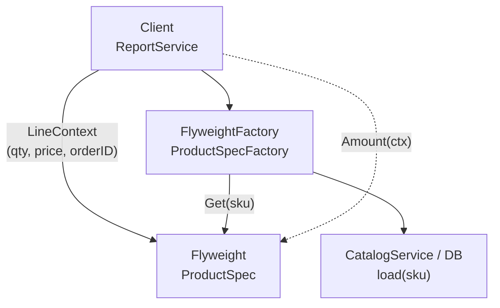

**享元模式**（Flyweight）运用 **共享技术** 支撑大量细粒度对象；能否奏效，取决于能否把对象状态拆成两类（Refactoring.Guru / GoF 的 intrinsic / extrinsic，下文统称 **内在 / 外在**——**不是** 泛指的「struct 里字段 vs struct 外字段」）：

- **内在状态**：对象的 **常量式** 数据——只随 **种类 / 键**（如 SKU、字符码、图标 id）变化，**不** 随「这一行出现在哪张订单里」变化；位于享元 **内部**，多处 **只读共享**（其他对象可读，不应原地修改）。
- **外在状态**：随 **使用情景** 变化、常可从 **外部** 改变的数据（如本行数量、成交价、订单 id、屏幕坐标）；**不** 存进享元，由客户端或 `LineContext` 持有，调用 `LineAmount(ctx)` 等方法时 **作为参数传入**。

**唯一划分规则：享元里只放内在，外在绝不写入享元。** 由于 **内在变体远少于外在变体**（商品种类有限，订单行组合却可成千上万），享元工厂可以按内在键缓存同一实例，从而大幅削减所需对象数量。

下文继续用「电商订单系统」：大促或批量导出时，同一 SKU 会出现在 **成千上万条** 订单明细里——若每条明细都 **完整拷贝** 商品名、类目、税码、重量、主图 URL 等 **与 SKU 绑定、与具体订单无关** 的字段，堆内存与 GC 压力会随订单量线性膨胀；而 [外观模式](/cs-fundamentals/design-patterns/facade) 编排下单、[组合模式](/cs-fundamentals/design-patterns/composite) 与 [装饰器模式](/cs-fundamentals/design-patterns/decorator) 解决的是 **结构与行为组合**，**不** 解决 **海量重复元数据** 的存储问题。

## 问题

`CheckoutService` 已能遍历 [组合](/cs-fundamentals/design-patterns/composite) 树与 [装饰器](/cs-fundamentals/design-patterns/decorator) 链做 `Total()`、`ReserveInventory()`。当系统要 **渲染订单列表、批量对账、导出百万行明细** 时，每条 `OrderLine` 若 **内嵌完整商品快照**，同一 `"tea-001"` 的 name、category、taxCode 会在内存里出现 **N 次**：

```go
type OrderLine struct {
    SKU         string
    ProductName string // 与 SKU 绑定，却在每条明细里各存一份
    Category    string
    TaxCode     string
    WeightGrams int
    ImageURL    string
    Quantity    int     // 外在状态：随本行订单变化
    UnitPrice   int64   // 外在状态：成交价随促销/订单变化
    OrderID     string  // 外在状态：所属订单
}

func loadOrderLines(orderIDs []string) []OrderLine {
    var lines []OrderLine
    for _, oid := range orderIDs {
        // 从 DB 反序列化：每行都带完整 ProductName、Category…
        lines = append(lines, fetchLinesForOrder(oid)...)
    }
    return lines // 10 万行 × 同一 SKU 重复 10 万份元数据
}
```

报表服务还要按类目汇总重量、按税码分组——若元数据散落在每条 line 里，**无法** 安全地按 SKU 去重缓存：

1. **内存随明细条数膨胀**：618 大促导出 500 万行，同一爆款 SKU 占 80% 行数，**重复字符串与 struct 字段** 占满堆；违反 **用空间换时间** 时也应 **有节制**——这里重复的是 **不变数据**，不是业务必需。
2. **内在 / 外在状态混在一起**：`ProductName` 等应属 **内在**（随 SKU 不变、可共享），`Quantity` 等应属 **外在**（随订单变），却塞进同一个 struct——改类目税率要 **扫全部 line**，无法 **只更新 SKU 级享元**。
3. **与组合 / 装饰的分工错位**：树形明细与行级增强已统一接口；问题出在 **叶子节点里冗余了可共享的商品目录数据**，不是「怎么遍历」或「怎么叠折扣」。
4. **缓存与一致性难做**：商品主数据在 `CatalogService` 已有一份，订单明细再 **各存一份快照**——类目改名后，内存里的 line 与 DB 快照 **两套真相**，除非每条都带 version。
5. **测试与 mock 笨重**：构造 1 万行测试数据要复制 1 万份 `"Organic Green Tea 100g"` 字符串。

本质矛盾是：**大量细粒度对象** 在 **内在状态上高度重复**，却用 **「每个对象一份完整拷贝」** 建模——需要 **分离内在与外在**，并 **集中管理** 可复用的享元。

### 内在状态 vs 外在状态

享元能否成立，取决于能否 **稳定划分** 两类状态（Refactoring.Guru 的划分方式）：

| | 内在状态（Intrinsic） | 外在状态（Extrinsic） |
| :--- | :--- | :--- |
| **含义** | **常量式** 数据，位于享元 **内部**；其他对象 **可读、不应修改** | 随 **使用上下文** 变化，常可被 **从外部** 改变 |
| **存储位置** | 享元对象 / 工厂缓存 | **不** 存进享元；上下文 struct、订单行、方法参数 |
| **传递方式** | 已在享元里，无需每次传入 | 调用 `LineAmount(ctx)` 等方法时 **传入** |
| **变体数量** | **少**（如 SKU 种类数） | **多**（如订单行数 × 数量 × 成交价组合） |
| **电商例子** | 商品名、类目、默认税码、标称重量、主图 URL | SKU（本行卖哪个商品）、数量、成交价、所属 `OrderID`、行号 |

> **SKU 容易混**：订单行上的 `sku` 是 **外在**——标识「这一行引用哪个商品」，各行不同；工厂用该键 `Get(sku)` 取出享元。享元 `ProductSpec` 里也可存一份 `sku` 字段，那是 **内在**——属于该商品共享身份的一部分。**同一字符串，在两处角色不同，并不矛盾。**

**划分原则**：凡 **只随 SKU（或等价键）变化、可在多行间共享** 的字段 → **内在**，进享元；凡 **随订单、行号、促销成交价** 变化的字段 → **外在**，留在客户端 / `LineContext`，调用时传入。

## 意图

用一句话说：**运用共享技术有效地支持大量细粒度的对象。**

把 **商品目录元数据** 抽成享元 `ProductSpec`（**仅内在状态**），由 `ProductSpecFactory` 按 SKU **缓存**；订单明细只保留 **外在状态**（`sku` + `LineContext`，或解析后的 `*ProductSpec` 指针 + `LineContext`）：

```go
ctx := LineContext{
    Quantity:  2,
    UnitPrice: 8800,
    OrderID:   "ord-1001",
    LineNo:    1,
}
amount := specFactory.Get("tea-001").LineAmount(ctx) // 元数据共享，上下文传入
```

GoF 从 **结构** 角度的定义：

> 运用共享技术有效地支持大量细粒度的对象。

### 和单例、原型、对象池有啥不同

四者都涉及「少建对象」，但 **动机与粒度** 不同：

| | 享元 | 单例 | 原型 | 对象池 |
| :--- | :--- | :--- | :--- | :--- |
| **实例个数** | **每键一个**（如每 SKU 一个 `ProductSpec`） | **全局一个** | **按克隆源** 复制 | **池大小固定**，借还复用 |
| **解决什么** | **细粒度对象** 的 **内在状态重复** | **唯一** 协调者（连接池、配置） | **创建成本高** 时用拷贝代替 new | **有状态对象** 的 **生命周期复用**（DB 连接） |
| **状态** | 享元 **只读共享内在** + **外在外置** | 常带 **可变** 全局状态 | 克隆体 **各自独立** | 借出前 **重置** 状态 |
| **典型场景** | 百万订单行共享 SKU 元数据 | `SettlementHub` 单例 | 复杂订单模板 `Clone()` | `sync.Pool` 缓冲 `[]byte` |

#### 享元像「给每个 SKU 做单例」吗？

**形态上接近**：工厂里 `map[string]*ProductSpec`，每个 SKU 最多一份。差别在于：

| | 单例 | 享元工厂 |
| :--- | :--- | :--- |
| **键** | 无键，**一个** 类一个实例 | **多键**，每 SKU / 每字形 / 每图标 id 一份 |
| **目的** | 协调 **全局唯一** 资源 | **压缩** 大量 **同质细粒度** 对象的内存 |
| **外在状态** | 常把可变状态也塞进单例（反模式） | **必须** 外置 extrinsic state |

#### 享元像「缓存 Catalog 查询结果」吗？

**是，且享元是缓存的一种结构化用法**——但享元还强调：

1. **接口统一**：`ProductSpec` 暴露 **依赖外在状态** 的行为（如 `LineAmount(ctx)`、`TaxFor(ctx)`），而不只是 `GetProduct(sku)` 返回 DTO。
2. **客户端契约**：调用方 **知道** 哪些字段在享元里、哪些在 `LineContext` 里——不是隐式全局 map。
3. **与领域对象边界**：订单 **持久化** 仍可能存 SKU + 快照 version；**运行时** 渲染百万行用享元 **减内存**，两者可并存。

## 解决方案

引入 **享元** `ProductSpec`（**仅内在状态**）与 **外在状态** `LineContext`；**享元工厂** `ProductSpecFactory` 保证 **每个 SKU 至多一个** 享元实例。

### 享元（Flyweight）——仅存内在状态

```go
type ProductSpec struct {
    sku         string
    name        string
    category    string
    taxCode     string
    weightGrams int
    imageURL    string
}

func (p ProductSpec) SKU() string { return p.sku }

// 行为依赖外在状态：数量、成交价在 ctx 里
func (p ProductSpec) LineAmount(ctx LineContext) int64 {
    return ctx.UnitPrice * int64(ctx.Quantity)
}

func (p ProductSpec) LineWeightGrams(ctx LineContext) int {
    return p.weightGrams * ctx.Quantity
}

func (p ProductSpec) TaxCode() string { return p.taxCode } // 纯内在，无 ctx
```

享元 **构造后只读**——类目、税码变更应 **替换工厂中的实例** 或 **带 version 的新键**，而不是 mutate 共享对象（否则所有引用该享元的 line 同时「变味」）。

### 外在状态（Extrinsic State）——不存进享元

```go
type LineContext struct {
    Quantity  int
    UnitPrice int64 // 下单时成交价，随促销变
    OrderID   string
    LineNo    int
}
```

订单 **存储层** 可只 persist `(order_id, line_no, sku, quantity, unit_price)`；**加载到内存** 做报表时再 **通过工厂** 绑定享元，而不是把 name/category 再读进每个 line struct。

### 享元工厂（FlyweightFactory）

```go
type ProductSpecFactory struct {
    mu    sync.RWMutex
    specs map[string]*ProductSpec
    load  func(sku string) (*ProductSpec, error) // 委托 CatalogService / DB
}

func NewProductSpecFactory(load func(string) (*ProductSpec, error)) *ProductSpecFactory {
    return &ProductSpecFactory{
        specs: make(map[string]*ProductSpec),
        load:  load,
    }
}

func (f *ProductSpecFactory) Get(sku string) (*ProductSpec, error) {
    f.mu.RLock()
    if spec, ok := f.specs[sku]; ok {
        f.mu.RUnlock()
        return spec, nil
    }
    f.mu.RUnlock()

    f.mu.Lock()
    defer f.mu.Unlock()
    // double-check
    if spec, ok := f.specs[sku]; ok {
        return spec, nil
    }
    spec, err := f.load(sku)
    if err != nil {
        return nil, err
    }
    f.specs[sku] = spec
    return spec, nil
}
```

Go 里工厂常用 `map + sync.RWMutex` 或 `sync.Map`；**预加载** 热门 SKU 可在启动时 `Warmup([]string)`。

### 客户端（Client）——订单行视图

两种常见形态：

**A. 行对象持有 SKU（外在）+ Context（外在），用时查工厂**（省内存，多一次 map 查找）：

```go
type FlyweightOrderLine struct {
    sku string
    ctx LineContext
}

func (l FlyweightOrderLine) Amount(factory *ProductSpecFactory) (int64, error) {
    spec, err := factory.Get(l.sku)
    if err != nil {
        return 0, err
    }
    return spec.LineAmount(l.ctx), nil
}
```

**B. 行对象持有 `*ProductSpec` 指针（指向共享内在）+ Context（外在）**（加载时解析一次 SKU，后续无查找）：

```go
type ResolvedOrderLine struct {
    spec *ProductSpec
    ctx  LineContext
}

func (l ResolvedOrderLine) Amount() int64 {
    return l.spec.LineAmount(l.ctx)
}
```

批量导出时：**先** `Get(sku)` **再** 构造 `ResolvedOrderLine`，在 **同一 SKU 连续出现** 的场景下指针重复但 **仅一份** `ProductSpec` 本体。

### 与组合、装饰的衔接

[组合模式](/cs-fundamentals/design-patterns/composite) 的 `ProductLine` 可 **只存** `sku` + `LineContext`，`Total()` 内 `factory.Get(sku).LineAmount(ctx)`；[装饰器](/cs-fundamentals/design-patterns/decorator) 包装的是 **计价行为**，享元提供 **共享的商品元数据**——正交：

```go
type ProductLine struct {
    sku string
    ctx LineContext
    factory *ProductSpecFactory
}

func (p ProductLine) Total() int64 {
    spec, _ := p.factory.Get(p.sku)
    base := spec.LineAmount(p.ctx)
    // 装饰器在外层改 base，享元不动
    return base
}
```

[外观模式](/cs-fundamentals/design-patterns/facade) 的 `CheckoutFacade` **不必感知** 享元——它仍收 `[]OrderLine`；享元在 **明细构造层** 或 **Catalog 边界** 注入。

## 结构

| 角色 | 代码里是谁 | 管什么 |
| :--- | :--- | :--- |
| **享元**（Flyweight） | `ProductSpec` | **仅存内在状态** + 依赖 ctx 的方法 |
| **享元工厂**（FlyweightFactory） | `ProductSpecFactory` | 按 SKU **创建 / 缓存 / 返回** 享元 |
| **外在状态** | `sku`（查工厂用）、`LineContext` | **不** 写入享元；调用时传入或随客户端持有 |
| **客户端**（Client） | `FlyweightOrderLine`、报表服务 | 维护外在状态，通过工厂使用享元 |



**运行时** 汇总百万行同一 SKU 的内存示意：

```go
factory.Get("tea-001") // 堆上 1 个 ProductSpec
// 100_000 行 ResolvedOrderLine{ spec: 同一指针, ctx: 各自不同 }
// vs 100_000 个 OrderLine 各带一份 name/category/taxCode/...
```

### 和 GoF 术语的对应（选读）

| GoF 叫法 | 本文代码 | 一句话 |
| :--- | :--- | :--- |
| Flyweight | `ProductSpec` | **仅存** 内在状态，支持带 ctx 的操作 |
| FlyweightFactory | `ProductSpecFactory` | 管理享元缓存，避免重复创建 |
| Client | 报表 / 导出服务 | 保存并使用外在状态 |
| Unshared extrinsic state | `sku`、`LineContext` | **不** 放进享元，随调用传入 |

Go 无「抽象 Flyweight 接口」硬性要求；当多种享元（`ProductSpec`、`ShippingZoneSpec`）时，可抽 `type Spec interface { Key() string }` 或分工厂。

## 适用场景

1. **对象数量极大，且内在状态可枚举、可共享**：订单明细、地图瓦片、文档编辑器字符样式、游戏中的子弹/粒子 **类型**（非每颗子弹的坐标）。
2. **内在状态变体远少于外在状态**：SKU 种类有限，订单行与 `(sku, qty, price, orderID)` 组合却可成千上万。
3. **享元可被安全共享**：内在状态 **只读**，或变更通过 **版本 / 换键** 而非原地 mutate。
4. **外在状态可在使用时注入**：`LineAmount(ctx)`、`Render(ctx)`，而不是享元里藏 `currentOrderID`。
5. **与持久化策略配合**：DB 存 **快照或 SKU 引用**；内存密集计算用享元 **去重**。

**不必强行使用**：

- 订单行 **总共几百条**、SKU **几乎不重复**——工厂与 indirection 的开销 **大于** 省下的内存。
- **无法划分** 内在 / 外在——成交价有时要 **写回** 商品对象，或字段 **既像目录又像订单** 混在一起。
- 需要的是 **唯一全局实例**——用 [单例模式](/cs-fundamentals/design-patterns/singleton)，不是按 SKU 的享元池。
- 需要的是 **深拷贝已有订单**——用 [原型模式](/cs-fundamentals/design-patterns/prototype)；享元 **不** 复制 extrinsic state。
- 可变重对象 **借还复用**（连接、buffer）——用 **对象池** / `sync.Pool`，不是 Flyweight。
- 内在状态 **频繁 per-instance 不同**——该建模为普通对象，别硬享元。

常见例子：Java `Integer.valueOf` 小整数缓存、文本编辑器 **字形**（字体+字号+字符码共享，坐标外置）、游戏 **树木模型**（mesh 共享，位置外置）、CSS 类名 → 样式规则共享、IM 表情 **资源 id** 共享。

## 优缺点

| 优点 | 说明 |
| :--- | :--- |
| **降内存** | 重复 **内在状态** 只存一份，细粒度对象数量可很大 |
| **集中更新入口** | 类目/税码变更可 **换享元或 version**，而非扫 N 条 line |
| **与组合 / 装饰正交** | 树与装饰链仍可统一 `OrderLine`，底层用享元存 SKU 元数据 |
| **可测试** | 工厂注入 `load` fake，`ProductSpec` 纯函数式方法易单测 |

| 缺点 | 说明 |
| :--- | :--- |
| **复杂度上升** | 内在 / 外在划分、工厂生命周期、并发缓存都要设计 |
| **外在状态传递成本** | 每次 `LineAmount(ctx)` 要带 ctx；漏传则 bug subtle |
| **共享只读约束** | mutate 享元 **影响所有引用**——团队纪律或 immutable 构造 |
| **与订单快照语义** | 法务/审计要 **下单时刻商品名**——DB 仍要 snapshot，享元 **不能替代** 持久化真相 |
| **工厂内存上限** | SKU 种类 **百万级** 时，工厂 map 本身也要 **淘汰策略**（LRU） |

## 组装实践

> **阅读提示**：先掌握「**仅内在进享元** + **外在进 Context / 客户端** + 工厂按键共享」即可。本节是工程变体；初学可先跳过。

### 持久化快照 vs 运行时享元

| 层 | 建议 |
| :--- | :--- |
| **订单 DB** | 存 `sku, quantity, unit_price, product_name_snapshot, snapshot_version`（合规） |
| **运行时报表** | 用 `ProductSpecFactory` + `LineContext`，**不** 把 name 再加载进每行 struct |
| **展示** | 审计单用 **快照**；运营大盘用 **当前目录享元** |

二者 **不矛盾**：享元优化 **内存中的重复**；快照保证 **历史不可抵赖**。

### 不可变享元与 catalog 变更

```go
type ProductSpec struct { /* 全部小写，无 setter */ }

func (f *ProductSpecFactory) Invalidate(sku string) {
    f.mu.Lock()
    delete(f.specs, sku)
    f.mu.Unlock()
}

// 或 versioned key: "tea-001@v3"
```

`CatalogService` 发 **商品变更事件** → 工厂 `Invalidate` 或 bump version——**避免** 改共享 struct 字段。

### 与 `sync.Pool` 的分工

| | 享元 | `sync.Pool` |
| :--- | :--- | :--- |
| **生命周期** | 进程级 **长期** 缓存 SKU 元数据 | **短生命周期** 临时对象（`[]byte`、解析器） |
| **状态** | **语义不变** 的内在状态 | 借出前 **Reset**，内容每次不同 |
| **键** | 业务键 SKU | 通常 **无键**，任意借还 |

导出 CSV 的 **行 buffer** 用 Pool；**商品名** 用享元——别混为一谈。

### 预加载与 LRU

大促前：

```go
func (f *ProductSpecFactory) Warmup(skus []string) error {
    for _, sku := range skus {
        if _, err := f.Get(sku); err != nil {
            return err
        }
    }
    return nil
}
```

长尾 SKU 百万种、内存有限时，工厂加 **LRU  eviction**——被踢掉的 SKU 下次 `Get` 再 load；**不影响正确性**，只影响命中率。

### 测试策略

```go
func TestProductSpecFactory_SharesInstance(t *testing.T) {
    loads := 0
    factory := NewProductSpecFactory(func(sku string) (*ProductSpec, error) {
        loads++
        return &ProductSpec{sku: sku, name: "tea"}, nil
    })
    a, _ := factory.Get("tea-001")
    b, _ := factory.Get("tea-001")
    if a != b {
        t.Fatal("expected same flyweight instance")
    }
    if loads != 1 {
        t.Fatal("expected load once")
    }
}

func TestProductSpec_LineAmountUsesExtrinsic(t *testing.T) {
    spec := &ProductSpec{sku: "tea-001"}
    ctx := LineContext{Quantity: 3, UnitPrice: 100}
    if got := spec.LineAmount(ctx); got != 300 {
        t.Fatalf("got %d", got)
    }
}
```

### 泛型工厂（Go 1.18+，可选）

多种享元类型时可抽：

```go
type FlyweightFactory[K comparable, F any] struct {
    mu   sync.RWMutex
    pool map[K]F
    new  func(K) (F, error)
}
```

业务仍按 **SKU / 字体键 / 图标 id** 各自实例化，避免过度抽象。

## 小结

记住这四点即可：

1. **大量细粒度 + 内在重复 → 享元**：**随 SKU 不变** 的字段（名、类目、税码…）进 `ProductSpec`；**随订单变** 的（sku 引用、数量、成交价…）进客户端 / `LineContext`。
2. **工厂按键共享**：每个 SKU **至多一个** 享元；客户端 **传入外在状态** 调用行为方法。
3. **只读共享**：mutate 享元 = 改 **所有** 引用；catalog 变更用 **失效 / 版本**，不是原地改字段。
4. **与单例、原型、池不同**：享元是 **多键共享内在**；单例 **全局一个**；原型 **拷贝独立对象**；池 **借还有状态对象**。

[外观模式](/cs-fundamentals/design-patterns/facade) 统一了 **下单用例的编排**；享元模式统一了 **订单明细里可共享的商品元数据在内存里只存一份**。放回电商订单系统：组合与装饰解决 **明细结构与计价增强** 后，当 **同一 SKU 出现在海量行** 中，用享元把 **目录侧内在状态** 与 **订单侧外在状态** 分开——报表、导出、对账 **不必** 为每一行重复 `"Organic Green Tea 100g"`。

## 参考阅读

- [x] [组合模式](/cs-fundamentals/design-patterns/composite) — 明细树；叶子可只持 SKU + Context
- [x] [装饰器模式](/cs-fundamentals/design-patterns/decorator) — 行级增强；与享元正交
- [x] [外观模式](/cs-fundamentals/design-patterns/facade) — 用例编排；不替代 SKU 元数据共享
- [x] [单例模式](/cs-fundamentals/design-patterns/singleton) — 全局唯一 vs 每键享元
- [x] [Refactoring.Guru - 享元模式](https://refactoringguru.cn/design-patterns/flyweight) (2026-06-22)
- [x] [菜鸟教程 - 享元模式](https://www.runoob.com/design-pattern/flyweight-pattern.html) (2026-06-22)
