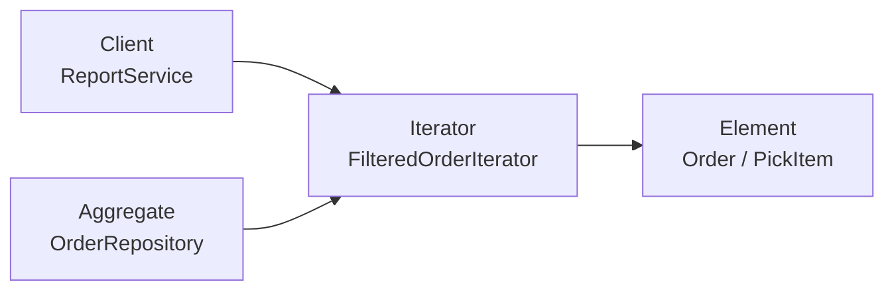
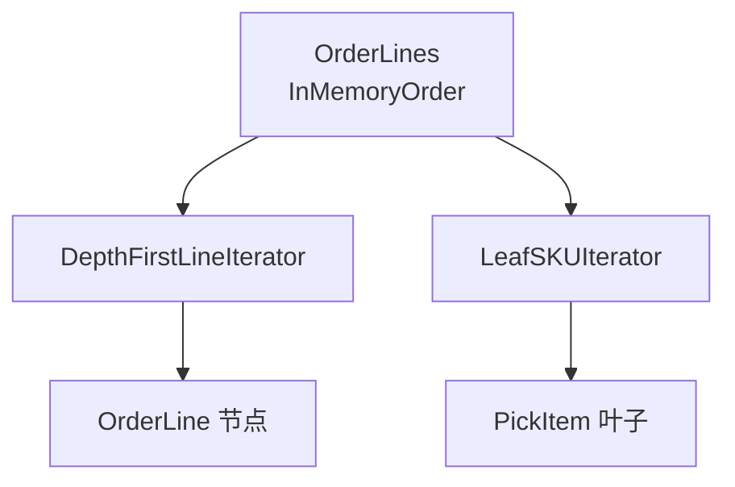

**迭代器模式**（Iterator）把 **对集合元素的访问** 封装成 **独立对象**：客户端通过统一的 `Next` / `HasNext`（或 Go 的 `range` / `iter.Seq`） **逐个取元素**，而不必知道 **底层是切片、链表、树还是数据库游标**——从而把 **「怎么遍历」** 与 **「集合怎么存」** 拆开，并可在 **同一聚合** 上挂 **多种遍历策略**（全量、仅叶子 SKU、按状态过滤、逆序分页）。

与 [组合模式](/cs-fundamentals/design-patterns/composite) 的 **分工** 很常被问到：[组合](/cs-fundamentals/design-patterns/composite) 解决 **「整棵明细树用同一接口递归操作」**（`Total()`、`Validate()`）；迭代器解决 **「按某种顺序、某种过滤规则 **逐个** 取出元素，且调用方不碰内部结构」**——导出拣货单要 **深度优先扫所有叶子 SKU**、对账报表要 **分页扫历史订单**、退款脚本要 **只遍历可退行**，若在每个 Service 里 **手写 `for` + `switch` + 递归**，会与 Composite 的遍历逻辑 **重复且难换存储**。与 [外观模式](/cs-fundamentals/design-patterns/facade) 也不同：[外观](/cs-fundamentals/design-patterns/facade) 提供 **用例级入口**（`PlaceOrder`）；迭代器提供 **对某一集合的访问协议**，常由 Facade **内部** 或 **报表 / 批处理 Client** 使用。与 [命令模式](/cs-fundamentals/design-patterns/command) 可配合：批处理 Worker **`for order := range orders.Iterator()`** 再 **`Enqueue(CancelOrderCommand)`**——迭代器管 **怎么拿下一个元素**，命令管 **拿到后做什么**。

下文继续用「电商订单系统」：[组合](/cs-fundamentals/design-patterns/composite) 已把订单明细建成 `OrderLine` 树；[命令](/cs-fundamentals/design-patterns/command) 已支持批量关单入队。当 **仓储导出** 要 **扁平化所有叶子 SKU**、**运营报表** 要 **按状态分页扫订单**、**对账任务** 要 **游标式读明细而不一次加载百万行**、且 **存储从内存切片迁到 DB / ES** 时，若对外暴露 `[]OrderLine` 或 `[]Order`，会出现 **遍历算法散落、换存储要改所有调用方**——迭代器把 **遍历职责** 收到 Iterator 里，Aggregate 只承诺 **`Iterator()`**。

## 问题

明细树与订单列表开始被 **直接暴露内部结构**：

```go
type Order struct {
    ID     string
    Status string
    Lines  []OrderLine // 组合模式下的根列表；也可能是 DB 行 ID
}

// 仓储导出：手写递归扫叶子 SKU——与 Composite 里别的遍历重复
func exportPickList(order Order) []PickItem {
    var out []PickItem
    var walk func(OrderLine)
    walk = func(line OrderLine) {
        switch l := line.(type) {
        case ProductLine:
            out = append(out, PickItem{SKU: l.SKU, Qty: l.Quantity})
        case BundleLine:
            for _, c := range l.Children {
                walk(c)
            }
        }
    }
    for _, line := range order.Lines {
        walk(line)
    }
    return out
}

// 报表：直接依赖 []Order，换 ES 分页时要改这里
func reportPaidOrders(orders []Order, page, size int) []OrderSummary {
    start := page * size
    if start >= len(orders) {
        return nil
    }
    end := start + size
    if end > len(orders) {
        end = len(orders)
    }
    var sums []OrderSummary
    for _, o := range orders[start:end] {
        if o.Status != "paid" {
            continue
        }
        sums = append(sums, summarize(o))
    }
    return sums
}
```

1. **遍历逻辑重复**：导出、对账、库存释放、券分摊 **各自写递归或嵌套 `for`**；改明细类型（加「赠品行」）要 **改每一处 walk**。
2. **客户端与存储紧耦合**：报表 `[]Order` 分页；订单中心改成 **DB cursor / ES scroll** 时，**所有** `len(orders)`、`orders[i]` 都要重写。
3. **多种遍历策略难并存**：同一订单树要 **「仅叶子」**、**「深度优先含 bundle 节点」**、**「跳过赠品」**——全塞进 `Order` 的方法会 **接口膨胀**。
4. **违反单一职责与封装**：`OrderRepository` 既要 **查库**，又要让调用方知道 **返回的是 slice 还是 map**；调用方 **越权** 改 `order.Lines` 破坏不变量。
5. **与组合 / 命令的分工错位**：[组合](/cs-fundamentals/design-patterns/composite) 管 **节点上的一致操作**；[命令](/cs-fundamentals/design-patterns/command) 管 **单步可撤销写**——这里要解决的是 **以统一方式访问集合元素**，且 **遍历算法可替换**。

本质矛盾是：**多种消费者** 要以 **不同顺序、不同过滤** 访问 **同一批订单或明细**，但 **集合内部表示** 会随性能需求变化（内存树 → 分页 SQL → 流式 RPC）；客户端不应 **绑定某一种 `for` 写法**。

### 迭代器 vs 直接 `range` / 回调

| 方式 | 特点 | 何时够用 |
| :--- | :--- | :--- |
| **暴露 `[]T` + `range`** | 零抽象、Go 惯用 | 小列表、存储永不变、只有一种遍历 |
| **函数式 `Each(fn)` 回调** | 简单封装 | 不需多种 Iterator、不需暂停/续扫 |
| **迭代器对象** | 多种策略、可暂停、可换底层 | 树遍历、分页、过滤、存储迁移、批处理管道 |

Go 1.23+ 的 `iter.Seq` / `iter.Pull` 是 **语言级迭代器**；GoF 迭代器模式与 **`range` over func** 思想一致——文档用 **显式 `Iterator` 接口** 对齐 GoF，工程上可 **薄封装到 `iter.Seq`**。

## 意图

用一句话说：**提供一种方法顺序访问一个聚合对象中的各个元素，而又不暴露该对象的内部表示。**

引入 **迭代器**（Iterator）统一访问协议；**聚合**（Aggregate）提供 `Iterator()`（或 `AllLines()` 返回序列）；**具体迭代器** 实现 **叶子优先、过滤、分页** 等策略。报表服务 **只调** `repo.Iterator(FilterPaid).Next()`，不必 `import` 仓储的 SQL 细节：

```go
it := repo.Iterator(ctx, Filter{Status: "paid"}, Page{Offset: 0, Limit: 50})
for it.HasNext() {
    order, err := it.Next()
    if err != nil {
        return err
    }
    sums = append(sums, summarize(order))
}
```

GoF 从 **结构** 角度的定义：

> 提供一种方法顺序访问一个聚合对象中的各个元素，而又不暴露该对象的内部表示。

### 和组合、命令、访问者有啥不同

| | 迭代器 | 组合 | 命令 | 访问者 |
| :--- | :--- | :--- | :--- | :--- |
| **动机** | **解耦遍历与集合**；隐藏内部结构 | **统一部分-整体接口** | **封装操作为对象** | **把新操作从节点类挪走** |
| **核心抽象** | `Iterator`（Next/HasNext） | `OrderLine`（Total 等） | `Command`（Execute） | `Visitor` + `Accept` |
| **谁管顺序** | **Iterator** | Composite **递归顺序由方法隐含** | 队列 / Invoker 管 **执行顺序** | Visitor **定义遍历+操作** |
| **典型能力** | 分页、过滤、多策略遍历 | 树上一致 `Total()` | Undo、排队 | 新增「打印/export」不改节点 |
| **电商例子** | 扁平化拣货 SKU、订单分页 | 礼盒嵌套计价 | 批量关单命令 | 多种报表格式访问同一树 |

#### 迭代器像「把 Composite 的递归挪出去」吗？

**部分像。** `BundleLine.Total()` **内部仍递归**；迭代器给 **需要「逐个元素」而非「聚合结果」** 的场景——例如 **WMS 只要 SKU 列表**、**审计逐行打日志**。两者 **可共存**：Composite 管 **结构语义**；`LeafSKUIterator` 管 **扁平访问**。

#### 迭代器和 `for range` 在 Go 里怎么选？

**小团队、slice 稳定**：直接 `range order.Lines`。**要多种遍历或隐藏存储**：`OrderLinesIterator`、`OrderQueryIterator`。Go 1.23+ 可 **`func(yield func(OrderLine) bool)`** 作为 **轻量 Iterator**，对外仍不暴露 `[]OrderLine`。

## 解决方案

定义 **迭代器** 接口；**聚合** 提供工厂方法创建迭代器；各 **具体迭代器** 持有遍历状态（栈、cursor、offset）。

### 迭代器（Iterator）接口

```go
type Iterator[T any] interface {
    HasNext() bool
    Next() (T, error)
}

// 可选：支持 early stop、资源释放
type Closer interface {
    Close() error
}
```

若用 Go 1.23+ `iter.Seq[T]`，Aggregate 可返回 **`func(yield func(T) bool)`**，调用方 `for v := range seq`——语义等价，见 [组装实践](#组装实践)。

### 聚合（Aggregate）——订单明细

```go
type OrderLines interface {
    // 默认：深度优先，含 bundle 节点
    Iterator() Iterator[OrderLine]
    // 仅叶子 SKU，供仓储拣货
    LeafSKUIterator() Iterator[PickItem]
}

type InMemoryOrder struct {
    lines []OrderLine
}

func (o *InMemoryOrder) Iterator() Iterator[OrderLine] {
    return &DepthFirstLineIterator{
        stack: append([]OrderLine(nil), o.lines...),
    }
}

func (o *InMemoryOrder) LeafSKUIterator() Iterator[PickItem] {
    return &LeafSKUIterator{
        stack: append([]OrderLine(nil), o.lines...),
    }
}
```

**不暴露** `lines` 字段给包外；测试包内可用 **构造器** 注入。

### 具体迭代器：深度优先（含组合节点）

```go
type DepthFirstLineIterator struct {
    stack []OrderLine
}

func (it *DepthFirstLineIterator) HasNext() bool {
    return len(it.stack) > 0
}

func (it *DepthFirstLineIterator) Next() (OrderLine, error) {
    if !it.HasNext() {
        return nil, ErrIteratorDone
    }
    n := len(it.stack) - 1
    line := it.stack[n]
    it.stack = it.stack[:n]
    if b, ok := line.(BundleLine); ok {
        // 子节点逆序压栈 → 深度优先正序弹出
        for i := len(b.Children) - 1; i >= 0; i-- {
            it.stack = append(it.stack, b.Children[i])
        }
    }
    return line, nil
}
```

用 **显式栈** 代替递归，避免 **深树栈溢出**；顺序与 **先根深度优先** 一致。

### 具体迭代器：仅叶子 SKU（扁平拣货）

```go
type LeafSKUIterator struct {
    stack []OrderLine
}

func (it *LeafSKUIterator) HasNext() bool {
    for len(it.stack) > 0 {
        top := it.stack[len(it.stack)-1]
        if _, ok := top.(ProductLine); ok {
            return true
        }
        it.stack = it.stack[:len(it.stack)-1]
        if b, ok := top.(BundleLine); ok {
            for i := len(b.Children) - 1; i >= 0; i-- {
                it.stack = append(it.stack, b.Children[i])
            }
        }
    }
    return false
}

func (it *LeafSKUIterator) Next() (PickItem, error) {
    if !it.HasNext() {
        return PickItem{}, ErrIteratorDone
    }
    n := len(it.stack) - 1
    line := it.stack[n].(ProductLine)
    it.stack = it.stack[:n]
    return PickItem{SKU: line.SKU, Qty: line.Quantity}, nil
}
```

仓储 **`exportPickList`** 改为：

```go
func exportPickList(order OrderLines) []PickItem {
    var out []PickItem
    it := order.LeafSKUIterator()
    for it.HasNext() {
        item, _ := it.Next()
        out = append(out, item)
    }
    return out
}
```

**不再** 复制 `walk` 递归；新增明细类型时 **只改 Iterator**（或 Composite + Iterator 各管一层）。

### 聚合（Aggregate）——订单仓储与过滤迭代器

```go
type OrderFilter struct {
    Status string
    Page   Page
}

type Page struct {
    Offset int
    Limit  int
}

type OrderRepository interface {
    Iterator(ctx context.Context, f OrderFilter) Iterator[Order]
}

// 内存实现：演示过滤 + 分页
type InMemoryOrderRepo struct {
    orders []Order
}

func (r *InMemoryOrderRepo) Iterator(ctx context.Context, f OrderFilter) Iterator[Order] {
    return &FilteredOrderIterator{
        ctx: ctx, src: r.orders, filter: f, cursor: f.Page.Offset,
    }
}

type FilteredOrderIterator struct {
    ctx    context.Context
    src    []Order
    filter OrderFilter
    cursor int
    count  int
    ready  Order
    hasReady bool
}

func (it *FilteredOrderIterator) advance() bool {
    for it.cursor < len(it.src) && it.count < it.filter.Page.Limit {
        o := it.src[it.cursor]
        it.cursor++
        if it.filter.Status != "" && o.Status != it.filter.Status {
            continue
        }
        // 跳过 Page.Offset 之前的匹配项
        if it.filter.Page.Offset > 0 {
            it.filter.Page.Offset--
            continue
        }
        it.ready, it.hasReady = o, true
        it.count++
        return true
    }
    it.hasReady = false
    return false
}

func (it *FilteredOrderIterator) HasNext() bool {
    if it.hasReady {
        return true
    }
    return it.advance()
}

func (it *FilteredOrderIterator) Next() (Order, error) {
    if !it.HasNext() {
        return Order{}, ErrIteratorDone
    }
    o := it.ready
    it.hasReady = false
    return o, nil
}
```

DB 实现可把 **`FilteredOrderIterator`** 换成 **持有 `*sql.Rows` 或 ES scroll id**——**报表 Client 代码不变**。

### 客户端（Client）——报表与批处理

```go
func reportPaidOrders(ctx context.Context, repo OrderRepository, page, size int) ([]OrderSummary, error) {
    it := repo.Iterator(ctx, OrderFilter{
        Status: "paid",
        Page:   Page{Offset: page * size, Limit: size},
    })
    var sums []OrderSummary
    for it.HasNext() {
        order, err := it.Next()
        if err != nil {
            return nil, err
        }
        sums = append(sums, summarize(order))
    }
    return sums, nil
}

// 与命令模式：批量关单
func enqueueCancelPaidExpired(ctx context.Context, repo OrderRepository, q *CommandQueue) error {
    it := repo.Iterator(ctx, OrderFilter{Status: "paid_expired"})
    for it.HasNext() {
        order, err := it.Next()
        if err != nil {
            return err
        }
        q.Enqueue(NewCancelOrderCommand(ordersSvc, order.ID))
    }
    return nil
}
```

Client **只依赖** `Iterator[Order]`，不依赖 `[]Order`。

## 结构

| 角色 | 代码里是谁 | 管什么 |
| :--- | :--- | :--- |
| **迭代器**（Iterator） | `Iterator[T]` 接口 | `HasNext` / `Next` |
| **具体迭代器**（ConcreteIterator） | `LeafSKUIterator`、`FilteredOrderIterator` | 遍历状态与策略 |
| **聚合**（Aggregate） | `OrderLines`、`OrderRepository` | 创建 Iterator，隐藏存储 |
| **具体聚合**（ConcreteAggregate） | `InMemoryOrder`、`SQLAuditRepo` | 持有真实数据 |
| **客户端**（Client） | 报表、导出、批处理 Worker | 只通过 Iterator 访问 |



明细树多种迭代器：



### 和 GoF 术语的对应（选读）

| GoF 叫法 | 本文代码 | 一句话 |
| :--- | :--- | :--- |
| Iterator | `Iterator[T]` | 顺序访问元素 |
| ConcreteIterator | `LeafSKUIterator` | 具体遍历算法 |
| Aggregate | `OrderLines`、`OrderRepository` | 创建 Iterator |
| ConcreteAggregate | `InMemoryOrder` | 实际集合 |
| Client | `ReportService` | 使用 Iterator |

Go 常用 **泛型 `Iterator[T]`** 或 **`iter.Seq[T]`** 代替 GoF 的 **非泛型 Iterator + 手动类型断言**。

## 适用场景

1. **隐藏集合内部表示**：切片、链表、树、DB 游标、RPC 流 **统一访问**。
2. **同一聚合多种遍历**：全树 / 仅叶子 / 跳过赠品 / 逆序。
3. **分页与流式处理**：大促对账、导出 **不把百万行一次载入内存**。
4. **过滤与懒计算**：`FilterPaidIterator` **包装** 内层 Iterator，符合 [开闭](/cs-fundamentals/design-patterns#设计原则)。
5. **与组合树配合**：Composite 表达结构；Iterator 表达 **扁平或定制顺序的访问**。
6. **批处理管道**：`for` Iterator + [命令](/cs-fundamentals/design-patterns/command) / 领域服务 **解耦「取下一个」与「处理」**。

**不必强行使用**：

- **固定小 slice、单一 `range`**——直接 `for _, line := range order.Lines`。
- **只需聚合结果**（总价）——[组合](/cs-fundamentals/design-patterns/composite) 的 `Total()` 足够，不必先 Iterator 再求和。
- **操作类型很多、节点类稳定**——考虑 **访问者** 而非多个 Iterator 各拷一份遍历。
- **并发修改集合**——Iterator 需 **快照 / 版本号 / 只读副本**；否则 `range` 同样不安全。

常见例子：`java.util.Iterator`、C++ STL 迭代器、Go `database/sql.Rows`、ES scroll、Kubernetes `ListWatch` 分页、文件目录 walk 的抽象。

## 优缺点

| 优点 | 说明 |
| :--- | :--- |
| **解耦客户端与聚合** | 报表不依赖 `[]Order` 或 SQL |
| **开闭** | 新遍历 = 新 ConcreteIterator |
| **多种策略并存** | 同一 `OrderLines` 上 `LeafSKUIterator` vs `DepthFirstLineIterator` |
| **支持懒加载与分页** | Iterator 按需 `Next`，控制内存 |
| **单一职责** | 遍历算法 **不在** 业务 Service 里复制 |

| 缺点 | 说明 |
| :--- | :--- |
| **抽象层增加** | 简单列表可能 **过度** |
| **并发修改** | 遍历中改集合需 **约定**（快照或 fail-fast） |
| **与语言特性重叠** | Go `range`、`iter.Seq` 已很强；显式 Iterator 为 **换存储 / 多策略** 服务 |
| **错误处理** | `Next() (T, error)` 需区分 **Done vs 失败** |
| **组合过滤 Iterator 链** | 多层装饰式 Iterator 调试时要 **命名清晰** |

## 组装实践

> **阅读提示**：先掌握「**Aggregate 提供 Iterator，Client 只 Next**」即可。本节是工程变体；初学可先跳过。

### Go 1.23+ `iter.Seq` 薄封装

```go
func (o *InMemoryOrder) AllLeafSKUs() iter.Seq[PickItem] {
    return func(yield func(PickItem) bool) {
        it := o.LeafSKUIterator()
        for it.HasNext() {
            item, err := it.Next()
            if err != nil {
                return
            }
            if !yield(item) {
                return
            }
        }
    }
}

// Client
for item := range order.AllLeafSKUs() {
    pickList = append(pickList, item)
}
```

**early stop**：`yield` 返回 `false` 即停——比经典 Iterator 的 **Break** 更 Go 惯用。

### 装饰式过滤 Iterator

```go
type FilterIterator[T any] struct {
    inner Iterator[T]
    pred  func(T) bool
    next  T
    ok    bool
}

func (f *FilterIterator[T]) HasNext() bool {
    for f.inner.HasNext() {
        v, err := f.inner.Next()
        if err != nil {
            return false
        }
        if f.pred(v) {
            f.next, f.ok = v, true
            return true
        }
    }
    return false
}

func (f *FilterIterator[T]) Next() (T, error) {
    if !f.ok && !f.HasNext() {
        var zero T
        return zero, ErrIteratorDone
    }
    f.ok = false
    return f.next, nil
}

// 在「已支付」Iterator 外再包「金额 > 1000」
it := &FilterIterator[Order]{
    inner: repo.Iterator(ctx, OrderFilter{Status: "paid"}),
    pred:  func(o Order) bool { return o.Total > 1000 },
}
```

**开闭**：新条件 **新 pred 或新 FilterIterator**，不改 `FilteredOrderIterator` 源码。

### 与组合、命令、外观一起用

```text
OrderLines（Composite 树）
  → LeafSKUIterator → WMS 导出
  → DepthFirstLineIterator → 审计日志

OrderRepository.Iterator
  → ReportService 分页
  → CommandQueue Worker 批量 CancelOrderCommand

CheckoutFacade.PlaceOrder
  → 内部可能对 Lines 做 Validate（Composite）
  → 落库后 SearchIndexer 用 OrderLineIterator 扇出 SKU
```

[组合](/cs-fundamentals/design-patterns/composite) 管 **节点行为**；迭代器管 **访问顺序与暴露边界**；[命令](/cs-fundamentals/design-patterns/command) 管 **对 Iterator 取出的每个 Order 做什么**。

### 并发与快照

| 场景 | 做法 |
| :--- | :--- |
| 遍历中可能改购物车 | Iterator 构造时 **拷贝 slice 头** 或 **版本号** 检测 |
| DB 分页 | **稳定排序键** + `WHERE id > ? LIMIT`；勿无 ORDER BY 深分页 |
| 长事务导出 | **只读副本** 或 **快照隔离**；Iterator `Close` 释放连接 |

```go
type SnapshotLineIterator struct {
    lines []OrderLine // 构造时 deep copy 或 immutable 共享
    idx   int
}
```

### 测试策略

```go
func TestLeafSKUIterator_FlattensBundle(t *testing.T) {
    order := &InMemoryOrder{lines: []OrderLine{
        BundleLine{Children: []OrderLine{
            ProductLine{SKU: "a", Quantity: 1},
            ProductLine{SKU: "b", Quantity: 2},
        }},
    }}
    var skus []string
    it := order.LeafSKUIterator()
    for it.HasNext() {
        item, _ := it.Next()
        skus = append(skus, item.SKU)
    }
    if len(skus) != 2 || skus[0] != "a" {
        t.Fatal(skus)
    }
}

func TestFilteredOrderIterator_Pagination(t *testing.T) {
    repo := &InMemoryOrderRepo{orders: []Order{
        {ID: "1", Status: "paid"},
        {ID: "2", Status: "pending"},
        {ID: "3", Status: "paid"},
    }}
    it := repo.Iterator(context.Background(), OrderFilter{
        Status: "paid", Page: Page{Offset: 0, Limit: 10},
    })
    var ids []string
    for it.HasNext() {
        o, _ := it.Next()
        ids = append(ids, o.ID)
    }
    if len(ids) != 2 {
        t.Fatal(ids)
    }
}
```

## 小结

记住这四点即可：

1. **遍历即对象**：`LeafSKUIterator`、`FilteredOrderIterator` 封装 **怎么取下一个**，Client 不碰内部 `[]OrderLine` / SQL。
2. **Aggregate 只造 Iterator**：`OrderLines.LeafSKUIterator()`、`OrderRepository.Iterator(filter)`——换存储 **改 ConcreteAggregate + ConcreteIterator**。
3. **与 Composite 分层**：Composite 的 `Total()` **递归聚合**；Iterator **按需逐个元素** 给导出、报表、批处理。
4. **Go 工程**：简单场景 `range`；多策略 / 分页 / 隐藏存储 用 **显式 Iterator 或 `iter.Seq`**；与 [命令](/cs-fundamentals/design-patterns/command) 组合做 **「遍历 + 入队」** 管道。

[组合模式](/cs-fundamentals/design-patterns/composite) 解决了 **「树形明细上操作一致」**；迭代器解决 **「访问这棵树或订单列表时，调用方不必知道怎么存、怎么扫」**——把 **遍历算法** 从业务 Service 和聚合内部 **抽到可替换的 Iterator**，让仓储迁移与多种导出视图在 [开闭](/cs-fundamentals/design-patterns#设计原则) 下演进。

## 参考阅读

- [x] [组合模式](/cs-fundamentals/design-patterns/composite) — 订单明细树；与扁平 Iterator 配合
- [x] [命令模式](/cs-fundamentals/design-patterns/command) — 对 Iterator 元素批量入队执行
- [x] [外观模式](/cs-fundamentals/design-patterns/facade) — 用例编排；内部可用 Iterator 扇出索引
- [x] [Refactoring.Guru - 迭代器模式](https://refactoringguru.cn/design-patterns/iterator) (2026-06-22)
- [x] [菜鸟教程 - 迭代器模式](https://www.runoob.com/design-pattern/iterator-pattern.html) (2026-06-22)
