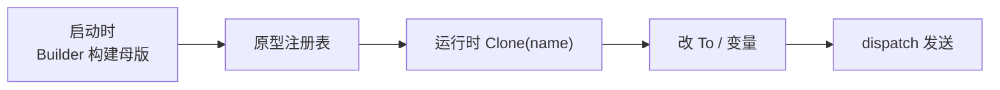

**原型模式**（Prototype）提供一种 **通过复制已有实例来创建新对象** 的方式，使 **克隆过程与使用过程分离**：调用方不必知道具体类型名，也不必重复昂贵的初始化步骤，只需从 **原型** 拿到一份拷贝，再按需改少量字段即可。

打个比方：印通知像「盖公章」——先刻好一枚章（原型），之后每次盖章（`Clone()`）比重新雕一枚快得多；若要在某份复印件上改收件人，改克隆体即可，不必动原模板。

下文延续 [生成器模式](/cs-fundamentals/design-patterns/builder) 的「通知模块」场景：运营预先配置好多套 **通知模板**（正文、渠道、附件规则、元数据等），发送时按模板名克隆一份，只改收件人和变量占位符。

## 问题

业务里经常要造 **结构相同、只有少量字段不同** 的对象。若每次都从空对象重新填一遍，要么 **慢**（解析模板文件、拉取默认附件、校验元数据），要么 **容易抄错**（手动复制十几个字段，漏改 `metadata` 或浅拷贝共享了切片）。

```go
func sendFromTemplate(tpl *Notification, to string, vars map[string]string) error {
    // 看似「复制模板」，实则共享内部切片 / map——改 n 会污染 tpl
    n := &Notification{
        To:          []string{to},
        CC:          tpl.CC,
        Subject:     tpl.Subject,
        Body:        render(tpl.Body, vars),
        Channel:     tpl.Channel,
        Priority:    tpl.Priority,
        Attachments: tpl.Attachments,
        Metadata:    tpl.Metadata,
    }
    return dispatch(n)
}
```

模板一多、字段一嵌套，问题就会暴露：

1. **初始化成本高**：模板从磁盘加载、渲染预览、预热渠道配置——每条消息都 `NewNotificationBuilder()` 从头拼，浪费 CPU 与 I/O。
2. **手工拷贝易错**：`CC`、`Attachments` 是切片，`Metadata` 是 map——赋值只复制引用，改克隆体会 **污染原型**；深拷贝逻辑散落在各处，维护困难。
3. **创建逻辑与使用耦合**：调用方既要知道「从哪份模板来」，又要自己实现「怎么安全复制」，违反 [单一职责](/cs-fundamentals/design-patterns#设计原则)。
4. **类型扩展困难**：新增一种模板（如「大促推送」）时，每个发送点都要认识新 struct 并写一套拷贝代码，而不是统一 `Clone()`。
5. **与工厂 / 生成器分工不清**：工厂管「造哪类」、生成器管「怎么一步步拼」——当 **已有完整实例、只差改几个字段** 时，两者都显得笨重。

本质矛盾是：**你手里已经有一份「对的」对象**，却还要走一遍 **从零构造或手工 field-by-field 复制** 的弯路。

## 意图

用一句话说：**用原型实例指定创建对象的种类，并通过复制该原型创建新对象。**

把「如何得到一份安全、独立的拷贝」封装进原型自身的 `Clone()`（或注册表统一克隆）；调用方只依赖 **原型接口**，按名或按引用取克隆体，再改差异字段。GoF 从 **实现结构** 角度的定义是：

> 用原型实例指定创建对象的种类，并且通过复制这些原型创建新的对象。

与 [工厂方法](/cs-fundamentals/design-patterns/factory)、[生成器](/cs-fundamentals/design-patterns/builder) 的关系：

| | 工厂方法 | 生成器 | 原型 |
| :--- | :--- | :--- | :--- |
| 创建方式 | 构造函数 / `NewXxx()` | 分步 setter + `Build()` | **复制已有实例** |
| 典型动机 | 解耦「造哪一种类型」 | 字段多、构建步骤复杂 | 初始化贵、大量相似实例 |
| 典型入口 | `NewEmailNotifier()` | `NewNotificationBuilder()...Build()` | `tpl.Clone()` / `registry.Clone("order_shipped")` |
| 谁持有「配方」 | 工厂 / 组装层 | 生成器 + 可选指导者 | **原型实例本身** |

三者可 **组合**：用生成器在启动时 **构建并注册** 模板原型；运行时 `Clone()` + 改 `To` / 变量。

> **命名说明**
>
> - **原型模式**（本文，GoF Prototype）：通过 `Clone()` 复制实例创建新对象。
> - **原型注册表**（Prototype Registry）：按字符串 key 存原型，是常见变体，**不是** GoF 单独列出的模式，但工程里极常见。
> - **深拷贝 / 浅拷贝**：Go 无内置 `Clone`；`Clone()` 的实现质量决定模式是否安全（见下文 [组装实践](#深拷贝与浅拷贝)）。

## 解决方案

把「安全复制」收进原型；发送侧只 **克隆 + 改差异字段**。

### 原型接口

所有可克隆模板实现同一接口：

```go
type NotificationPrototype interface {
    Clone() NotificationPrototype
    // 便于发送层使用；也可拆成独立 Product 接口
    DispatchClone(to string, vars map[string]string) error
}
```

### 具体原型

模板在 **加载 / 构建阶段** 初始化一次（可用 [生成器](/cs-fundamentals/design-patterns/builder)）；`Clone()` 负责 **深拷贝** 可变字段：

```go
type Notification struct {
    to          []string
    cc          []string
    subject     string
    body        string
    channel     string
    priority    int
    attachments []string
    metadata    map[string]string
}

func (n *Notification) Clone() NotificationPrototype {
    cc := append([]string(nil), n.cc...)
    attachments := append([]string(nil), n.attachments...)
    meta := make(map[string]string, len(n.metadata))
    for k, v := range n.metadata {
        meta[k] = v
    }
    return &Notification{
        cc:          cc,
        subject:     n.subject,
        body:        n.body,
        channel:     n.channel,
        priority:    n.priority,
        attachments: attachments,
        metadata:    meta,
        // to 留空，由每次发送填入
    }
}

func (n *Notification) DispatchClone(to string, vars map[string]string) error {
    cloned := n.Clone().(*Notification)
    cloned.to = []string{to}
    cloned.body = render(n.body, vars)
    return dispatch(cloned)
}
```

### 原型注册表（常见变体）

多套模板在 `init` 或启动时注册，发送时按名克隆：

```go
type PrototypeRegistry struct {
    protos map[string]NotificationPrototype
}

func NewPrototypeRegistry() *PrototypeRegistry {
    return &PrototypeRegistry{protos: make(map[string]NotificationPrototype)}
}

func (r *PrototypeRegistry) Register(name string, p NotificationPrototype) {
    r.protos[name] = p
}

func (r *PrototypeRegistry) Clone(name string) (NotificationPrototype, error) {
    p, ok := r.protos[name]
    if !ok {
        return nil, fmt.Errorf("prototype: unknown template %q", name)
    }
    return p.Clone(), nil
}

// 启动时：用生成器造好「母版」，注册为原型
func bootstrapTemplates(reg *PrototypeRegistry) error {
    orderShipped, err := NewNotificationBuilder().
        Subject("订单已发货").
        Body("您好，订单 {{.OrderID}} 已发出…").
        Channel("email").
        Priority(1).
        Attachment("/static/invoice_footer.pdf").
        Metadata("template_id", "order_shipped_v2").
        Build()
    if err != nil {
        return err
    }
    reg.Register("order_shipped", orderShipped)
    // …注册 promo_push、password_reset 等
    return nil
}
```

### 使用者

业务 **不** 再手工复制字段，也不重复跑构建流程：

```go
func sendOrderShipped(reg *PrototypeRegistry, to, orderID string) error {
    proto, err := reg.Clone("order_shipped")
    if err != nil {
        return err
    }
    return proto.DispatchClone(to, map[string]string{"OrderID": orderID})
}
```

与「每次 New + 手抄字段」对比：

| | 手工 field 复制 | 原型 |
| :--- | :--- | :--- |
| 正确性 | 易浅拷贝、漏字段 | `Clone()` 一处维护深拷贝 |
| 性能 | 重复解析 / 构建 | 母版只初始化一次 |
| 扩展 | 新模板改多处发送逻辑 | 注册新原型，发送仍 `Clone(name)` |
| 可读性 | 发送函数里堆赋值 | 「从哪份模板来」语义清晰 |

## 结构

| 角色 | 代码里是谁 | 管什么 |
| :--- | :--- | :--- |
| **原型** | `NotificationPrototype` | 声明 `Clone()` |
| **具体原型** | `Notification` | 实现深拷贝与可选的 `DispatchClone` |
| **注册表**（可选） | `PrototypeRegistry` | 按名存取、统一克隆 |
| **使用者** | `sendOrderShipped` / `Service` | `Clone()` 后只改差异 |



**注册时**：母版构建完成，只读存放（勿在发送路径修改注册表里的实例）。

**克隆时**：得到独立副本，再改收件人、渲染变量——原型本身不变。

## 适用场景

1. **创建成本高于复制**：模板解析、网络拉取默认配置、复杂校验只在母版做一次。
2. **大量相似对象、仅少量字段不同**：批量通知、多收件人同一正文、游戏实体刷怪（同 archetype 不同坐标）。
3. **调用方不应依赖具体类名**：依赖 `NotificationPrototype`，具体模板在注册表或配置里切换。
4. **需要保存 / 恢复对象快照**：撤销栈、配置快照、试验性分支（克隆后尝试，失败丢弃）。
5. **与 [生成器](/cs-fundamentals/design-patterns/builder) 分工**：生成器负责 **造母版**；原型负责 **运行时复制母版**。

常见例子：文档模板引擎、GUI 控件复制粘贴、数据库记录「另存为」、配置 Profile 复制。

**不必强行使用**：对象很轻、每次字段组合差异大、或克隆比 `New` 更贵（母版极大而只改一个 int）——直接 `NewXxx()` 或生成器更简单。没有共享可变状态时，浅拷贝即可，也不必上完整原型层次。

## 优缺点

| 优点 | 说明 |
| :--- | :--- |
| **绕过重复构造** | 昂贵初始化摊到母版，运行时只复制 |
| **少写创建类层次** | 不必为每种变体子类化工厂 |
| **克隆语义集中** | 深拷贝规则只在 `Clone()` 维护 |
| **运行时换模板** | 注册表改 key 或热更新母版（注意并发） |
| **与配置结合自然** | 「模板名 → 原型」映射贴近运营心智 |

| 缺点 | 说明 |
| :--- | :--- |
| **深拷贝要自己写** | Go 无内置克隆；嵌套指针、循环引用要仔细处理 |
| **母版被误改则全盘受影响** | 注册表中的实例必须视为只读，或每次 `Clone` 前从不可变存储取 |
| **循环引用难克隆** | 图结构需 visited 表或重新设计所有权 |
| **调试链略长** | 「这份从哪个原型来」要跳注册表或接口 |
| **与序列化拷贝混淆** | `json` 往返能深拷贝，但有性能与类型损失，不宜当默认方案 |

## 组装实践

> **阅读提示**：先掌握「`Clone()` + 改差异字段」即可。本节是 Go 项目里的实现细节；初学可先跳过。

### 深拷贝与浅拷贝

| 字段类型 | 赋值 `b = a` | 安全 `Clone` 常见做法 |
| :--- | :--- | :--- |
| 值类型（`int`、`string`） | 已拷贝 | 直接复制 |
| 切片 | 共享底层数组 | `append([]T(nil), s...)` |
| map | 共享 | `make` 后逐 key 复制 |
| 指针 / 接口 | 共享指向对象 | 视情况递归 `Clone` 或不可变共享 |

```go
// 反例：Clone 里仍共享 map
func (n *Notification) BadClone() *Notification {
    cp := *n
    cp.metadata = n.metadata // 浅拷贝——危险
    return &cp
}
```

单元测试应覆盖：**改克隆体不影响母版**（尤其切片、map）。

### 母版只读

注册进 `PrototypeRegistry` 的实例，发送路径 **只读**；所有变更在 `Clone()` 返回的副本上进行：

```go
func (r *PrototypeRegistry) Clone(name string) (NotificationPrototype, error) {
    p, ok := r.protos[name]
    if !ok {
        return nil, fmt.Errorf("prototype: unknown template %q", name)
    }
    // 永远 Clone，不把母版指针交给调用方去改
    return p.Clone(), nil
}
```

若运营要「热更新模板」，用 **替换注册表条目**（新 `Build()` 后 `Register`），而不是原地改已注册 struct 的字段。

### 与生成器组合

[生成器](/cs-fundamentals/design-patterns/builder) 适合 **启动时** 拼出复杂母版；[原型](/cs-fundamentals/design-patterns/prototype) 适合 **运行时** 复制：

```go
// 启动：生成器 → 注册原型
mother, _ := NewNotificationBuilder().
    Subject("…").Body("…").Channel("email").Build()
reg.Register("welcome", mother)

// 运行时：克隆 → 填差异
p, _ := reg.Clone("welcome")
_ = p.DispatchClone("user@example.com", nil)
```

不必二选一：母版用 Builder，副本用 Prototype。

### 与工厂方法的区别

[工厂方法](/cs-fundamentals/design-patterns/factory) 回答 **「造哪一种 Notifier」**；原型回答 **「从哪份已有 Notification 母版复制」**。渠道选型仍在组装层 `NewEmailNotifier()`；模板复制在业务发送路径 `Clone("order_shipped")`。

### `json.Marshal` / `Unmarshal` 当克隆？

偶尔用于 **快速深拷贝 DTO**（结构简单、无 `time.Time` 精度等特殊需求）：

```go
func cloneViaJSON[T any](src T) (T, error) {
    var dst T
    b, err := json.Marshal(src)
    if err != nil {
        return dst, err
    }
    err = json.Unmarshal(b, &dst)
    return dst, err
}
```

生产路径更推荐 **显式 `Clone()`**：性能可预期、类型安全、不依赖 JSON tag。原型模式的价值正在于 **把拷贝规则写在类型旁边**，而不是藏在一行魔法序列化里。

## 小结

记住这四点即可：

1. **已有「对的」实例、且复制比重建划算 → 考虑原型**：`Clone()` 封装深拷贝，发送侧只改差异字段。
2. **母版只构建一次、注册后视为只读**：避免污染注册表里的原型。
3. **与工厂 / 生成器分工不同**：工厂选型、生成器拼母版、原型在运行时复制母版。
4. **Go 无内置克隆**：`Clone()` 的质量决定模式是否成立；切片、map、指针要逐项处理。

上一篇的 [生成器模式](/cs-fundamentals/design-patterns/builder) 管 **单个复杂对象分步构建**；本篇管 **从已有实例安全复制**。字段从零拼 → 生成器；同一模板发一千次 → 原型。

## 参考阅读

- [x] [生成器模式](/cs-fundamentals/design-patterns/builder) — 创建型模式前置，常用于构建母版
- [x] [Refactoring.Guru - 原型模式](https://refactoringguru.cn/design-patterns/prototype) (2026-06-17)
- [x] [菜鸟教程 - 原型模式](https://www.runoob.com/design-pattern/prototype-pattern.html) (2026-06-17)
