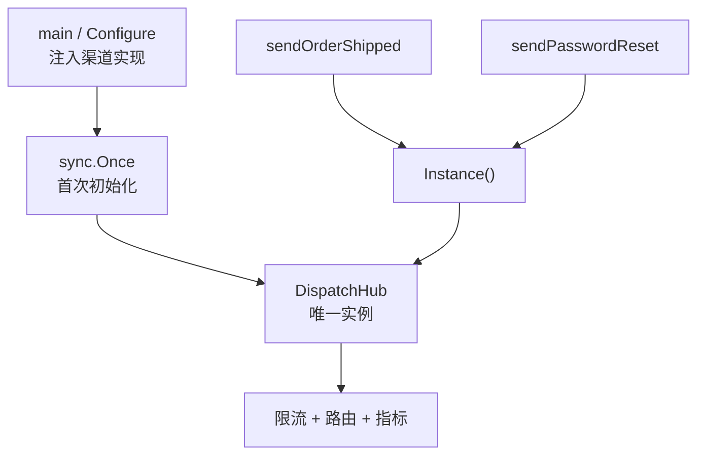

**单例模式**（Singleton）保证某个类在进程内 **只有一个实例**，并提供一个 **全局访问点**：所有调用方拿到的都是同一份对象，共享同一份状态与资源（连接池、限流计数、指标等）。

打个比方：通知中心的「总机」只能有一部——各部门都拨同一个号码，排队、限流、统计才一致；若每个包自己 `New` 一台「分总机」，就会出现重复发信、配额算重、连接数暴涨。

下文延续 [原型模式](/cs-fundamentals/design-patterns/prototype) 的「通知模块」场景：模板克隆后由 **统一派发中心**（`DispatchHub`）路由到邮件 / 短信 / 推送渠道；该中心在全局只能存在一份。

## 问题

业务里有些组件 **天然应是唯一的**：连接外部 API 的客户端、全局限流器、指标收集器、配置热加载器。最直接的做法是在用到的地方各自 `New`：

```go
type DispatchHub struct {
    email   Notifier
    sms     Notifier
    push    Notifier
    limiter *RateLimiter // 全渠道共享配额
    metrics *Metrics
}

func NewDispatchHub(email, sms, push Notifier) *DispatchHub {
    return &DispatchHub{
        email:   email,
        sms:     sms,
        push:    push,
        limiter: NewRateLimiter(1000), // 每秒 1000 条
        metrics: NewMetrics(),
    }
}

func sendOrderShipped(reg *PrototypeRegistry, to, orderID string) error {
    hub := NewDispatchHub(NewEmailNotifier(), NewSmsNotifier(), NewPushNotifier())
    // …Clone 模板、hub.Dispatch(…)
    return nil
}

func sendPasswordReset(to string) error {
    hub := NewDispatchHub(NewEmailNotifier(), NewSmsNotifier(), NewPushNotifier())
    // 又一个 hub——限流与 metrics 互不共享
    return nil
}
```

看起来每个函数都「自给自足」，但实例一多，问题就会暴露：

1. **状态分裂**：`RateLimiter` 按 hub 实例各自计数，全局「每秒 1000 条」的配额被放大成 N×1000，容易打爆下游。
2. **资源浪费**：每个 hub 持有独立的 SMTP / HTTP 连接池，连接数与内存随调用点线性增长。
3. **指标失真**：`Metrics` 分散在多个 hub 里，监控面板无法反映真实发送量。
4. **初始化重复**：渠道客户端、TLS 握手、凭证加载在每条发送路径上重复执行，启动慢、I/O 浪费。
5. **与 [单一职责](/cs-fundamentals/design-patterns#设计原则) 冲突**：业务函数既管「发什么」，又管「怎么造全局枢纽」，创建逻辑散落各处。

本质矛盾是：**系统语义上只需要一个协调者**，代码却允许 **随处 `New` 出多个「协调者」**。

## 意图

用一句话说：**保证一个类仅有一个实例，并提供一个访问它的全局访问点。**

把「如何得到那唯一实例」封装进类型自身（或包级 API）；调用方通过 `Instance()` / `GetHub()` 获取，而不是到处 `NewDispatchHub()`。GoF 从 **实现结构** 角度的定义是：

> 保证一个类仅有一个实例，并提供一个访问它的全局访问点。

与 [工厂方法](/cs-fundamentals/design-patterns/factory)、[原型](/cs-fundamentals/design-patterns/prototype) 的关系：

| | 工厂方法 | 原型 | 单例 |
| :--- | :--- | :--- | :--- |
| 核心问题 | 解耦 **造哪一种** | 解耦 **怎么复制已有实例** | 保证 **只有一份** 协调实例 |
| 实例数量 | 每次可造新的产品 | 每次 `Clone()` 得新副本 | **进程内唯一** |
| 典型动机 | 类型选型、可替换实现 | 昂贵母版、大量相似对象 | 共享状态、全局资源 |
| 典型入口 | `NewEmailNotifier()` | `reg.Clone("order_shipped")` | `dispatchhub.Instance()` |

三者可 **组合**：工厂在组装层注入各渠道 `Notifier`；原型克隆模板；单例 `DispatchHub` 统一限流与派发。

> **命名说明**
>
> - **单例模式**（本文，GoF Singleton）：类 + 私有构造 + 静态 `Instance()`——经典 OOP 写法。
> - **包级单例**（Go 惯用法）：`var defaultHub = …` 或 `sync.Once` 懒初始化——**效果等同**，不必硬套 Java 式 `getInstance()`。
> - **依赖注入替代**：把「唯一实例」在 `main` 里 `New` 一次再注入，**不调用** `Instance()`——很多 Go 项目更推荐，见 [组装实践](#依赖注入与单例的取舍)。

## 解决方案

把「全局只应有一份」的 `DispatchHub` 收进单例；发送路径只 **取用**，不 **新建**。

### 经典结构（概念）

```go
type DispatchHub struct {
    email   Notifier
    sms     Notifier
    push    Notifier
    limiter *RateLimiter
    metrics *Metrics
}

var (
    hubInstance *DispatchHub
    hubOnce     sync.Once
)

// Instance 懒加载：首次调用时初始化，之后始终返回同一指针
func Instance() *DispatchHub {
    hubOnce.Do(func() {
        hubInstance = &DispatchHub{
            email:   NewEmailNotifier(),
            sms:     NewSmsNotifier(),
            push:    NewPushNotifier(),
            limiter: NewRateLimiter(1000),
            metrics: NewMetrics(),
        }
    })
    return hubInstance
}

func (h *DispatchHub) Dispatch(n *Notification) error {
    if err := h.limiter.Wait(context.Background()); err != nil {
        return err
    }
    notifier := h.pick(n.Channel)
    err := notifier.Send(n)
    h.metrics.Record(n.Channel, err)
    return err
}
```

### 组装阶段注入渠道（推荐变体）

单例不等于「写死 `NewEmailNotifier()`」。可在 **首次初始化** 时接受依赖，仍保证只初始化一次：

```go
type HubConfig struct {
    Email Notifier
    SMS   Notifier
    Push  Notifier
}

var hubCfg HubConfig

func Configure(cfg HubConfig) {
    hubCfg = cfg
}

func Instance() *DispatchHub {
    hubOnce.Do(func() {
        if hubCfg.Email == nil {
            hubCfg.Email = NewEmailNotifier()
        }
        hubInstance = &DispatchHub{
            email:   hubCfg.Email,
            sms:     hubCfg.SMS,
            push:    hubCfg.Push,
            limiter: NewRateLimiter(1000),
            metrics: NewMetrics(),
        }
    })
    return hubInstance
}

// main 里：测试可注入 mock，生产用真实实现
func main() {
    Configure(HubConfig{
        Email: NewEmailNotifier(),
        SMS:   NewSmsNotifier(),
        Push:  NewPushNotifier(),
    })
    // …
}
```

### 使用者

业务与 [原型](/cs-fundamentals/design-patterns/prototype) 组合：克隆模板后交给 **唯一** hub 派发：

```go
func sendOrderShipped(reg *PrototypeRegistry, to, orderID string) error {
    proto, err := reg.Clone("order_shipped")
    if err != nil {
        return err
    }
    // DispatchClone 内部最终调用 dispatchhub.Instance().Dispatch(…)
    return proto.DispatchClone(to, map[string]string{"OrderID": orderID})
}
```

与「每处 `NewDispatchHub()`」对比：

| | 随处 `New` | 单例 |
| :--- | :--- | :--- |
| 限流 | 每实例独立计数 | 全进程共享配额 |
| 连接 / 指标 | 重复持有、统计分散 | 一份连接池、一份 metrics |
| 调用方 | 要知道如何组装 hub | `Instance().Dispatch(…)` |
| 测试 | 难以替换全局依赖 | `Configure(mock)` 或注入接口（见下文） |

## 结构

| 角色 | 代码里是谁 | 管什么 |
| :--- | :--- | :--- |
| **单例类** | `DispatchHub` | 唯一实例承载的业务（派发、限流、指标） |
| **静态实例** | `hubInstance` + `hubOnce` | 保存唯一指针；`sync.Once` 保证初始化一次 |
| **全局访问点** | `Instance()` / `GetHub()` | 对外返回同一实例 |
| **使用者** | `sendOrderShipped` 等 | 通过访问点获取，不 `New` |



**初始化时**：`hubOnce.Do` 内完成渠道绑定、限流器与 metrics 创建——只执行一次。

**运行时**：所有发送路径经同一 `Instance()` 进入，共享限流与连接。

## 适用场景

1. **必须全局唯一的状态**：限流器、计数器、配置快照、任务调度器令牌。
2. **昂贵资源的单一入口**：数据库连接池、消息队列 producer、到第三方 API 的长连接客户端。
3. **协调多子系统**：本文的 `DispatchHub` 统一路由邮件 / 短信 / 推送。
4. **日志、追踪、插件注册表**：全进程一份注册表，避免重复注册或状态不一致。
5. **与 [原型](/cs-fundamentals/design-patterns/prototype) 分工**：原型负责 **复制模板**；单例 hub 负责 **用同一份基础设施发出去**。

常见例子：`database/sql` 的 `DB` 往往以单例方式在进程内复用；应用级 `Logger`；硬件驱动访问层。

**不必强行使用**：无共享状态、每次调用需要独立实例（带请求上下文的产品对象）——用 [工厂方法](/cs-fundamentals/design-patterns/factory) 每次 `New` 更合适。单例滥用会导致 **隐式全局状态**、测试困难；若「唯一」只需在 `main` 组装层保证，**依赖注入** 往往比 `Instance()` 更清晰。

## 优缺点

| 优点 | 说明 |
| :--- | :--- |
| **状态一致** | 限流、指标、连接池全进程一份，语义与运维预期一致 |
| **节省资源** | 昂贵初始化只做一次 |
| **访问简单** | `Instance()` 随处可取，不必层层传参 |
| **与创建型模式互补** | 工厂造渠道、原型造消息体、单例管派发枢纽 |

| 缺点 | 说明 |
| :--- | :--- |
| **隐式全局依赖** | 调用链上看不出依赖 hub，耦合藏在 `Instance()` 里 |
| **测试不便** | 需 `Configure`、接口抽象或重置钩子，否则难以 mock |
| **违反单一职责** | 类型既管业务又管「如何成为唯一」 |
| **并发与生命周期** | 懒初始化要考虑 `sync.Once`；进程内唯一 ≠ 多副本部署时的分布式唯一 |
| **过度使用** | 把本可注入的普通服务做成单例，扩大全局状态面 |

## 组装实践

> **阅读提示**：先掌握「`sync.Once` + `Instance()`」即可。本节是 Go 项目里的实现细节与替代方案；初学可先跳过。

### `sync.Once` 与饿汉 / 懒汉

| 方式 | 写法 | 特点 |
| :--- | :--- | :--- |
| **饿汉** | `var hub = NewDispatchHub(...)` 包初始化 | 简单、天然并发安全；若 `New` 很重且未必用到，浪费启动时间 |
| **懒汉（Once）** | `hubOnce.Do(func() { … })` | 首次访问才初始化；Go 推荐写法 |
| **懒汉（无 Once，反例）** | `if hub == nil { hub = New… }` | 竞态，**不要**在并发下这样写 |

```go
// 饿汉：依赖简单、必定会用时
var defaultLimiter = NewRateLimiter(1000)

// 懒汉：依赖重或可能不用时
func Instance() *DispatchHub {
    hubOnce.Do(initHub)
    return hubInstance
}
```

### 依赖注入与单例的取舍

很多 Go 代码 **不在业务里调 `Instance()`**，而在 `main` 里构造唯一 `*DispatchHub`，通过构造函数注入：

```go
type NotifyService struct {
    hub  *DispatchHub // main 里 New 一次，全应用共享同一指针
    reg  *PrototypeRegistry
}

func NewNotifyService(hub *DispatchHub, reg *PrototypeRegistry) *NotifyService {
    return &NotifyService{hub: hub, reg: reg}
}

func (s *NotifyService) SendOrderShipped(to, orderID string) error {
    proto, err := s.reg.Clone("order_shipped")
    if err != nil {
        return err
    }
    n, err := materializeForDispatch(proto, to, map[string]string{"OrderID": orderID})
    if err != nil {
        return err
    }
    return s.hub.Dispatch(n) // 注入的 hub 与 Instance() 可以是同一指针
}
```

| | `Instance()` 单例 | `main` 注入同一指针 |
| :--- | :--- | :--- |
| 实例数量 | 进程内唯一 | 进程内唯一（由组装层保证） |
| 依赖可见性 | 隐式 | 显式，构造签名即文档 |
| 测试 | 需全局 `Configure` / reset | 直接 `NewNotifyService(mockHub, …)` |
| 更符合 Go 社区习惯 | 库、SDK 边界常见 | **应用内部更常见** |

**结论**：需要「全局访问点」时可用单例；应用内部更推荐 **组装层造一份、注入传递**——语义仍是「只有一个 hub」，但不引入隐藏全局。

### 测试：可替换的单例

若保留 `Instance()`，为测试提供 **重置** 或 **配置钩子**（仅测试包使用，生产勿暴露随意 reset）：

```go
// testing 包或 internal 测试辅助
func resetForTest(t *testing.T) {
    t.Helper()
    hubOnce = sync.Once{}
    hubInstance = nil
    t.Cleanup(func() {
        hubOnce = sync.Once{}
        hubInstance = nil
    })
}
```

更好的做法是：**业务依赖接口** `type Dispatcher interface { Dispatch(*Notification) error }`，生产实现委托给 `Instance()`，测试注入 fake。

### 单例 ≠ 分布式唯一

`DispatchHub` 的单例保证 **单个进程内** 只有一份。多实例部署（Kubernetes 多 Pod）时，全局限流仍需 **Redis / 中央配额服务**——单例解决不了跨进程协调，不要误以为「用了单例就不会超发」。

### 与枚举式单例

Go 无 enum，常用 **包级变量 + 不导出类型** 表达「仅此一份」：

```go
var Hub = newDispatchHub() // 包内初始化，对外只读使用 Hub.Dispatch

type dispatchHub struct { /* 小写，包外无法 New */ }
```

与 `Instance()` 等价，风格更「Go idiom」。

## 小结

记住这四点即可：

1. **需要全局一份状态或昂贵资源 → 考虑单例**：限流、连接池、统一派发中心。
2. **Go 用 `sync.Once` 做懒加载**：不要用无锁的 `if instance == nil`。
3. **应用内部优先注入同一指针**：`main` 里 `New` 一次传入 `Service`，比随处 `Instance()` 更易测。
4. **单例只管进程内唯一**：分布式限流、幂等等仍需基础设施，不能单靠模式。

上一篇的 [原型模式](/cs-fundamentals/design-patterns/prototype) 管 **从模板安全复制消息体**；本篇管 **用唯一枢纽把消息发出去**。克隆模板 → 原型；共享派发与配额 → 单例。

## 参考阅读

- [x] [原型模式](/cs-fundamentals/design-patterns/prototype) — 创建型模式前置，常与单例 hub 组合
- [x] [Refactoring.Guru - 单例模式](https://refactoringguru.cn/design-patterns/singleton) (2026-06-17)
- [x] [菜鸟教程 - 单例模式](https://www.runoob.com/design-pattern/singleton-pattern.html) (2026-06-17)
