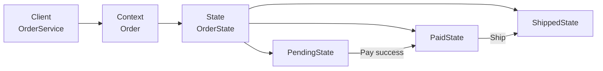
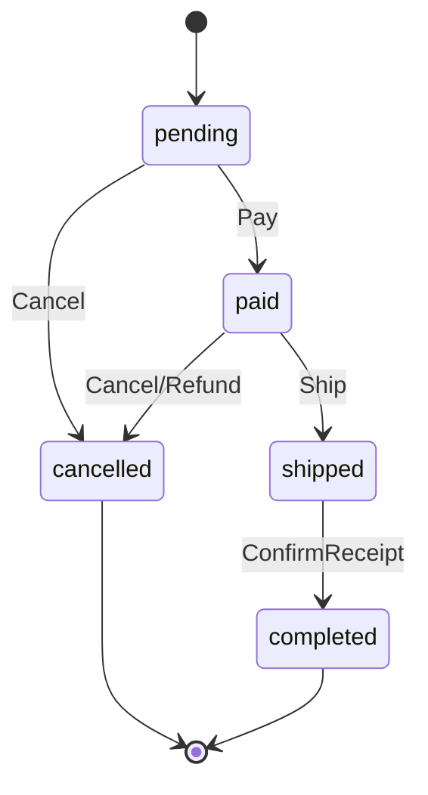

**状态模式**（State）把 **与状态相关的行为** 拆进 **独立的状态类**：**上下文（Context）** 持有当前 `State`，对外暴露 **统一操作**（`Pay`、`Ship`、`Cancel`、`Refund`），**委托** 给当前状态实现——状态 **允许则执行并可能切换到下一状态**，**不允许则返回明确错误**——从而消除 **`switch order.Status`** 散落各处，让 **「在此状态下能做什么」** 与 **「转换到何状态」**  **内聚在对应 State 类** 里。

与 [策略模式](/cs-fundamentals/design-patterns/strategy) 的 **分工** 很常被问到：策略是 **客户端主动选择** 可互换算法（如会员价 vs 普通价），**选定后通常不变**；状态是 **对象随内部生命周期自动切换**（待支付 → 已支付 → 已发货），**同一方法**（`Cancel`）在 **不同状态有不同语义与结果**。与 [观察者模式](/cs-fundamentals/design-patterns/observer) 也不同：状态管 **能不能做、做完变什么状态**；观察者管 **变完之后通知谁**——`PaidState.Pay` 成功后 **`context.Publish(OrderPaid)`** 可组合。与 [命令模式](/cs-fundamentals/design-patterns/command) 也可配合：**能否 Execute** 由 State 校验；Command **Execute 成功** 后调 `context.Transition`。

下文继续用「电商订单系统」：[观察者](/cs-fundamentals/design-patterns/observer) 已把 **支付后扇出** 从 `OrderService` 剥离。当 **订单生命周期** 变复杂（待支付、已支付、部分发货、已发货、已完成、已取消、退款中、已退款），且 **`Pay` / `Ship` / `Cancel` / `AdjustLines` / `Refund` 能否调用** 到处 **`if status == …`** 时，若 **运营改规则**（「已支付未发货可改地址」「跨境单取消要走审核」）要 **改十个 Service 方法**，会出现 **非法转换漏拦、行为不一致**——状态模式把 **每态行为** 收进 `PendingState`、`PaidState` 等，Context **只转发**。

## 问题

订单操作开始 **用枚举 + 巨型 switch**：

```go
type OrderStatus string

const (
    StatusPending   OrderStatus = "pending"
    StatusPaid      OrderStatus = "paid"
    StatusShipped   OrderStatus = "shipped"
    StatusCompleted OrderStatus = "completed"
    StatusCancelled OrderStatus = "cancelled"
)

func (s *OrderService) Pay(ctx context.Context, orderID string) error {
    order, _ := s.repo.Get(ctx, orderID)
    switch order.Status {
    case StatusPending:
        order.Status = StatusPaid
        return s.repo.Save(ctx, order)
    case StatusPaid, StatusShipped, StatusCompleted:
        return ErrAlreadyPaid
    case StatusCancelled:
        return ErrOrderCancelled
    default:
        return ErrInvalidStatus
    }
}

func (s *OrderService) Cancel(ctx context.Context, orderID string) error {
    order, _ := s.repo.Get(ctx, orderID)
    switch order.Status {
    case StatusPending:
        order.Status = StatusCancelled
        return s.repo.Save(ctx, order)
    case StatusPaid:
        // 还要退款？释放库存？——逻辑开始膨胀
        return s.refundAndCancel(ctx, order)
    case StatusShipped:
        return ErrCannotCancelShipped
    default:
        return ErrInvalidStatus
    }
}

func (s *AdminService) AdjustLines(ctx context.Context, orderID string, lines []OrderLine) error {
    order, _ := s.repo.Get(ctx, orderID)
    if order.Status != StatusPending && order.Status != StatusPaid {
        return ErrNotEditable
    }
    if order.Status == StatusPaid && order.CrossBorder {
        return ErrCrossBorderPaidEdit
    }
    // 每个操作重复 status 判断
    order.Lines = lines
    return s.repo.Save(ctx, order)
}
```

1. **违反开闭**：加 **「部分发货」** 状态，要 **改 Pay、Ship、Cancel、AdjustLines** 所有 switch。
2. **转换规则分散**：「已支付取消 = 退款 + 释库存」只在 `Cancel` 里写一半，`Refund` API **又写一遍**。
3. **行为与状态脱节**：`order.Status = StatusPaid` **随处可赋**——绕过 **非法转换**。
4. **测试组合爆炸**：每种 `(status, operation)` 组合 **测一个 Service 方法**。
5. **与观察者 / 命令的分工错位**：[观察者](/cs-fundamentals/design-patterns/observer) 管 **事后通知**；[命令](/cs-fundamentals/design-patterns/command) 管 **操作封装**——这里要解决 **生命周期内行为随状态变化**，不是 **发邮件** 或 **AdjustQuantity 对象化**（虽可组合）。

本质矛盾是：**订单在不同阶段允许的操作不同**，且 **操作成功会触发状态迁移**；这些规则 **不应** 以 **`if status` 重复** 形式散落在各 Service。

### 状态模式 vs 枚举 + switch vs 策略

| 方式 | 状态迁移 | 行为位置 | 何时够用 |
| :--- | :--- | :--- | :--- |
| **枚举 + switch** | 手动赋值 | 每个方法里 switch | 3 态、规则永不改 |
| **状态模式** | **State 内** Transition | 各 `XxxState` 类 | 多态行为、转换复杂 |
| **策略** | **通常无** 自动迁移 | 可互换算法 | 计价、路由 **非生命周期** |
| **表驱动 FSM** | 配置表 | 数据 + 引擎 | 状态极多、规则常由运营配置 |

表驱动是状态模式的 **工程变体**；GoF 状态强调 **多态 State 对象**。

## 意图

用一句话说：**允许对象在内部状态改变时改变它的行为，对象看起来好像修改了它的类。**

引入 **State** 接口；**Context**（`Order`）持有 `state` 并 **委托** `Pay`/`Ship`/…；各 **ConcreteState** 实现 **本态行为** 与 **`TransitionTo`**：

```go
order := LoadOrder(ctx, id) // 内部 state = PaidState{}
return order.Pay(ctx)       // 委托 → PaidState.Pay → ErrAlreadyPaid
return order.Ship(ctx, trk) // → PaidState.Ship → 切 ShippedState + Save
```

GoF 从 **结构** 角度的定义：

> 允许对象在内部状态改变时改变它的行为。对象看起来好像修改了它的类。

### 和策略、观察者、命令有啥不同

| | 状态 | 策略 | 观察者 | 命令 |
| :--- | :--- | :--- | :--- | :--- |
| **动机** | **行为随生命周期变** | **算法可互换** | **变更后通知** | **封装操作** |
| **谁切换** | **State / Context 内部** | **客户端设置** | 不切换 | Invoker 执行 |
| **同一方法语义** | **随状态不同** | 策略不同 | N/A | 固定 Execute |
| **电商例子** | 待支付可 Cancel、已发货不可 | 会员价算法 | OrderPaid 发邮件 | AdjustQty Undo |

#### 状态像「把 switch 拆成类」吗？

**是。** 每个 `case StatusPaid:` 的 **行为块** → `PaidState` 的方法；Context **eliminate switch**。

#### 状态和观察者冲突吗？

**不冲突，分层。** `PaidState.Ship` 成功 → `o.setState(ShippedState{})` → `o.publish(OrderShipped{…})`——**状态管规则与迁移**；**观察者管扇出**。

## 解决方案

定义 **State** 接口；**Order**（Context）保存数据 + 当前 State，**委托** 操作；各 **ConcreteState** 实现 **允许/拒绝/迁移**。

### 状态（State）接口

```go
type OrderState interface {
    Pay(ctx context.Context, o *Order) error
    Ship(ctx context.Context, o *Order, tracking string) error
    Cancel(ctx context.Context, o *Order) error
    Refund(ctx context.Context, o *Order) error
    AdjustLines(ctx context.Context, o *Order, lines []OrderLine) error
    Name() string
}
```

可按 **接口隔离** 拆成 `Payable`、`Cancellable`——文档为清晰保留 **统一 State**（非法操作 **返回 ErrNotAllowed**）。

### 上下文（Context）——Order

```go
type Order struct {
    ID           string
    UserID       string
    Lines        []OrderLine
    CrossBorder  bool
    TrackingNo   string
    state        OrderState
    repo         OrderRepository
    publisher    EventPublisher
    payment      PaymentService
    inventory    InventoryService
}

func (o *Order) setState(s OrderState) {
    o.state = s
}

func (o *Order) Status() string {
    return o.state.Name()
}

func (o *Order) Total() int64 {
    var sum int64
    for _, line := range o.Lines {
        sum += line.Amount()
    }
    return sum
}

func (o *Order) Pay(ctx context.Context) error {
    return o.state.Pay(ctx, o)
}

func (o *Order) Ship(ctx context.Context, tracking string) error {
    return o.state.Ship(ctx, o, tracking)
}

func (o *Order) Cancel(ctx context.Context) error {
    return o.state.Cancel(ctx, o)
}

func (o *Order) persist(ctx context.Context) error {
    return o.repo.Save(ctx, o)
}

func (o *Order) publish(ctx context.Context, ev DomainEvent) {
    if o.publisher != nil {
        _ = o.publisher.Publish(ctx, ev)
    }
}

// 从 DB 加载时按 persisted status 还原 State 对象
func RestoreOrder(row OrderRow, deps OrderDeps) *Order {
    o := &Order{ID: row.ID, Lines: row.Lines, repo: deps.Repo, /* … */}
    o.setState(stateFromName(row.Status))
    return o
}

func stateFromName(name string) OrderState {
    switch name {
    case "pending":
        return PendingState{}
    case "paid":
        return PaidState{}
    case "shipped":
        return ShippedState{}
    case "cancelled":
        return CancelledState{}
    default:
        return PendingState{}
    }
}
```

**持久化** 仍存 **status 字符串**；**内存中** 是 **State 对象**——`RestoreOrder` **重建多态**。

### 具体状态：待支付（PendingState）

```go
type PendingState struct{}

func (PendingState) Name() string { return "pending" }

func (PendingState) Pay(ctx context.Context, o *Order) error {
    if err := o.payment.Capture(ctx, o.ID, o.Total()); err != nil {
        return err
    }
    o.setState(PaidState{})
    if err := o.persist(ctx); err != nil {
        return err
    }
    o.publish(ctx, OrderPaid{OrderID: o.ID, UserID: o.UserID, Amount: o.Total()})
    return nil
}

func (PendingState) Ship(ctx context.Context, o *Order, _ string) error {
    return ErrMustPayFirst
}

func (PendingState) Cancel(ctx context.Context, o *Order) error {
    if err := o.inventory.Release(ctx, o.Lines); err != nil {
        return err
    }
    o.setState(CancelledState{})
    if err := o.persist(ctx); err != nil {
        return err
    }
    o.publish(ctx, OrderCancelled{OrderID: o.ID})
    return nil
}

func (PendingState) Refund(context.Context, *Order) error {
    return ErrNotPaid
}

func (PendingState) AdjustLines(ctx context.Context, o *Order, lines []OrderLine) error {
    o.Lines = lines
    return o.persist(ctx)
}
```

### 具体状态：已支付（PaidState）

```go
type PaidState struct{}

func (PaidState) Name() string { return "paid" }

func (PaidState) Pay(context.Context, *Order) error {
    return ErrAlreadyPaid
}

func (PaidState) Ship(ctx context.Context, o *Order, tracking string) error {
    o.TrackingNo = tracking
    o.setState(ShippedState{})
    if err := o.persist(ctx); err != nil {
        return err
    }
    o.publish(ctx, OrderShipped{OrderID: o.ID, TrackingNo: tracking})
    return nil
}

func (PaidState) Cancel(ctx context.Context, o *Order) error {
    if err := o.payment.Refund(ctx, o.ID); err != nil {
        return err
    }
    if err := o.inventory.Release(ctx, o.Lines); err != nil {
        return err
    }
    o.setState(CancelledState{})
    if err := o.persist(ctx); err != nil {
        return err
    }
    o.publish(ctx, OrderCancelled{OrderID: o.ID})
    return nil
}

func (PaidState) Refund(ctx context.Context, o *Order) error {
    return PaidState{}.Cancel(ctx, o) // 或独立 RefundingState
}

func (s PaidState) AdjustLines(ctx context.Context, o *Order, lines []OrderLine) error {
    if o.CrossBorder {
        return ErrCrossBorderPaidEdit
    }
    o.Lines = lines
    return o.persist(ctx)
}
```

### 具体状态：已发货 / 已取消（节选）

```go
type ShippedState struct{}

func (ShippedState) Name() string { return "shipped" }

func (ShippedState) Pay(context.Context, *Order) error    { return ErrAlreadyPaid }
func (ShippedState) Cancel(context.Context, *Order) error  { return ErrCannotCancelShipped }
func (ShippedState) AdjustLines(context.Context, *Order, []OrderLine) error {
    return ErrNotEditable
}

func (ShippedState) Ship(ctx context.Context, o *Order, tracking string) error {
    o.TrackingNo = tracking // 改运单号
    return o.persist(ctx)
}

type CancelledState struct{}

func (CancelledState) Name() string { return "cancelled" }

func (CancelledState) Pay(context.Context, *Order) error    { return ErrOrderCancelled }
func (CancelledState) Ship(context.Context, *Order, string) error { return ErrOrderCancelled }
func (CancelledState) Cancel(context.Context, *Order) error { return ErrOrderCancelled }
func (CancelledState) Refund(context.Context, *Order) error { return ErrOrderCancelled }
func (CancelledState) AdjustLines(context.Context, *Order, []OrderLine) error {
    return ErrOrderCancelled
}
```

**终态** `CancelledState` **所有写操作拒绝**——规则 **集中在一处**。

### 客户端——OrderService 只加载并委托

```go
type OrderService struct {
    repo OrderRepository
    deps OrderDeps
}

func (s *OrderService) Pay(ctx context.Context, orderID string) error {
    o, err := s.load(ctx, orderID)
    if err != nil {
        return err
    }
    return o.Pay(ctx)
}

func (s *OrderService) load(ctx context.Context, id string) (*Order, error) {
    row, err := s.repo.Get(ctx, id)
    if err != nil {
        return nil, err
    }
    return RestoreOrder(row, s.deps), nil
}
```

HTTP、MQ、CLI **统一** `order.Pay()`——**无 switch**。

## 结构

| 角色 | 代码里是谁 | 管什么 |
| :--- | :--- | :--- |
| **上下文**（Context） | `Order` | 委托、持有 State、持久化、Publish |
| **状态**（State） | `OrderState` 接口 | 各操作在本态的行为 |
| **具体状态**（ConcreteState） | `PendingState`、`PaidState`… | 允许/拒绝、迁移 |
| **客户端**（Client） | `OrderService`、Handler | 加载 Context、调统一 API |



状态迁移示意：



### 和 GoF 术语的对应（选读）

| GoF 叫法 | 本文代码 | 一句话 |
| :--- | :--- | :--- |
| Context | `Order` | 委托给 State |
| State | `OrderState` | 状态接口 |
| ConcreteState | `PaidState` 等 | 具体行为与迁移 |
| Client | `OrderService` | 使用 Context |

Go **State 常用 struct 值类型**（无字段）+ **Context 指针**；可 **单例 State**（空 struct 复用）。

## 适用场景

1. **对象行为随状态变**：订单、工单、审批单、连接（TCP）、播放器。
2. **大量条件分支依赖状态**：`switch status` **重复** 且 **难维护**。
3. **转换规则要集中**：非法转换 **编译/测试可覆盖**。
4. **开闭**：新状态 **新 ConcreteState**，少改 Context 方法签名。
5. **与观察者组合**：State **迁移后 Publish** 领域事件。

**不必强行使用**：

- **2～3 个状态、几乎无分支**——枚举够用。
- **纯算法切换、无生命周期**——用 **策略**。
- **状态由运营配置、上百条转换**——**表驱动 FSM** 更合适。
- **仅通知下游**——[观察者](/cs-fundamentals/design-patterns/observer) 足够，不需 State 类。

常见例子：TCP 连接状态、媒体播放器、工作流引擎、Document 草稿/发布、Vending machine。

## 优缺点

| 优点 | 说明 |
| :--- | :--- |
| **消除巨型 switch** | 行为 **按状态分文件** |
| **开闭** | 新状态 **加类** |
| **转换内聚** | Pay/Cancel **副作用** 在 **对应 State** |
| **显式非法操作** | `ShippedState.Cancel` **统一拒绝** |
| **易单测** | `PaidState{}.Ship(mockOrder)` **无 DB** |

| 缺点 | 说明 |
| :--- | :--- |
| **类数量增加** | 每状态一类；可用 **表驱动** 减类 |
| **Context 可能膨胀** | 共享依赖 **注入 Order**；或 **StateFactory** |
| **双份「状态」** | DB enum + 内存 State——**Restore 要同步** |
| **分散的迁移图** | 需 **文档/图** 汇总全局 FSM |
| **与 DDD 聚合** | 大 Aggregate 上 State 要 **控边界** |

## 组装实践

> **阅读提示**：先掌握「**Order 委托 state.Pay，PaidState 内迁移**」即可。本节是工程变体；初学可先跳过。

### 与观察者、命令组合

```text
PendingState.Pay
  → payment.Capture
  → setState(PaidState)
  → persist
  → publish(OrderPaid)     // 观察者扇出

AdjustQuantityCommand.Execute
  → order.AdjustLines(...)  // 经 State 校验
  → PendingState / PaidState 允许或拒绝
```

[命令](/cs-fundamentals/design-patterns/command) **不替代** State——Command 问 **Receiver**；Receiver（Order）**再问当前 State**。

### 表驱动 FSM（状态很多时）

```go
type transition struct {
    from, event, to string
    guard           func(*Order) bool
}

var orderTransitions = []transition{
    {from: "pending", event: "pay", to: "paid"},
    {from: "paid", event: "ship", to: "shipped"},
    {from: "pending", event: "cancel", to: "cancelled"},
}

func (o *Order) Apply(ctx context.Context, event string) error {
    for _, t := range orderTransitions {
        if o.Status() == t.from && event == t.event {
            if t.guard != nil && !t.guard(o) {
                return ErrGuardFailed
            }
            o.setState(stateFromName(t.to))
            return o.persist(ctx)
        }
    }
    return ErrInvalidTransition
}
```

**运营可配置** 时用表；**行为差异大**（Paid Cancel 要退款链）仍用 **多态 State** 或 **表 + 钩子**。

### State 持有 Context 引用？

GoF 允许 State **反向引用 Context** 以 `Transition`——本文 **State 方法收 `*Order`**，避免 **双向引用循环**；迁移用 **`o.setState`**。

### 部分发货（PartialShippedState）

```go
type PartialShippedState struct{ ShippedSKUs map[string]int }

func (s PartialShippedState) Ship(ctx context.Context, o *Order, tracking string) error {
    // 多次 Ship 直至全发完 → ShippedState
    if allLinesShipped(o, s.ShippedSKUs) {
        o.setState(ShippedState{})
    }
    return o.persist(ctx)
}
```

**新状态** = **新 struct**，不改 `PaidState` 里 **嵌套 if partial**。

### 与外观、责任链

- [外观](/cs-fundamentals/design-patterns/facade) `PlaceOrder`：**创建** Pending 订单 → `order.Pay`（或支付子步骤）——Facade **编排**；State **管单订单生命周期**。
- [责任链](/cs-fundamentals/design-patterns/chain-of-responsibility) **下单前校验**；State **下单后** 状态机——**时间线不同**。

### 持久化与并发

| 问题 | 做法 |
| :--- | :--- |
| **乐观锁** | `UPDATE … WHERE status=pending`；失败 = **并发已迁移** |
| **Restore** | 读 DB status → `stateFromName` |
| **禁止绕过** | 禁止 **直接改** `order.status` 字段；只 **`setState`** |

### 测试策略

```go
func TestPendingState_PayTransitionsToPaid(t *testing.T) {
    o := &Order{ID: "o1", state: PendingState{}, payment: fakePayOK{}}
    if err := o.Pay(context.Background()); err != nil {
        t.Fatal(err)
    }
    if o.Status() != "paid" {
        t.Fatal(o.Status())
    }
}

func TestShippedState_CancelRejected(t *testing.T) {
    o := &Order{state: ShippedState{}}
    err := o.Cancel(context.Background())
    if !errors.Is(err, ErrCannotCancelShipped) {
        t.Fatal(err)
    }
}

func TestPaidState_CrossBorderAdjustRejected(t *testing.T) {
    o := &Order{state: PaidState{}, CrossBorder: true}
    err := o.AdjustLines(context.Background(), o, nil)
    if !errors.Is(err, ErrCrossBorderPaidEdit) {
        t.Fatal(err)
    }
}
```

## 小结

记住这四点即可：

1. **行为随状态变**：`order.Pay()` **委托** `state.Pay()`——**无外部 switch**。
2. **迁移在 State 内**：`PaidState.Ship` → `setState(ShippedState{})` + `persist`。
3. **与观察者分层**：State **管规则与迁移**；**Publish** 交 [观察者](/cs-fundamentals/design-patterns/observer) 扇出。
4. **Restore 重建多态**：DB 存 enum；加载时 **`stateFromName`**。

[观察者模式](/cs-fundamentals/design-patterns/observer) 解决了 **「状态变完之后通知谁」**；状态模式解决 **「在此状态下能做什么、做完变成什么态」**——把 **生命周期规则** 从 **散落条件分支** 收到 **可扩展的状态类**，让订单、工单等在规则频繁变化时仍符合 [开闭](/cs-fundamentals/design-patterns#设计原则) 与 **单一职责**。

## 参考阅读

- [x] [观察者模式](/cs-fundamentals/design-patterns/observer) — 迁移后 Publish；与 State 分层
- [x] [命令模式](/cs-fundamentals/design-patterns/command) — 操作封装；Execute 经 State 校验
- [x] [外观模式](/cs-fundamentals/design-patterns/facade) — PlaceOrder 编排；与单订单状态机配合
- [x] [责任链模式](/cs-fundamentals/design-patterns/chain-of-responsibility) — 下单前校验；非生命周期状态
- [x] [Refactoring.Guru - 状态模式](https://refactoringguru.cn/design-patterns/state) (2026-06-22)
- [x] [菜鸟教程 - 状态模式](https://www.runoob.com/design-pattern/state-pattern.html) (2026-06-22)
